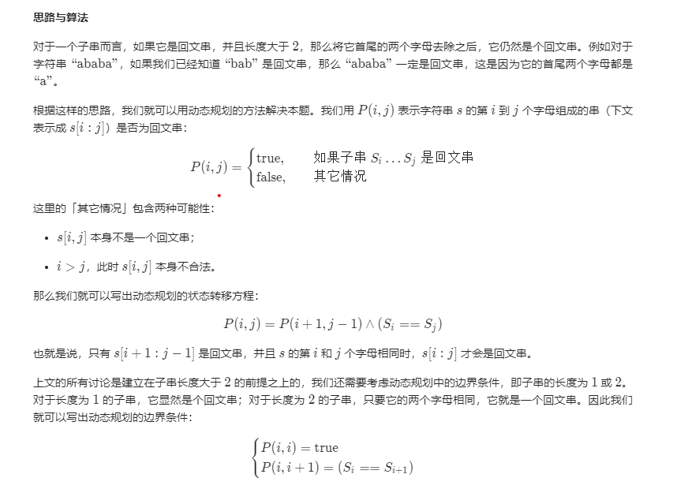

LeetCode进阶之路
<!--more-->

## 初级题目

### 数组问题

#### 从排序数组中删除重复项

```c++
    int removeDuplicates(vector<int>& nums) {
        if(nums.size() == 0)
            return 0;
        int k = 1;
        for(int i = 1; i < nums.size(); i++){
            if (nums[i] == nums[i - 1])
                continue;
            nums[k++] = nums[i];
        }
        
        return k;
    }
```

#### 买卖股票的最佳时机

- 解读

  典型的贪心算法，当明天比今天低价的时候将股票卖出即可。

- 代码

  ```c++
  int maxProfit(vector<int>& prices) {
          
          int result = 0;
          for(int i = 0; i < prices.size() - 1; i++){
              if( prices[i] < prices[i + 1]){
                  result = result + (prices[i + 1] - prices[i]);
              }
          }
          return result;
      }
  ```

#### 旋转数组

给定一个数组，将数组中的元素向右移k位，其中k是非负数

- 说明
  - 尽可能想出更多的解决方案，至少有三种不同的方法可以解决这个问题。
  - 要求使用空间复杂度为 O(1) 的原地算法。

- 解读
  [参考这篇博客](https://blog.csdn.net/biezhihua/article/details/79535021)

  使用`i = (i + k) % n`的思路，每次调换元素后，后一个元素调换都是基于上一个位置。如：

  ```
  1,2,3,4,5,6,7,8  n = 8, k = 2
  ```

  则执行流程如下：

  ```
  //奇数位旋转完毕
  1
  1,2,3,4,5,6,7,8
  
      3 
  1,2,1,4,5,6,7,8
  
          5    
  1,2,1,4,3,6,7,8
  
              7
  1,2,1,4,3,6,5,8
  
  
  7,2,1,4,3,6,5,8
  
  //偶数位旋转开始
    2
  7,2,1,4,3,6,5,8
  
        4
  7,2,1,2,3,6,5,8
        
            6
  7,2,1,2,3,4,5,8
  
                8
  7,2,1,2,3,4,5,6
  
  7,8,1,2,3,6,5,6
  
  ```

- 解题如下：

  ```c++
  class Solution
  {
    public:
      void rotate(vector<int> &nums, int k)
      {
          if (nums.size() == 0 || (k %= nums.size()) == 0)
          {
              return;
          }
          int length = nums.size();
          int start = 0;
          int i = 0;
          int cur = nums[i];
          int cnt = 0;
  gengxin
          while (cnt++ < length)
          {
              i = (i + k) % length;
              int t = nums[i];    //t用于记录转换前的数字
              nums[i] = cur;      //旋转
              if (i == start)  //用于处理奇偶位旋转问题
              {
                  ++start;     //start更新
                  ++i;         //index更新
                  cur = nums[i];  //因为更新了奇偶位，用于转换的数据也需要更新
              }
              else
              {
                  cur = t;        //将上一次被转换的位置的数据用于转换下次数据
              }
          }
      }
  };
  ```

#### 存在重复

- 给定一个整数数组，判断是否存在重复元素。

  如果任何值在数组中出现至少两次，函数返回 true。如果数组中每个元素都不相同，则返回 false。

- **示例 1:**

  ```
  输入: [1,2,3,1]
  输出: true
  ```

- 解读

  - 可以利用set的特性来解决这个问题
  - 可先排序，然后再判断是否有连续index具备相同的元素

- 解题如下：

  ```C++
  #include <set>
  class Solution {
  public:
      bool containsDuplicate(vector<int>& nums) {
          
          bool flag = false;
          set<int> set_int;
          
          for(int i = 0; i < nums.size(); i++){
              set_int.insert(nums[i]);
          }
          
          if(set_int.size() != nums.size()){
              flag = true;
          }
          
          return flag;
          
      }
  };
  ```

  #### 只出现一次的数字

  给定一个**非空**整数数组，除了某个元素只出现一次以外，其余每个元素均出现两次。找出那个只出现了一次的元素。

- **说明：**

  你的算法应该具有线性时间复杂度。 你可以不使用额外空间来实现吗？

- **示例 1:**

  ```
  输入: [2,2,1]
  输出: 1
  ```

- **解读**

  两个相同的数字进行异或后得到0

- **解题如下**

  ```C++
  class Solution {
  public:
      int singleNumber(vector<int>& nums) {
          
          int tmp = 0;
          for(int i = 0; i < nums.size(); i++){
              tmp = tmp ^ nums[i];
          }     
          return tmp; 
      }
  };
  ```
  
  #### 两个数组的交集 II
  
  给定两个数组，编写一个函数来计算它们的交集。
  
- **示例 1:**

  ```
  输入: nums1 = [1,2,2,1], nums2 = [2,2]
  输出: [2,2]
  ```

- **说明：**

  - 输出结果中每个元素出现的次数，应与元素在两个数组中出现的次数一致。
  - 我们可以不考虑输出结果的顺序。

- **进阶:**

  - 
    搜索
    20:03

    
    一家子
    未来	如果给定的数组已经排好序呢？你将如何优化你的算法？

  - 如果 *nums1* 的大小比 *nums2* 小很多，哪种方法更优？

  - 如果 *nums2* 的元素存储在磁盘上，磁盘内存是有限的，并且你不能一次加载所有的元素到内存中，你该怎么办？

- **解读**

  可以使用map的特性，值对具备相同性质的元素进行筛选，利用`value`记录元素出现的次数

- **解题如下**

  ```C++
  #include <map>
  
  class Solution {
  public:
      vector<int> intersect(vector<int>& nums1, vector<int>& nums2) {
          
          map<int, int> num2count1;
          vector<int> result;
          
          for(int i = 0;i < nums1.size(); i++){
              
              if(num2count1.find(nums1[i]) != num2count1.end()){
                  num2count1[nums1[i]]++;//每出现一次+1
              }else{
                  num2count1[nums1[i]] = 1;//初次出现则初始化value
              }
          }
          
          for(int i = 0; i < nums2.size(); i++){
              
              if(num2count1.find(nums2[i]) != num2count1.end()){
                  
                  result.push_back(nums2[i]);
                  num2count1[nums2[i]]--;//将一个元素放入result
                  
                  if(num2count1[nums2[i]] == 0) num2count1.erase(num2count1.find(nums2[i]));//如果元素被放置完，则删除该元素
              }
          }
          
          return result;
      }
  };
  ```

## 开始

### 1. 两数之和

给定一个整数数组 nums 和一个目标值 target，请你在该数组中找出和为目标值的那 两个 整数，并返回他们的数组下标。

你可以假设每种输入只会对应一个答案。但是，数组中同一个元素不能使用两遍。

示例:

```
给定 nums = [2, 7, 11, 15], target = 9
因为 nums[0] + nums[1] = 2 + 7 = 9
所以返回 [0, 1]
```

#### 两遍哈希表法

```c++
class Solution {
public:
    vector<int> twoSum(vector<int>& nums, int target) {
        map<int, int> a;//存储数组元素和对应下标
        vector<int> b(2, -1);//存放结果
        
        //将元素插入到哈希表中
        for(int i = 0; i < nums.size(); i++){
            a.insert(map<int, int>::value_type(nums[i], i));
        }
        
        for(int i = 0; i < nums.size(); i++){
            //判断是否找到目标元素，且目标元素不能是他自己本身
            if(a.count(target - nums[i]) > 0 && (a[target - nums[i]] != i)){
                b[0] = i;
                b[1] = a[target - nums[i]];
                break;
            } 
        }
        return b;
    }
};
```

#### 一遍哈希表

```c++
class Solution {
public:
    vector<int> twoSum(vector<int>& nums, int target) {
        map<int, int> a;
        vector<int> b(2, -1);
        
        for(int i = 0; i < nums.size(); i++){
            if(a.count(target - nums[i]) > 0){
                b[0] = i;
                b[1] = a[target - nums[i]];
                break;
            } 
            a[nums[i]] = i;//边插边判断是否找到目标元素，因为是先判断再进行插入的，所以后续不存在找到自己本身的情况，不需要判断目标元素不是自己
        }
        return b;
    }
};

```


### 3. 无重复字符的最长子串

给定一个字符串，请你找出其中不含有重复字符的 最长子串 的长度。

#### 第一种解法 滑动窗口解法

时间复杂度：O(n^2)

空间复杂度：O(1)

```c++
class Solution {
public:
    int lengthOfLongestSubstring(string s) {
        if(s.size() == 0) return 0;
        unordered_set<char> lookup;
        int maxStr = 0;
        int left = 0;
        
        for(int i = 0; i < s.size(); i++){
            while(lookup.find(s[i]) != lookup.end()){//窗口向右边扩张时，发现有相同的字符，将窗口左边缩窄，直到不存在重复字符。
                lookup.erase(s[left]);
                left++;
            }
            
            maxStr = max(maxStr, i - left + 1);//记录最长长度
            lookup.insert(s[i]);//窗口右侧扩张
            
        }
        return maxStr;
    }
};
```

#### 第二种解法 hashmap优化

时间复杂度：O(n^2)

空间复杂度：O(n^2)

```C++
class Solution {
public:
    int lengthOfLongestSubstring(string s) {
        int start(0), end(0), length(0), result(0);
        int sSize = int(s.size());
        unordered_map<char, int> hash;
        while(end < sSize){
            char tmp = s[end];
            if(hash.find(tmp) != hash.end() && hash[tmp] >= start){
                start = hash[tmp] + 1;//直接从hashmap中找到左侧需要缩窄到达的位置
                length = end - start;
            }
            hash[tmp] = end;
            length++;
            end++;
            result = max(result, length);
        }
        return result;
    }
};
```

利用hashmap记录的字符位置信息，节约缩窄窗口左侧的时间，达到以空间换时间的目的。

#### 5. 最长回文字符串

使用动态规划的方法



**时间复杂度：O(n^2)**

**空间复杂度：O(n^2)**

```c++

class Solution {
public:
    string longestPalindrome(string s) {
        int length = s.size();
        vector<vector<bool>> dp(length, vector<bool>(length));;
        string ans = "";
        int maxLength = 1;
        int start = 0;
        for(int i = 0; i < length; i++){
            dp[i][i] = true;
        }
        
        for(int j = 1; j < length; j++){
            for(int i = 0; i < j; i++){
                if(s[i] !=s[j]){ //头尾不相等时，则肯定不是回文字符串
                    dp[i][j] = false;
                }else{
                    if(j - i < 3){ 
                        dp[i][j] = true;//头尾相等，且长度小于等于3的，则为回文字符串
                    }else{
                        dp[i][j] = dp[i+1][j-1];//头尾相等，长度大于3时，切除头尾仍然为回文字符串时，则这个字符串也是回文字符串
                    }
                }
                if(dp[i][j] && ((j - i + 1) > maxLength)){
                    maxLength = j - i + 1;
                    start = i;
                    
                }
            }
        }
        ans = s.substr(start, maxLength);
        return ans;
    }
        
};
```

### 6. Z 字形变换

将一个给定字符串根据给定的行数，以从上往下、从左到右进行 Z 字形排列。

比如输入字符串为 `"LEETCODEISHIRING"` 行数为 3 时，排列如下：

```
L   C   I   R
E T O E S I I G
E   D   H   N
```

之后，你的输出需要从左往右逐行读取，产生出一个新的字符串，比如：`"LCIRETOESIIGEDHN"`。

请你实现这个将字符串进行指定行数变换的函数：

```c++
string convert(string s, int numRows);
```

**示例 1:**

```
输入: s = "LEETCODEISHIRING", numRows = 3
输出: "LCIRETOESIIGEDHN"
```

#### 题解

1. 初始化字符串数组用于记录字符排列顺序
2. 自上往下，再自下往上对字符进行逐个排列
3. 利用flag判断排列方向，初始化为-1
4. 当到达灵界点，即最上层和最下层时，改变排列方向，flag：-1 —> 1—> -1
5. 最后遍历所有字符串，并进行拼接

```c++
class Solution {
public:
    string convert(string s, int numRows) {
        if(numRows == 1) return s;
    
        vector<string> rows(min(numRows, (int)s.size()));

        int curRow = 0;
        int goDown = -1; //记录排列方向为向上或向下

        for(char c : s){
            rows[curRow] += c;
            if(curRow == 0 || curRow == numRows -1)  goDown = -goDown; //到达临界点时，改变排列方向

            curRow +=goDown;//依次向上或者向下排列
        }

        string ret;
        //遍历所有字符串
        for(string row : rows){
            ret += row;
        }

        return ret;
    }
};
```

