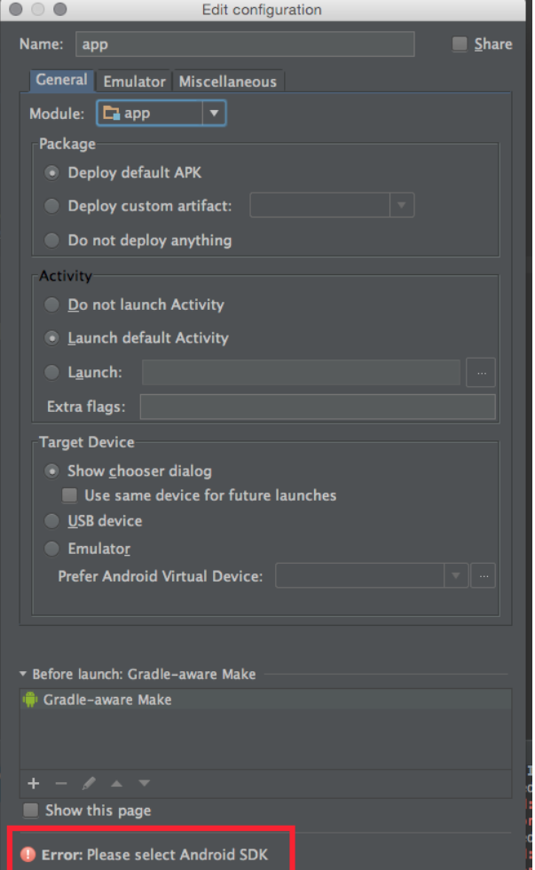

AndroidStudio错误记录（持续更新）
<!--more-->
## Android Studio运行app时提示`Please select Android SDK '.

报错`Error:Please select Android SDK`

有两个方法：

*1. 在File->Project Structure中将Build tools version修改，问题解决.* 

*2. 注释掉build.gradle中“buildToolsVersion '26.0.0'”。较新的AS创建的工程，已经默认去掉了该行*
