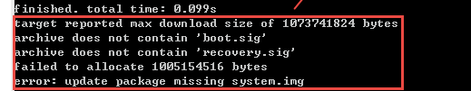

当官方脚本失效时使用这里的方法脚本
<!--more-->

## Android刷机脚本

当进行Nexus 5的`hammerhead-ktu84p`刷机时，发现使用`flash-all.sh`脚本会失效，内容如下：




解决办法及脚本如下：

- 解压`image-hammerhead-ktu84p.zip`文件，得到如下文件


- 刷机脚本

```shell
#!/bin/sh

# Copyright 2012 The Android Open Source Project
#
# Licensed under the Apache License, Version 2.0 (the "License");
# you may not use this file except in compliance with the License.
# You may obtain a copy of the License at
#
#      http://www.apache.org/licenses/LICENSE-2.0
#
# Unless required by applicable law or agreed to in writing, software
# distributed under the License is distributed on an "AS IS" BASIS,
# WITHOUT WARRANTIES OR CONDITIONS OF ANY KIND, either express or implied.
# See the License for the specific language governing permissions and
# limitations under the License.

fastboot flash bootloader bootloader-hammerhead-hhz11k.img
fastboot reboot-bootloader
sleep 5
fastboot flash radio radio-hammerhead-m8974a-2.0.50.1.16.img
fastboot reboot-bootloader
sleep 5

#官方刷机
# fastboot -w update image-hammerhead-ktu84p.zip
#done

#*********** 如果官方刷机方式失败，可以尝试下面的方法 *******#
fastboot flash recovery recovery.img
fastboot reboot-bootloader
sleep 5

fastboot flash boot boot.img
fastboot reboot-bootloader
sleep 5

fastboot flash system system.img
fastboot reboot-bootloader
sleep 5

fastboot flash cache cache.img

#if you update the user date
fastboot flash userdata userdata.img

echo 刷机成功

fastboot reboot
exit

#*********** done *******
```

## Android 8.0 user版本降级到Android 7.1.1 userdebuger版本

1. 先刷官方包，尤其不要忘记刷vendor.img
2. 刷完后再说编译出来的几个img即可；

具体原理不明，控制变量法判断编译出来的img没有vendor.img，而高版本vendor 不对低版本兼容