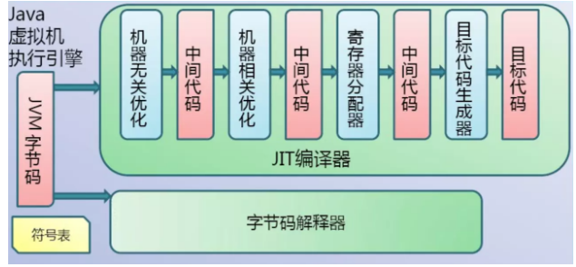
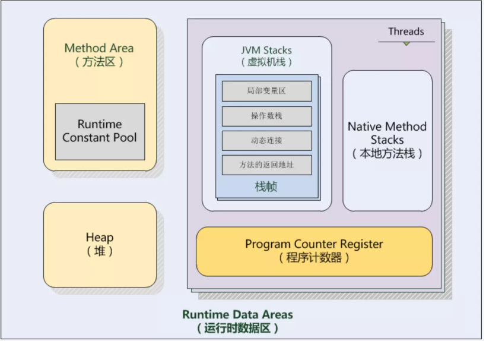
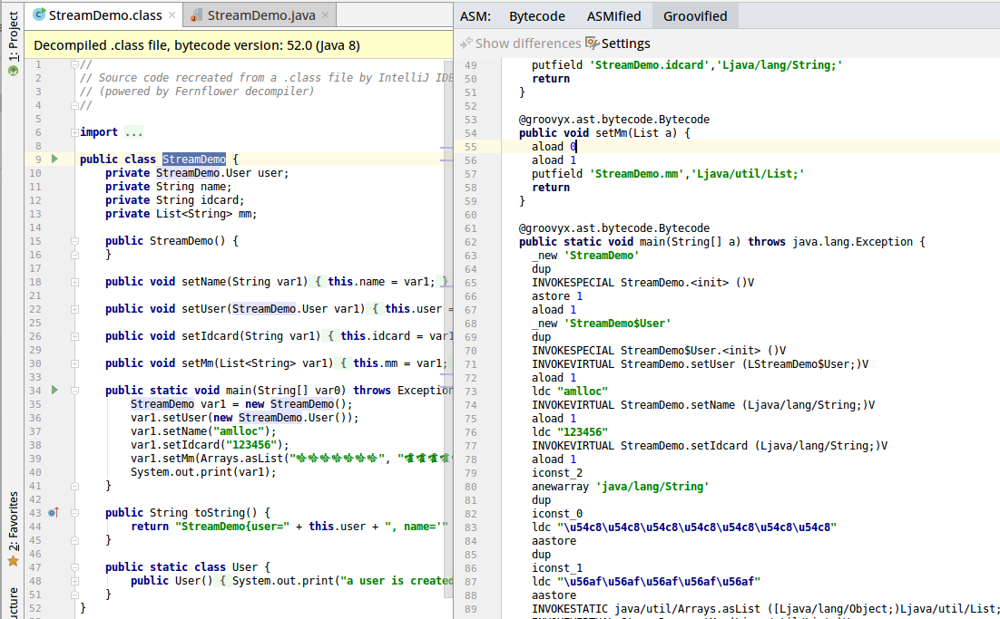

Java字符串加密学习笔记
<!--more-->

## Java字节码

### 字节码生成

- Java2bitcode

由Java源代码生成字节码的过程如下图（图片来源于网络）

- JVM执行
  - 不是热代码直接走字节码解释器
  - 热代码：多次调用，多次执行的循环体，会被JIT优化成机器码

## 字节码执行

方法调用在JVM中即是字节码执行，而字节码指令执行的树结构是栈帧（stack frame），也就是在虚拟机栈中的栈元素。虚拟机会给每个方法分配一个栈帧，因为虚拟机栈是LIFO(后进先出)的，所以当前线程正在活动的栈帧，也就是栈顶的栈帧，JVM规范中称之为“CurrentFrame”,这个当前栈帧对应的方法就是“CurrentMethod”。字节码的执行操作，指的就是对当前栈帧数据结构进行的操作。

JVM的运行时数据区结构如下：

## ASM入门

环境：Ubuntu14.10 + AndroidStudio3.2.1

插件：ASM Bytecode Outline

### 安装方法

- `file->setting->Plugins->输入ASM Bytecode Outline->Search in repositories`
- 安装并重启

打开Java项目后效果如下：

