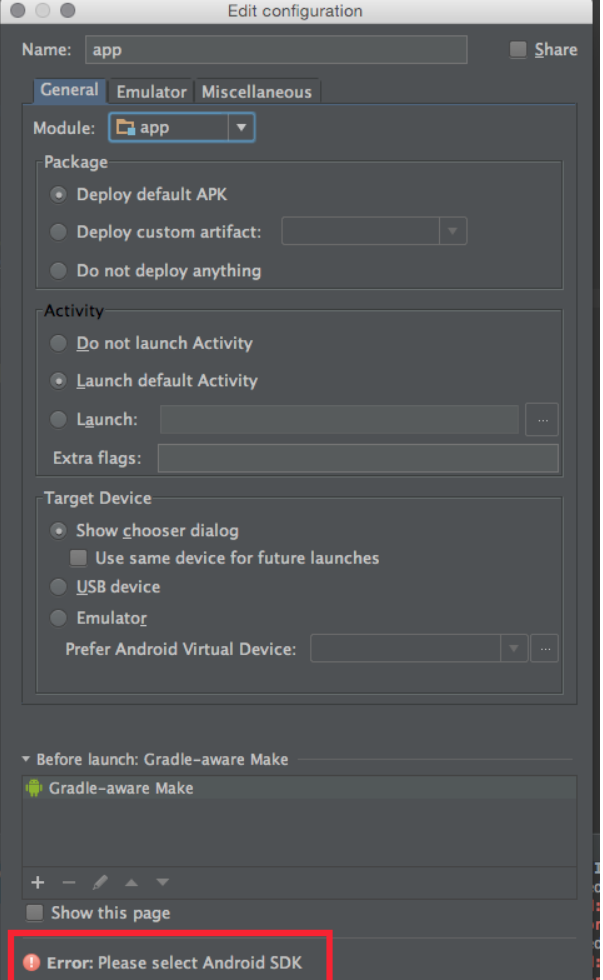
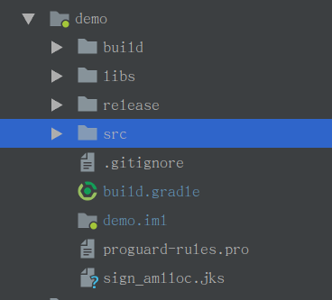
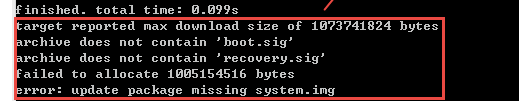
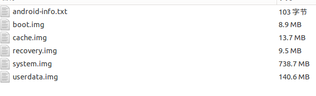
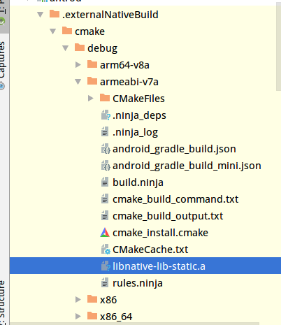

Android开发零零碎碎
<!--more-->

## 一、给Android Studio项目添加依赖

```
android {
    ...
    repositories{
        flatDir{
            dirs 'libs'
        }
    }
    ...
}

dependencies {
    implementation fileTree(dir: 'libs', include: ['*.jar'])
    implementation (name:'aar-name', ext:'aar')
    implementation (name:'aar-name', ext:'aar')
}
```
## 二、Android Studio运行app时提示Please select Android SDK '.

报错`Error:Please select Android SDK`



有两个方法：

*1. 在File->Project Structure中将Build tools version修改，问题解决.* 

*2. 注释掉build.gradle中“buildToolsVersion '26.0.0'”。较新的AS创建的工程，已经默认去掉了该行*

## 三、在Android Studio项目中使用build.gradle进行签名

- 将`.jks`签名文件放在项目模块文件夹下(签名文件可在`Build->Generte signed apk->Create new...`新建`)



- 在模块下的`build.gradle`添加如下配置

  ```groovy
  
  android {
      
      ...
  
      signingConfigs {
          release {
              storeFile file("sign_amlloc.jks")
              storePassword 'xxxxxxx'
              keyAlias 'yyyyyyyyy'
              keyPassword 'xxxxxxxxx'
          }
  
          debug {
              storeFile file("sign_amlloc.jks")
              storePassword 'xxxxxxx'
              keyAlias 'yyyyyyy'
              keyPassword 'xxxxxxxxx'
          }
      }
  
       buildTypes {
          release {
              minifyEnabled false
              proguardFiles getDefaultProguardFile('proguard-android.txt'), 'proguard-rules.pro'
              signingConfig signingConfigs.release
          }
  
          debug {
              signingConfig signingConfigs.debug
          }
      }
      ...
  }
  ```

- 此后编译出来的`release`和`debug`版本的app便会使用对应的签名文件进行签名

## 四、使用命令行的方式对AndroidStudio进行打包与清除

有时候启动Android Studio的时候会嫌弃它很重，懒得打开，所以特意整理了一下在命令行里面的命令

- 打包所有渠道的release

  `cd ${project_root}`

  `./gradlew assembleRelease`

- 清除项目

  `cd ${projece_root}`

  `./gradlew clean`

- 打包某个特定渠道的release

  `cd ${project_root} `

  `./gradlew assembleBaiduRelease`或`./gradlew aR`

- 打包debug版本的包

  `./gradlew assembleDebug`或`./gradkew aD`

- 打包特定module

  `./gradlew :${modulename}:assembleRelease`

## 五、/proc/{pid}/maps解读

总共6列，如

`76093000-76096000 r-xp 00000000 b3:19 941        /system/lib/libmemalloc.so`

1. 所处虚拟内存地址(VMA)范围：``76093000-76096000`

   - 在Linux中将进程虚拟空间中的一个段叫做虚拟内存区域VMA（Virtual Memory Area)。
   - VMA对应ELF文件中的segment。
   - ELF文件有section和segment的概念。从链接的角度看，ELF是按照section存储的，事实也的确如此；从装载的角度看，ELF文件又按照segment进行划分，这是为了防止按照section装载时造成的内部碎片。segment相当与是将多个属性（读写执行）相同的section合并在一起进行。program headers 存放segment的信息;section table存放section的信息.

2. VMA权限：`r-xp`

   `r=读，w=写,x=,s=共享,p=私有`

3. 偏移量：`00000000`

   表示VMA对应的segment在映像文件中的偏移。

4. 主设备号和次设备号（大雾）：`b3:19`

5. 映像文件的节点号inode：`941`

6. 映像文件的路径：`/system/lib/libmemalloc.so`

## 六、adb命令

- 启动apk

  `adb shell am start -n 包名 /. 类名`

- 关闭APK

  `adb shell am force-stop 包名`

- 对某一台设备进行操作

  - 获取连接电脑的手机设备号:`adb devices`

  - 对特定设备进行操作`adb -s <device id> <other>`

    如：`adb -s <device id> shell am start -n 包名 /.类名`

- 查看log

  - 清空log

    `adb logcat -c`

  - 以二进制形式输出日志

    `adb logcat -B`

  - 过滤项解析

    - ` <tag>[:priority] `, 标签:日志等级, 默认的日志过滤项是 " `*:I `"

      `adb logcat WifiHW:D *:S`

    - 可以同时设置多个过滤器

      `adb logcat WifiHW:D dalvikvm:I *:S`

## 七、Android刷机脚本

当进行Nexus 5的`hammerhead-ktu84p`刷机时，发现使用`flash-all.sh`脚本会失效，内容如下：




解决办法及脚本如下：

- 解压`image-hammerhead-ktu84p.zip`文件，得到如下文件



- 刷机脚本

```shell
#!/bin/sh

# Copyright 2012 The Android Open Source Project
#
# Licensed under the Apache License, Version 2.0 (the "License");
# you may not use this file except in compliance with the License.
# You may obtain a copy of the License at
#
#      http://www.apache.org/licenses/LICENSE-2.0
#
# Unless required by applicable law or agreed to in writing, software
# distributed under the License is distributed on an "AS IS" BASIS,
# WITHOUT WARRANTIES OR CONDITIONS OF ANY KIND, either express or implied.
# See the License for the specific language governing permissions and
# limitations under the License.

fastboot flash bootloader bootloader-hammerhead-hhz11k.img
fastboot reboot-bootloader
sleep 5
fastboot flash radio radio-hammerhead-m8974a-2.0.50.1.16.img
fastboot reboot-bootloader
sleep 5

#官方刷机
# fastboot -w update image-hammerhead-ktu84p.zip
#done

#*********** if flash failed, use cmd  above*******#
fastboot flash recovery recovery.img
fastboot reboot-bootloader
sleep 5

fastboot flash boot boot.img
fastboot reboot-bootloader
sleep 5

fastboot flash system system.img
fastboot reboot-bootloader
sleep 5

fastboot flash cache cache.img

#if you update the user date
fastboot flash userdata userdata.img

echo 刷机成功

fastboot reboot
exit

#*********** done *******
```

## 八、Android cmake填坑

指令总结方面可以直接查看这个官方链接：https://cmake.org/cmake/help/v3.3/manual/cmake-commands.7.html

这里总结一些常用的命令及使用示例：

- set

  - `set (<variable> <value>... [PARENT_SCOPE])`

    设置某个变量的值，作用域为当前函数或者当前文件夹，`[PARENT_SCOPE]`这个参数没用过，参照官方文档可知似乎是将此变量设置在上一级作用域中（也就是父目录或者调用函数）

    > 使用变量的方法：${<variable>}

- file

  - `file(WRITE <filename> <content>...)`

    将content写入指定文件，如果文件不存在则创建文件；如果文件存在则覆盖该文件

    示例：`file(WRITE src/hello.txt "hello world")`

  - `file(APPEND <filename> <content>...)`

    示例：`file(APPEND src/hello.txt "hello world 2")`

    将content以追加的形式写入指定文件

  - `file(READ <filename> <variable> [OFFSET <offset>][LIMIT <max-in>] [HEX])`

    将`<filename>`文件里面的内容从偏移为`<offset>`的地方最多读取`<max-in>`个内容，并放入`<variable>`进行保存，HEX选项为16进制读取。

    示例：`file(READ src/hello.txt context LIMIT 5)`

  - `file(GLOB <variable> [LIST_DIRECTORIES true|false] [RELATIVE <path>] [<globbing-expressions>...])`
    生成`<globbing-expressions>`与之匹配的文件列表并将其存储到`<variable>`。Globbing表达式与正则表达式类似，但更简单。如果RELATIVE指定了flag，则结果将作为给定路径的相对路径返回。

    默认情况下列出GLOB目录 - 如果LIST_DIRECTORIES设置为false，则在结果中省略目录 。

    示例：`file(GLOB utils_src_cc src/utils/*.cc)`

- find_library()

  - `find_library (<VAR> name1 [path1 path2 ...])`

    此命令用于查找库。创建名为`<VAR>`的缓存条目以存储此命令的结果。如果找到库，则结果存储在变量中，除非清除变量，否则不会重复搜索。如果找不到任何结果，结果将是` <VAR>-NOTFOUND`，并在下次使用相同变量调用`find_library`时再次尝试搜索。搜索的库的名称由name1指定(值为库的名称，如`libz.a`，则`name`值为`z`)。可以在PATHS参数之后指定其他搜索位置。

    示例：`find_library( log-lib log)`

- add_library()

  使用指定的源文件将库添加到项目中。

  - `add_library(<name> [STATIC | SHARED | MODULE] [EXCLUDE_FROM_ALL] source1 [source2 ...])`

    添加一个根据命令调用中列出的源文件,构建名为`<name>`的库目标。它`<name>`对应于逻辑目标名称，并且在项目中必须是全局唯一的。构建的库的实际文件名是基于本机平台（例如lib<name>.a or <name>.lib）的约定构造的。

    示例：

    ```cmake
    add_library(
            ${PROJECT_NAME}
    
            SHARED
    
            ${src1} //可以配合file命令，但官方不建议这么做，理由是cmake无法知晓有新的文件加入
            ${src2}
            ${src3}
            )
    ```

  - `add_library(<name> <SHARED|STATIC|MODULE|UNKNOWN> IMPORTED [GLOBAL])`

    导入名字为`<name>`的库

    示例：`add_library(myz SHARED IMPORTED)`

​           

- target_link_libraries()

  - target_link_libraries(<target> ... <item>... ...)

    默认情况下，使用此签名，库依赖项是可传递的。当此目标链接到另一个目标时，链接到此目标的库也将出现在另一个目标的链接行上。这个传递性的“链接接口”存储在`INTERFACE_LINK_LIBRARIES`目标属性，可以通过直接设置属性来覆盖。

    示例：`target_link_libraries(${PROJECT_NAME}  ${log-lib} ${z-lib})`

- include_directories(）

  - `include_directories([AFTER|BEFORE] [SYSTEM] dir1 [dir2 ...])`

    将给定目录添加到编译器用于搜索包含文件的目录中。相对路径被解释为相对于当前源目录。include目录被添加到当前CMakeLists文件的目录属性 INCLUDE_DIRECTORIES 之中。他们对当前CMakeLists文件中INCLUDE_DIRECTORIES属性中也加入了每个目标的目标属性。目标属性值是生成器使用的值。

  示例：

  ```cmake
  include_directories(
          src/dir1
          src/dir2
          src/dir3
          src/dir4
          )
  ```

- 两个Cmakelists.txt的例子：

  - 第一个

    ```cmake
    cmake_minimum_required(VERSION 3.4.1)
    
    set(PROJECT_NAME AMLLOC)
    
    file(WRITE amlloc/hello.txt "asdasda")
    file(READ amlloc/hello.txt context LIMIT 5)
    file(APPEND amlloc/hello.txt ${context})
    
    file(GLOB amlloc_src amlloc/src/*.cpp)
    file(GLOB utils1_src_cc amlloc/src/utils/*.cc)
    file(GLOB utils2_src amlloc/src/utils2/*.cpp)
    file(GLOB utils3_src_cc amlloc/src/utils3/*/*.cc)
    file(GLOB utils3_src_c amlloc/src/utils4/*/*.c)
    file(GLOB utils4_src amlloc/src/utils5/*.c)
    
    
    
    find_library( log-lib log)
    find_library( z-lib z)
    
    include_directories(
            amlloc/src/utils/include
            amlloc/src/include
            amlloc/src/utils1
            amlloc/src/utils2/md5
            amlloc/src/utils2
            amlloc/src/utils3
            )
    
    
    
    add_library(
            ${PROJECT_NAME}
    
            SHARED
    
            ${amlloc_src}
            ${utils1_src_cc}
            ${utils2_src}
            ${utils3_src_cc}
            ${utils3_src_c}
            ${utils4_src}
            )
    target_link_libraries(${PROJECT_NAME}  ${log-lib} ${z-lib})
    ```

  - 第二个

    首先看Project的目录结构

    ```
    ├── CMakeLists.txt
    ├── main.cpp
    └── module
        ├── CMakeLists.txt
        ├── GameSave.h
        ├── s_utils.cc
        ├── s_utils.h
        ├── log.cc
        ├── log.h
        ├── utils.cc
        └── utils.h

    ```
    
    ```

    子目录：

    ​```cmake
    set(PROJECT_NAME module_demo)
    file(GLOB module_src ./*.cc)
    
    add_library(${PROJECT_NAME} SHARED ${module_src})
    find_library(log-lib log)
    target_link_libraries(${PROJECT_NAME}  ${log-lib})
    ```

    父目录：

    ```cmake
    cmake_minimum_required(VERSION 3.4.1)
    
    #find library log and the result is stored
    #in the var log-lib
    find_library(log-lib log)
    
    #get the .so directory
    set(DISTRIBUTION_DIR ${CMAKE_SOURCE_DIR}/../../../libs)
    
    add_library(gamesavesaty_module SHARED IMPORTED)
    
    set_target_properties(gamesavesaty_module
                          PROPERTIES IMPORTED_LOCATION
                          ${DISTRIBUTION_DIR}/armeabi/libmodule.so
                          )
    
    add_library(gamesavety SHARED IMPORTED)
    
    set_target_properties(gamesavety
                          PROPERTIES IMPORTED_LOCATION
                          ${DISTRIBUTION_DIR}/armeabi/libgamesavety.so
                          )
    
    
    
    #set c++ compiler
    set(CMAKE_CXX_FLAGS "${CMAKE_CXX_FLAGS} -std=c++11")
    
    set(PROJECT_NAME demo)
    
    
    #include the module header file
    include_directories(./module)
    
    #add source file in module
    add_subdirectory(module)
    
    #Adds a library target called PROJECT_NAME to be built
    #from the source file main.cpp and files in module.
    add_library(${PROJECT_NAME} SHARED main.cpp)
    
    include_directories(${DISTRIBUTION_DIR}/armeabi)
    
    #Specify libraries module_demo and log-lib to
    #use when linking project demo.
    target_link_libraries(${PROJECT_NAME} module_demo gamesavety gamesavesaty_module ${log-lib})
    ```

## 九、在Android Studio下使用cmake编译出静态链接库的方法

这个是个巨坑，目前还没有找到真正有效的方法利用cmake的途径获取适用于Android平台下的`.a`文件，但找到一个比较讨巧的方法，是在[stackflow](https://stackoverflow.com/questions/52952226/how-to-create-a-static-library-a-file-in-android-studio-3-2-with-cmake)上面看到的一位外国人自问自答。

环境：

- Android Studio 3.2.1

- cmake3.6.4111459

首先得到的是默认的CMakeLists.txt如下：

```cmake
cmake_minimum_required(VERSION 3.4.1)

add_library( 
        native-lib
        SHARED
        src/main/cpp/native-lib.cpp)

find_library( 
        log-lib
        log)

target_link_libraries( 
        native-lib
        ${log-lib})
```

如果我们将`SHARED`变为`STATIC`，事实上我们将不会得到任何的库文件(不仅仅`.a`，连`.so`文件都没有)，个人认为出现这么不方便的问题应该是AndroiStudio或Gradle的问题。

解决问题的方法如下：

使用上面的代码我们已经可以得到`.so`文件了，然后我们加入以下代码获得`.a`文件，并使用和获得`.so`文件时使用的源文件一样：

```cmake
add_library(
        native-lib-static
        STATIC
        src/main/cpp/native-lib.cpp
)
```

`native-lib-static`可以换成任何你想要的名称，但是不可以是和动态链接库的名称一样。

然后再修改你的`target_link_libraries`如下

```CMAKE
target_link_libraries(
        native-lib
        native-lib-static
        ${log-lib})
```

再构建项目：

`Gradle->app->build->assembleDebug/assembleRelease`

最后你就可以在`app\.externalNativeBuild\cmake\debug(release)\<abi>\libnative-lib-static.a`获得你想要的`.a`文件了。



期待谷歌能对这块改善一下吧，over