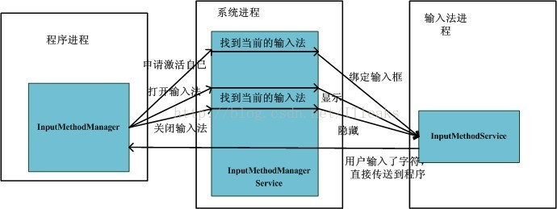

---

title: InputManagerService与keyboard学习分析
date: 2019-05-08 10:14:38
categories: codenote
tags: [Android, framworks, Service, keyboard]

typora-copy-images-to: InputManagerService与keyboard学习分析
---
InputManagerService与keyboard学习分析
<!--more-->

首先梳理一下输入法机制工作的大致流程

### 输入法框架

流程图大致如下：

### 输入法主体

- `InputMethodManager`(以下简称`IMM`)位于应用程序进程，应用程序通过它与`InputMethodManagerService`和`InputMethodService`进行数据交互。并且每个应用程序都有一个`InputMethodManager`实例
- `InputMethodManagerService`(以下简称`IMMS`)位于系统进程，负责管理手机内的所有输入法，包括输入法Service（`InputMethodService`简称`IMS`）的加载与切换。
- `InputMethodService`(以下简称IMS)是输入法进程，代表了输入法服务，它有以下几个特点
  - 系统可以有多个输入法，但只能有一个是激活的
  - 输入法可以被用户切换
  - 输入法以service的方式运行
  - 输入法同一时间只能服务一个程序
  - 最顶层可见程序才能接收输入法的输入数据

### 大致流程

- 程序获取焦点时，通过IMM向IMMS通知自己获得了焦点并且请求绑定自己到当前输入法上
- 当程序的某个view需要使用到输入法的时候，比如EditorView获得焦点，就会通过IMM向IMMS请求显示输入法
- IMMS收到请求后，将请求的EditText的数据接口发送给当前输入法，并请求显示输入法
- 输入法收到请求后，显示自己的UI dialog，同时保存目标view的数据结构
- 当用户实现输入后直接通过view的数据通信接口将字符传递到对应的View
- View收到字符后便将字符信息存储并显示给用户
