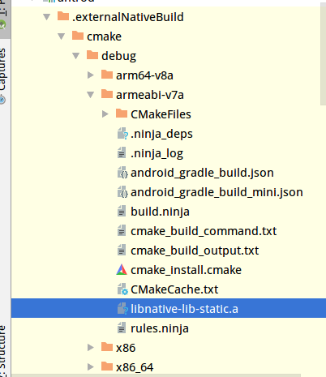

<!--more-->
## 在Android Studio下使用cmake编译出静态链接库的方法

这个是个巨坑，目前还没有找到真正有效的方法利用cmake的途径获取适用于Android平台下的`.a`文件，但找到一个比较讨巧的方法，是在[stackoverflow](https://stackoverflow.com/questions/52952226/how-to-create-a-static-library-a-file-in-android-studio-3-2-with-cmake)上面看到的一位外国人自问自答。

环境：

- Android Studio 3.2.1

- cmake3.6.4111459

首先得到的是默认的CMakeLists.txt如下：

```cmake
cmake_minimum_required(VERSION 3.4.1)

add_library( 
        native-lib
        SHARED
        src/main/cpp/native-lib.cpp)

find_library( 
        log-lib
        log)

target_link_libraries( 
        native-lib
        ${log-lib})
```

如果我们将`SHARED`变为`STATIC`，事实上我们将不会得到任何的库文件(不仅仅`.a`，连`.so`文件都没有)，个人认为出现这么不方便的问题应该是AndroiStudio或Gradle的问题。

解决问题的方法如下：

使用上面的代码我们已经可以得到`.so`文件了，然后我们加入以下代码获得`.a`文件，并使用和获得`.so`文件时使用的源文件一样：

```cmake
add_library(
        native-lib-static
        STATIC
        src/main/cpp/native-lib.cpp
)
```

`native-lib-static`可以换成任何你想要的名称，但是不可以是和动态链接库的名称一样。

然后再修改你的`target_link_libraries`如下

```CMAKE
target_link_libraries(
        native-lib
        native-lib-static
        ${log-lib})
```

再构建项目：

`Gradle->app->build->assembleDebug/assembleRelease`

最后你就可以在`app\.externalNativeBuild\cmake\debug(release)\<abi>\libnative-lib-static.a`获得你想要的`.a`文件了。



期待谷歌能对这块改善一下吧，over