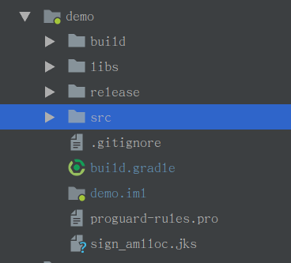

签名脚本记录
<!--more-->


## 在Android Studio项目中使用build.gradle进行签名

- 将`.jks`签名文件放在项目模块文件夹下(签名文件可在`Build->Generte signed apk->Create new...`新建`)



- 在模块下的`build.gradle`添加如下配置

  ```groovy
  
  android {
      
      ...
  
      signingConfigs {
          release {
              storeFile file("sign_amlloc.jks")
              storePassword 'xxxxxxx'
              keyAlias 'yyyyyyyyy'
              keyPassword 'xxxxxxxxx'
          }
  
          debug {
              storeFile file("sign_amlloc.jks")
              storePassword 'xxxxxxx'
              keyAlias 'yyyyyyy'
              keyPassword 'xxxxxxxxx'
          }
      }
  
       buildTypes {
          release {
              minifyEnabled false
              proguardFiles getDefaultProguardFile('proguard-android.txt'), 'proguard-rules.pro'
              signingConfig signingConfigs.release
          }
  
          debug {
              signingConfig signingConfigs.debug
          }
      }
      ...
  }
  ```

- 此后编译出来的`release`和`debug`版本的app便会使用对应的签名文件进行签名