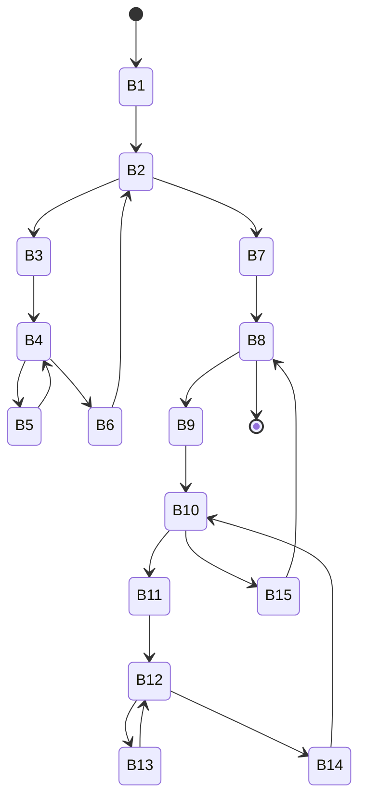

龙书习题8.4

<!--more-->

## 8.4.1

Figure 8.10 is a simple matrix-multiplication program.

1. Translate the program into three-address statements of the type we have been using in this section. Assume the matrix entries are numbers that require 8 bytes, and that matrices are stored in row-major order.
2. Construct the flow graph for your code from (a).
3. Identify the loops in your flow graph from (b).

```
for (i=O; i<n; i++)
    for (j=O; j<n; j++)
        c[i][j] = 0.0;
for (i=O; i<n; i++)
    for (j=O; j<n; j++)
        for (k=O; k<n; k++)
            c[i][j] = c[i][j] + a[i][k]*b[k][j];
```

### Answer

1.three-address statements

```
B1	1) i = 0
B2	2) if i >= n goto 13)
B3	3) j = 0
B4	4) if j >= n goto 11)
B5	5) t1 = n * i
	6) t2 = t1 + j
	7) t3 = t2 * 8
	8) c[t3] = 0.0
	9) j = j + 1
	10)goto 4)
B6	11)i = i + 1
	12)goto 2) 
B7	13)i = 0
B8	14)if i >= n goto 39)
B9	15)j = 0
B10	16)if j >= n goto 37
B11	17)k = 0
B12	18)if k >= n goto 35)
B13	19)t1 = i * n
	20)t2 = t1 + j
	21)t3 = t2 * 8
	22)t4 = t1 + k
	23)t5 = t4 * 8
	24)t6 = k * n
	25)t7 = t7 + j
	26)t8 = t8 * 8
	27)t9 = c[t3]
	28)t10 = a[t5]
	29)t11 = b[t8]
	30)t12 = t10 * t11
	31)t13 = t10 + t12
	32)c[t3] = t13
	33)k = k + 1
	34)goto 18)
B14	35)j = j + 1
	36)goto 16)
B15	37)i = i + 1
	38)goto 14)
out	39)...
```

2.flow graph


1. loops
   - {B2, B3, B4, B6}
   - {B4, B5}
   - {B8, B9, B10, B15}
   - {B10, B11, B12, B14}
   - {B12, B13}