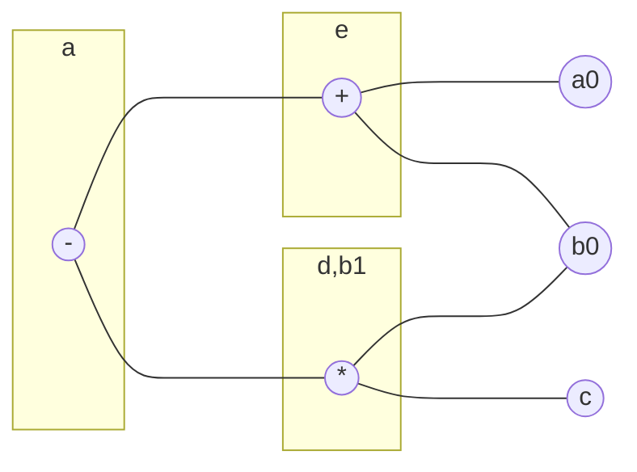
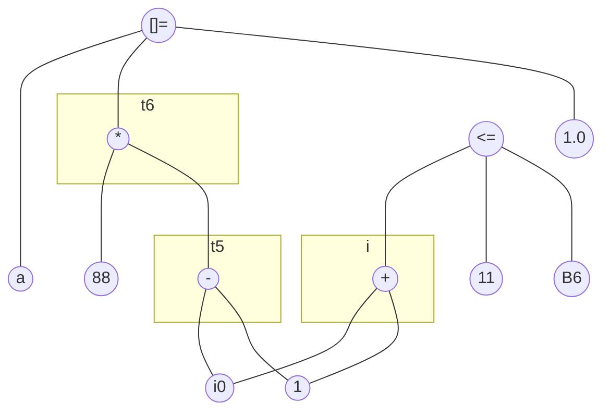

龙书习题8.5

<!--more-->

## 8.5.1

Construct the DAG for the basic block

```
d = b * c
e = a + b
b = b * c
a = e - d
```
### Answer


## 8.5.2

Simplify the three-address code of Exercise 8.5.1, assuming

1. Only a is live on exit from the block.
2. a, b, and c are live on exit from the block.

### Answer

1. ```
   e = a + b
   d = b * c
   a = e - d
   ```

2. ```
   e = a + b
   b = b * c
   a = e - b
   ```

## 8.5.3

Construct the basic block for the code in block B6 of Fig. 8.9. Do not forget to include the comparison i <= 10.


### Answer



## 8.5.8

Suppose a basic block is formed from the C assignment state­ments

```
x = a + b + c + d + e + f;
y = a + c + e;
```

1. Give the three-address statements (only one addition per statement) for this block.
2. Use the associative and commutative laws to modify the block to use the fewest possible number of instructions, assuming both x and y are live on exit from the block.

### Answer

1. three-address statements

   ```
   t1 = a + b
   t2 = t1 + c
   t3 = t2 + d
   t4 = t3 + e
   x = t4 + f
   t5 = a + c
   y = t5 + e
   ```

2. optimized statments

   ```
   t1 = a + c
   t2 = t1 + e
   y = t2
   t3 = t2 + b
   t4 = t3 + d
   t5 = t4 + f
   x = t5
   ```

   