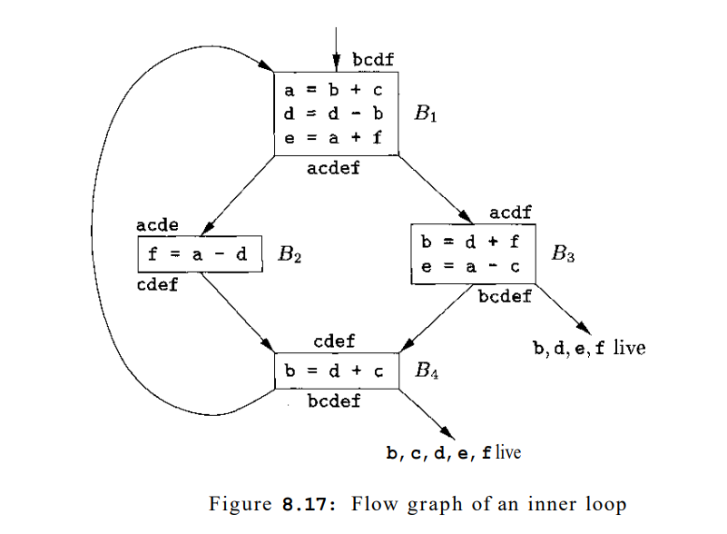

龙书习题8.8

<!--more-->

## 8.8.1

 Construct the register-interference graph for the program in Fig. 8.17. 

## 8.8.2

Devise a register-allocation strategy on the assumption that we automatically store all registers on the stack before each procedure call and restore them after the return.