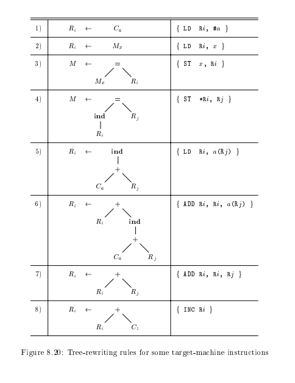
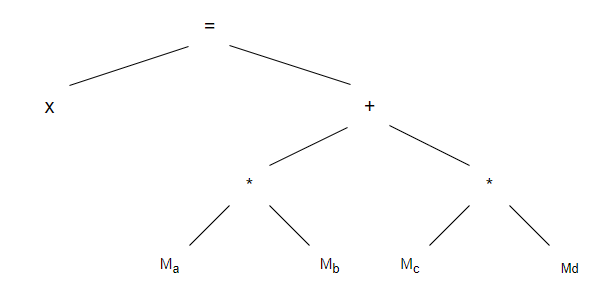
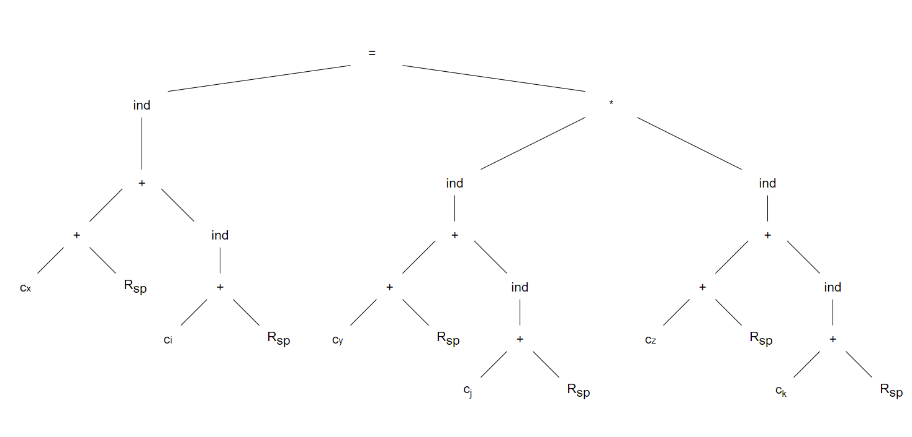
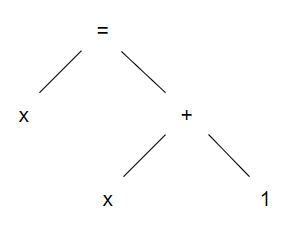

龙书习题8.9

<!--more-->

一些目标机指令的树重写规则



## 8.9.1

Construct syntax trees for each of the following statements assuming all nonconstant operands are in memory locations:

a) x = a * b + c * d;

b) x[i] = y[j] * z[k];

c) x = x + 1;

Use the tree-rewriting scheme in Fig. 8.20 to generate code for each statement.

a)x = a * b + c * d;



```
LD R0, a
LD R1, b
MUL R0, R0, R1
LD R2, c
LD R3, d
MUL R2, R2, R3
ADD R0, R0, R2
ST x, R0
```

b) x[i] = y[j] * z[k];



```
LD R0, Cy
ADD R0, R0, Rsp
ADD R0, R0, j(Rsp)
LD R1, Cz
ADD R1, R1, Rsp
ADD R1, R1, k(Rsp)
MUL R0, R0, R1
LD R2, Cx
ADD R2, R2, Rsp
ADD R2, R2, i(Rsp)
ST *R2, R0
```

c) x = x + 1;



```
LD R0, x
ADD R0, R0, 1
ST x, R0
```

