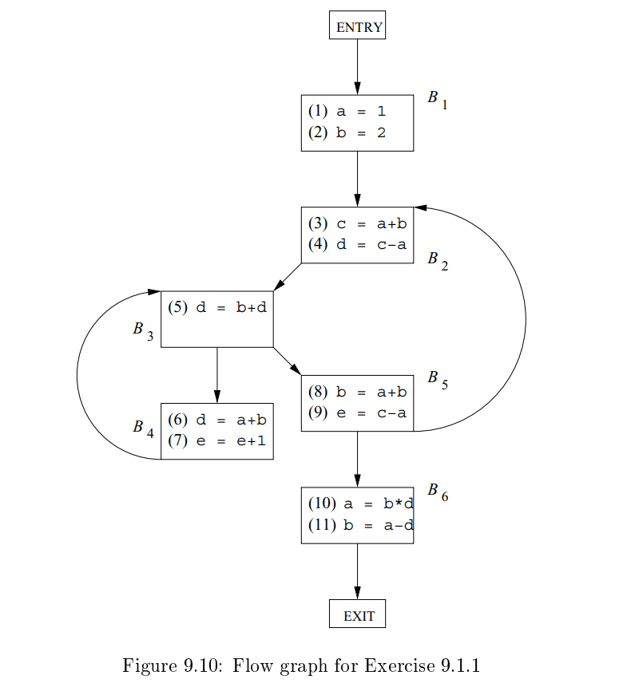
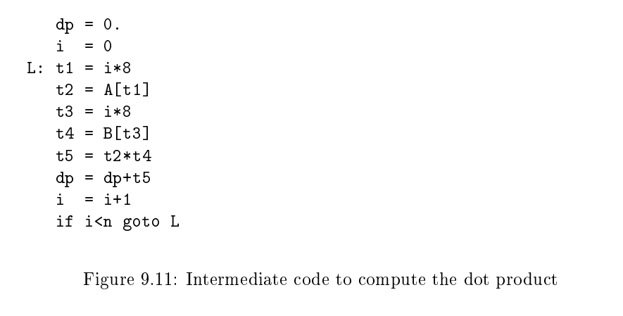
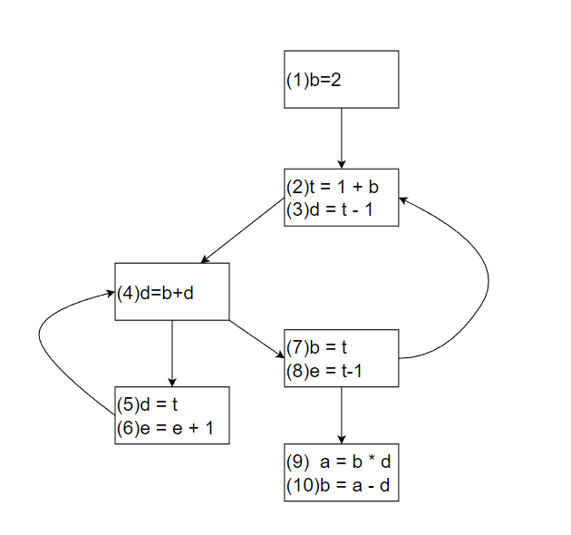
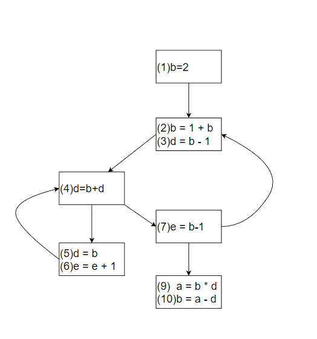

龙书习题9.1

## 9.1.1

For the ow graph in Fig. 9.10:



a) Identify the loops of the ow graph.

b) Statements (1) and (2) in B1 are both copy statements, in which a and b are given constant values. For which uses of a and b can we perform copypropagation and replace these uses of variables by uses of a constant? Doso, wherever possible.

c) Identify any global common subexpressions for each loop.

d) Identify any induction variables for each loop. Be sure to take into account any constants introduced in (b). 

e) Identify any loop-invariant computations for each loop.

### Answer

a){B2,B3,B5},{B3,B4},{B2,B3,B4,B5}

b)a可以在B2,B4,B5,B6进行复制传播。单独的b不可以进行复制传播，因为定值(8)会杀死定值(2)，但(8)对于其他程序点都是可达的。

如果已经对a进行复制传播，即把B6以外的表达式中的a都用1来代替，则改造后的flow graph中的b+1是可以复制传播的：即在B2一开始增加一个表达式：t=b+1，然后将b+1替换成t。

c) {B2,B3,B5}：a+b,c-a

{B3,B4}:没有公共子表达式

{B2,B3,B4,B5}：a+b,c-a

d)经过b),c)的优化后：



发现t成为了归纳变量，即每次赋值都是被+1的，所以可以用b把t给替代掉，优化后得：



## 9.1.2

Apply the transformations of this section to the ow graphof Fig. 8.9.

## 9.1.3

Apply the transformations of this section to your ow graphs from (a) Exercise 8.4.1; (b) Exercise 8.4.2.

## 9.1.4

In Fig. 9.11 is intermediate code to compute the dot product of two vectors A and B. Optimize this code by eliminating common subexpressions, performing reduction in strength on induction variables, and eliminatingall the induction variables you can.



### Answer

```
  dp = 0
  i = 0
  m = n * 8
L:i = i + 8
  t2 = A[i]
  t4 = B[i]
  t5 = t2 * t4
  dp = dp + t5
  if i < m goto L
```

公共子表达式，优化`i * 8`->死代码消除,优化`t3`->归纳变量->强度消减优化`i * 8`，代码外提优化`n* 8`

