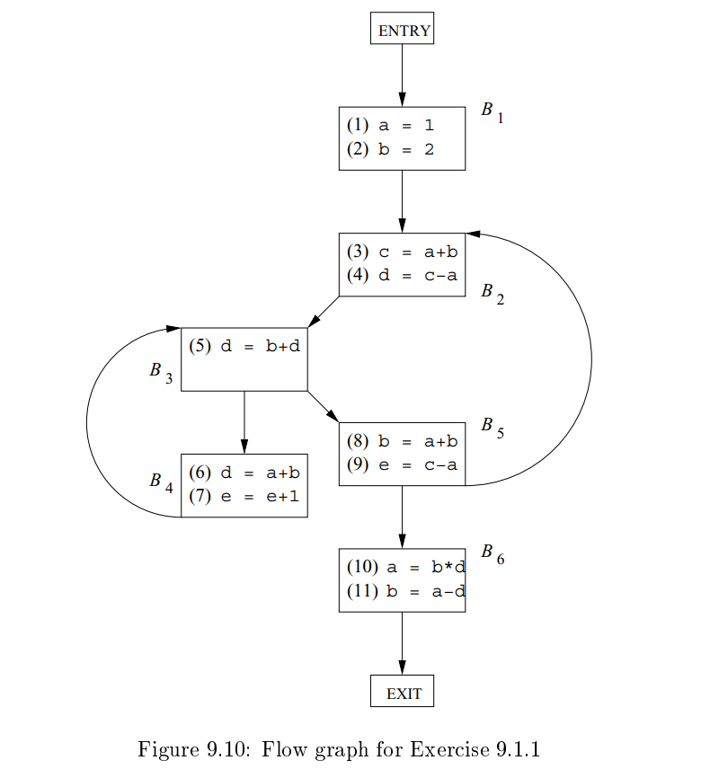

龙书习题9.2

## 9.2.1

For the ow graph of Fig. 9.10 (see the exercises for Section 9.1), compute 

a) The gen and kil l sets for each block. 

b) The IN and OUT sets for each bloc

### Answer

a)
$gen_{B1} = \{(1),(2)\}=11000000000 $
$kill_{B1}~ = \{(10),(11)\}=00000000011$

$gen_{B2} = \{(3),(4)\}=00110000000$
$kill_{B2} = \{(5),(6)\}=00001100000$

$gen_{B3} = \{(5)\}=00001000000 $
$kill_{B3} = \{(4),(6)\}=00010100000$

$gen_{B4} = \{(6),(7)\}=00000110000 $
$kill_{B4} = \{(4),(5),(9)\}=00011000100$

$gen_{B5} = \{(8),(9)\}=00000001100 $
$kill_{B5} = \{(2),(11),(7)\}=01000010001$

$gen_{B6} = \{(10),(11)\}=00000000011$
$kill_{B6} = \{(1),(2),(8)\}=11000001000$

b)到达定值的迭代算法
$$
OUT[ENTRY]=\emptyset
$$
且对于所有不等于`ENTRY`的基本块，有
$$
OUT[B]=gen_B\cup(IN[B]-kill_B)
$$

$$
IN[B]=\bigcup_{P是B的一个前驱基本块}OUT[P]
$$

这里只算第一第二轮。

| Block B | OUT[B]^0^   | IN[B]^1^                                    | OUT[B]^1^                                           | IN[B]^2^      | OUT[B]^2^     |
| ------- | ----------- | ------------------------------------------- | --------------------------------------------------- | ------------- | ------------- |
| B~1~    | 00000000000 | $OUT[ENTRY]=00000000000$                    | $gen_{B1}=11000000000$                              | $00000000000$ | $11000000000$ |
| B~2~    | 00000000000 | $OUT[B_1]^1\bigcup OUT [B_5]^0=11000000000$ | $gen_{B2}\bigcup (IN[B_2]^1-kill_{B2})=11110000000$ | $11111001110$ | $11110001110$ |
| B~3~    | 00000000000 | $OUT[B_2]^1\bigcup OUT [B_4]^0=11110000000$ | $gen_{B3}\bigcup (IN[B_3]^1-kill_{B3})=11101000000$ | $11110111110$ | $11100011110$ |
| B~4~    | 00000000000 | $OUT[B_3]^1=11111010011$                    | $gen_{B4}\bigcup (IN[B_4]^1-kill_{B4})=11100110000$ | $11100011110$ | $11100111010$ |
| B~5~    | 00000000000 | $OUT[B_3]^1=11111010011$                    | $gen_{B5}\bigcup (IN[B_5]^1-kill_{B5})=10111001110$ | $11100011110$ | $10100001110$ |
| B~6~    | 00000000000 | $OUT[B_5]^1=10111001110$                    | $gen_{B6}\bigcup (IN[B_6]^1-kill_{B6})=00111000111$ | $10100001110$ | $00100000111$ |
| Exit    | 00000000000 | $OUT[B_6]^1=00111000111$                    | $IN[Exit]=00111000111$                              | $00100000111$ | $00100000111$ |