---

title: 程序员的自我修养笔记
date: 2018-12-27 23:36:40
categories: codenote
tags: [OS, Linux]

typora-copy-images-to: 程序员的自我修养笔记
---

《程序员的自我修养笔记》 1

<!--more-->

### 第二章

程序源代码到最终可执行文件的4个步骤：

- 预编译

主要处理那些源代码文件中以"#"开始的预编译指令

`gcc -E hello.c -o hello.i`

- 编译

对预编译生成的文件进行词法分析，语法分析，语义分析，中间语言生成，目标代码生成及优化生成汇编代码文件

`gcc -S hello.i -o hello.s`

- 汇编

汇编器将汇编代码转换成可执行指令,输出目标文件

`as hello.s -o hello.o`或者`gcc -c hello.s -o hello.o`或者`gcc -c hello.c -o hello.o`

- 链接

`ld -static crt1.o crti.o crtbeginT.o -start-gruoup -lgcc -lgcc_eh -lc-end-group crtend.o crtn.o`

这里省略了各文件的路径

链接过程主要有如下步骤：

- 地址和空间分配
- 符号决议
- 重定位

### 第三章

#### 目标文件格式

- 可重定位文件(Relocatable File)
- 可执行文件(Executable File)
- 共享目标文件(Shared Object File)
- 核心转储文件(Core Dump File)

>在Linux下可使用file命令显示文件格式

#### 目标文件与程序之间的关系

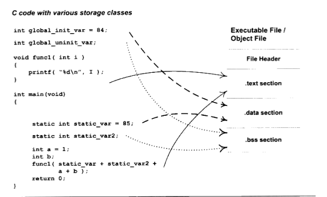

- 程序源代码编译后的机器指令被放在代码段(.code或者.text)里面
- 全局变量和局部静态变量放在数据段(.data)
- 未初始化全局变量和未初始化局部静态变量，或者有些编译器也会将初始化为0的变量也放置在.bss段

> 查看目标文件内部的结构可以使用objdump工具，可看到对应的各个段大致结构(-h)，各个段详细内容(-x)，代码段内容(翻译成了汇编语言)(-s -d)

#### 其他段内容

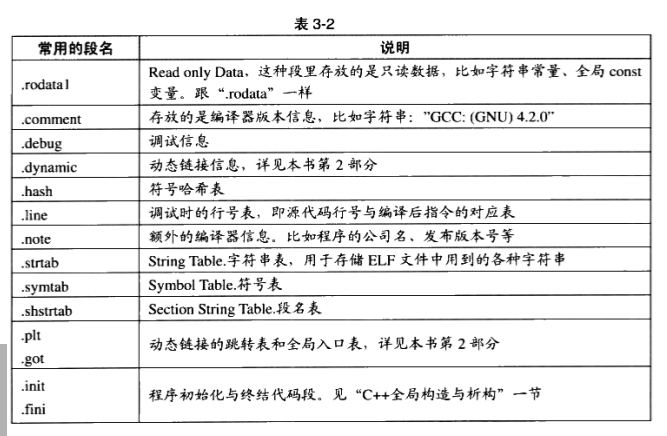

- 将某个二进制文件作为目标文件的一个段

  `objcopy -I binary -o elf32-i386 -B i386 image.jpg image.o`

- 将某个变量放在特定段

  `__attribute__((section("FOO"))) int global = 42`

  `__attribute__((section("BAR"))) void foo()`

### 第四章静态链接

#### 空间与地址分配

- 相似段合并

  - 空间与地址分配

    扫描所有输入目标文件，并获得他们各个段的长度、属性和位置，并将输入目标文件中的符号表所有的符号定义和符号引用收集起来，放到全局符号表中。于是，链接器将获取所有输入目标文件的段长度，并将他们合并，计算输出文件中各个段合并后的长度和位置，建立映射关系。

  - 符号解析与重定位

    利用上一步的信息进行段的数据，读取段数据，重定位信息，进行符号解析与重定位、调整代码中的地址等。

  如下图：

  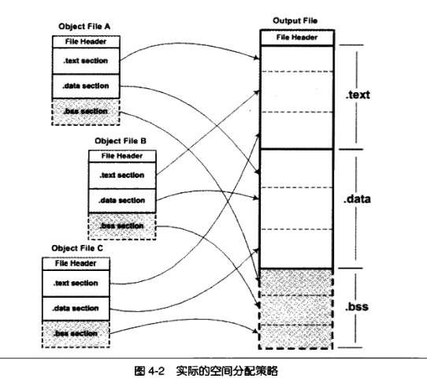


编写程序：

```c
/*a.c*/

extern int shared;

int main(){
	int a = 100;
	swap(&a, &shared);
	return 0;
}
```

```c
/* b.c */
int shared = 1;

void swap(int *a, int *b){
	*a ^= *b  ^= *a ^=*b;
}
```

- `objdump -h a.o`

  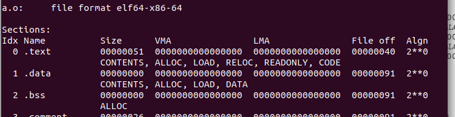

- `objdump -h b.o`

  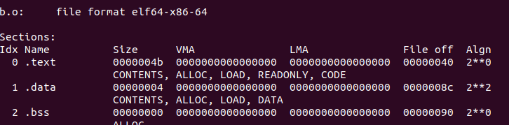

- 链接两个文件`ld a.o b.o -e main -o ab -lc`

  > 在我的机器上面需要加上-lc参数才能链接成功，不然报a.c:(.text+0x4b): undefined reference to `__stack_chk_fail错误，具体原因不明，
  >
  > -c:				从指定的命令文件读取命令
  >
  > -l:				把指定的存档文件添加到要连接的文件清单
  >
  > 得到的可执行文件不只是简单的链接过程，跟书中的内容有差异，有大神知道麻烦赐教

- `objdump -h ab`

  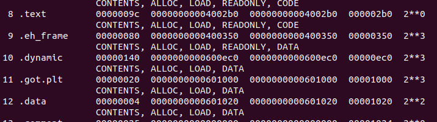

  可以看出，合并后得到的ab文件的`.text`段和`.data`段的长度分别是9c和4，正好等于两个.o文件相应段的长度之和。


#### 符号解析与重定位

##### 重定位

重定位是静态链接的核心内容，首先看`a.o`里面是如何访问调用外部符号(`shared`变量和`swap`函数)

- 使用`objdump -d` 命令查看`a.o`反编译代码

  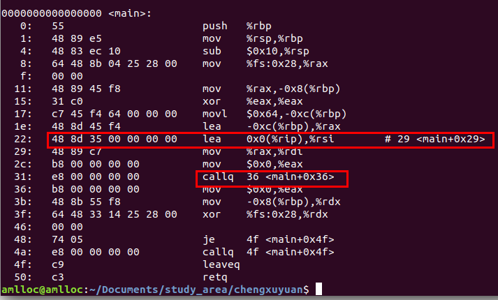

- `objdump -d ab`

  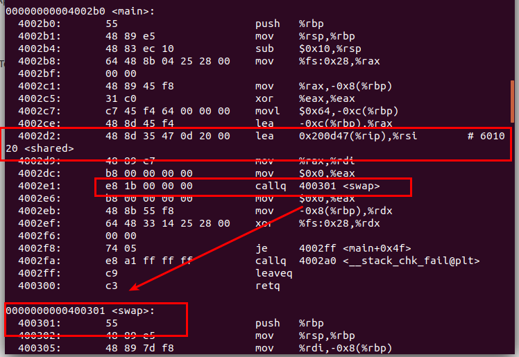


其中`main`起始地址为0x0，共占用0x50个字节，最左边那列代表偏移量偏移量为22和31的地方便是分别引用`sharead`变量和`swap`函数的位置。

- `a.o`中引用`shared`代码为`lea 0x0(%rip),%rsi`，是将`rip寄存器的值+0`直接传递给`rsi`寄存器，这是因为还无法查找符号`shared`的位置，使用0x0代替，后面链接完成之后,ab文件就将`0x0`替换为`0x200d47`，加上rsi寄存器的值，计算后也就是`shared`的地址`0x0601020`，可使用`objdump -s ab`在`data段`内看到该变量的值。

- 引用`swap`函数的代码为`callq 36 <main+0x36>`，既下一条指令的地址，ab文件则会直接将`swap`地址`0x400301`填入，变成`	callq  400301 <swap>`。

- 但是第二次试验，是在公司电脑，我得到的是如下结果

  

  

  也就是说，没有相对寻址了，这让我有点纳闷，`swap`函数地址也是,不同于家里电脑生成的指令。

总之，就是当文件并没有链接之前，遇到了不认得的符号时，编译器把地址0x0和下一条指令的地址作为代替，等链接完成地址和空间的分配后，就已经可以确定所有符号的虚拟地址了，此时链接器再将所有需要重定位的指令进行地址修复。

##### 重定位表

重定位表专门用于保存与重定位相关的信息，它在ELF文件中往往是一个或者多个段。对于可重定位ELF文件来说，一个重定位表往往就是ELF文件中的一个段，所以重定位表也可以叫做重定位段。比如，代码段“.text”如果有要被重定位的地方，那么就会有一个相对应的“.rel.text”的段保存代码段的重定位表，可使用objdump来查看目标文件的重定位表：

`objdump -r a.o`

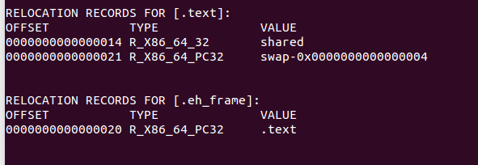

- 每个要被重定位的地方叫做重定位入口，我们可以看到”a.o“有两个**重定位入口(Relocation Entry)**。
- **偏移**：表示该入口在段中的位置
- `RELOCATION RECORDS FOR [.text]`表示这个重定位表是代码段的重定位表

重定位表的结构是一个`Elf64_Rel or Elf32_Rel`结构，如下

```c
struct Elf32_Rel
{
  Elf32_Addr  r_offset;  /* Address */
  Elf32_Word  r_info;    /* Relocation type and symbol index */
};
struct Elf64_Rel
{
  Elf64_Addr  r_offset;  /* Address */
  Elf64_Xword r_info;    /* Relocation type and symbol index */
};
```

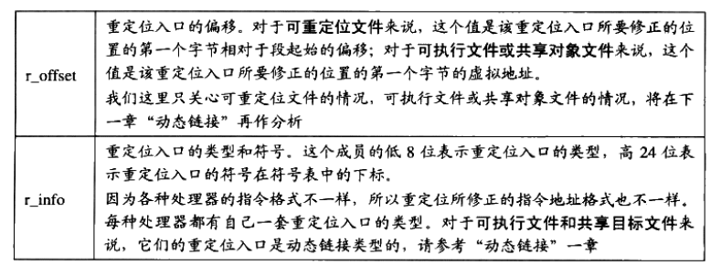

#### 符号解析

链接是因为我们的目标文件中用到的符号被定义在其他目标文件当中，如果我们直接使用ld来链接“a.o”，而不将“b.o”作为输入，则会出现`shared`和`swap`两个符号未定义的情况：

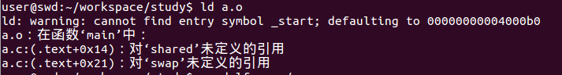

在开发过程中，发生这种情况的原因有很多，最常见的情况一般都是链接时缺少某个库文件或者输入目标文件路径不正确或者符号的声明和定义不一样。因此，从普通程序员的角度看，**符号的解析占据了链接过程的主要内容**。

其实，重定位过程也伴随着符号的解析过程，每一个目标文件都可能定义一些符号，也可能引用到定义在其他目标文件的符号。重定位过程中，每个重定位的入口都是对一个符号的引用，当连接器需要对某个符号的引用进行重定位时，就要确定这个符号的目标地址。此时，链接器就会去查找所有输入目标文件的符号表组成的全局符号表，找到对应的符号后进行重定位。

比如查看“a.o”的符号表

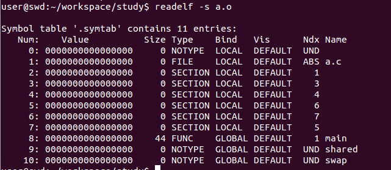

其中UND表示`undefined`未定义类型。这种未定义的符号是因为该目标文件中有关于他们的重定位项。所以链接器扫描完所有输入目标文件之后，这些未定义的符号都应该可以在全局符号表中找到，否则就会报符号未定义错误。

#### 指令修正方式

不同的处理器指令对与地址的格式和方式都不一样。但总的来说寻址方式有如下几个方面：

- 近址寻址或远址寻址

- 绝对寻址或相对寻址

- 寻址长度为8位、16位、32位或64位

  但是对于32位x86平台下ELF文件重定位入口所修正的指令寻址方式只有两种：

- 绝对近址32位寻址

- 相对近址32位寻址

书中的寻址方式是这个：

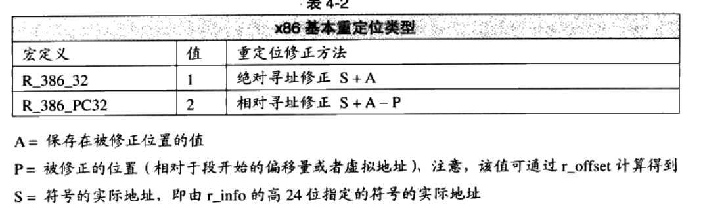

但是我机器是64位的，寻址方式是这个：

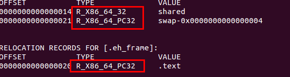

也就是`R_X86_64_32`和`R_X86_64_PC32`，网上也没找到对应的资料，哪位大佬如果知道恳请指导，或者在git上面提issue。

不过我研究了一下，`R_X86_64_32`的寻址方式