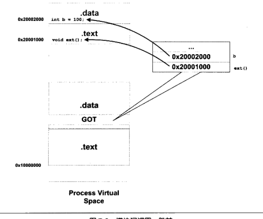

《程序员的自我修养笔记之动态链接》 3

动态链接原理

<!--more-->

#### 动态链接产生的原因

- 节省内存和磁盘空间
- 便于程序的开发，发布和更新
- 程序可扩展性和兼容性，可被人们用来制作程序插件

#### 动态链接的基本实现

##### 基本思想

把程序按照模块分拆开来形成各个相对独立的部分，在程序运行时将它们链接在一起形成一个完整的程序，静态链接则把所有程序模块都链接成一个单独的可执行文件。

##### 基本概念

Linux系统中，ELF动态链接万剑被称为**动态共享对象(DSO，Dynamic Shared Objects)**，简称**共享对象**，它们们一般都是以“.so”为扩展名。Windows中动态链接文件被称为**动态链接库（Dynamical Linking Library）**，它通常就是平时见到的以".dll"为扩展名的文件

##### 动态链接器

程序与so文件之间真正的链接工作由动态链接器完成，而不是ld完成。

#### 简单例子
Program1.c
```c
#include "Lib.h"

int main(int argc, char const *argv[])
{
	foobar(1);
	return 0;
}
```
Program2.c
```c
#include "Lib.h"

int main(int argc, char const *argv[])
{
	foobar(2);
	return 0;
}
```
Lib.c

```c
#include <stdio.h>

void foobar(int i){

printf("Printing from Lib.so %d \n", i );
sleep(-1);
}
```
Lib.h
```c
#ifndef LIB_H
#define LIB_H

void foobar(int i);

#endif
```

`gcc -fPIC -shared -o Lib.so Lib.c`

`gcc -o Program1 Program1.c ./Lib.so `

`gcc -o Program2 Program2.c ./Lib.so `

可以从图中看到相应动态链接库在进程中的内存映射


`readelf -l Lib.so`


可以看到动态链接模块的装载地址从`0x0`开始，这是因为**共享对象最终装载地址在编译时是不确定的**，而是装载器根据当前地址空间的空闲情况，动态分配一块足够大的虚拟地址空间给到相应的共享对象。

#### 地址无关代码

为了解决静态链接会发生装载的模块目标地址产生冲突的问题(也就是模块A与模块C目标被分配到了相同地址)的问题，提出**装载时重定位**和**地址无关代码**

- 装载时重定位

  `gcc  -shared -o Lib.so Lib.c`

  当模块在装载时，装载地址确定，也就表示目标地址确定，系统只要对程序中所有的绝对地址引用进行重定位即可。但缺点在于，由于指令部分也跟着被重定位，指令无法在多个进程内共同使用这样就失去了动态链接节省内存的一大优势。

- 地址无关代码（PIC）

  `gcc -fPIC -shared -o Lib.so Lib.c`

  - 目的：保证程序模块中指令部分在装载时不需要因为装载地址的改变而改变
  - 做法：分离指令中需要被修改的部分，并将其与数据部分放在一起，这样指令部分就可以保持不变，而数据部分在每个进程里都拥有一个副本

  这样我们就可以知道，模块引用分如下四个类型

  - 模块内部的函数调用、跳转等
  - 模块内部的数据访问，比如模块中定义的全局变量，静态变量g
  - 模块外部的函数调用、跳转等
  - 模块外部的数据访问，如其他模块中的全局变量

  

##### 类型一 模块内调用或者跳转

使用相对地址调用或者基于寄存器的相对调用


其中`0xffffffcc`是十进制`-52`的补码，也就是说，此条指令的下一条指令地址`799 `再减去`(-52)`得到`foo()`函数的地址。

##### 类型二 模块内数据访问

由于三级流水的工作原理，rip寄存器地址指向的是下一条指令所在地址，计算方式实质上是以相对地址寻址的方式进行。


##### 类型三 模块间数据访问

如上图b变量，所在地址值为`0x08102000`，而貌似并不经过`.got`表。和书上不一样，但运行后的确能得到`so`里面的b值，然后`dumpobj -R`查看需要动态重定位的部分，得到如下数据：


这与书中一样，但可以肯定的是，这个信息告诉了操作系统，这个数据可以从别的文件中的数据进行初始化。

于是作一个猜想，如果多个模块中具有相同符号的`extern`变量会发生什么呢？

编写第三个模块`fpic3.so`

```c
extern int b = 10;
```

如果不进行链接，则结果b的值为0：


然后链接顺序为先链接`fpic2.so`再链接`fpic3.co`，得到结果是拿到`fpic3.so`里面的b值：

改变链接顺序，则拿到的是`fpic2.so`里面的b值：


这里可以得出一个结论，**如果标记为`extern`的变量，他会告诉操作系统，这个值可以在其他模块中寻找对应的值进行初始化，其值为最后一个链接的模块中对应的值，如果没有发现，则为0，这样也解决了多个共享模块有相同全局符号变量的问题。**

##### 类型四 模块中调用跳转

这种情况要复杂得多，这里出现两个概念：**GOT表**和**plt表**

- GOT表： Global Offset Table，全局偏移表
- PLT表： Procedure Linkage Table，程序联动表，由一个个小段代码组成，这个是延迟绑定技术中不可或缺的部分

`foo()`函数调用`ext()`函数，首先跳转到plt表中的ext项：`ext@plt`


这里可以看到，`ext@plt`其实也是跳转到某个地方，也就是`0x200fd0`处：


发现这个地址位于`.got`表中位置所在值被初始化为`0x066060000`，具体含义目前未知。装载时这里的值会被改写为`ext()`的地址，操作系统根据这个地址进行跳转，原理如下

