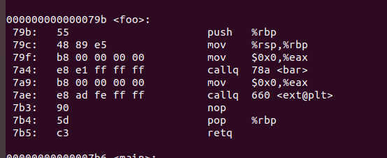

《程序员的自我修养笔记之动态链接》 3

动态链接原理

<!--more-->

#### 动态链接产生的原因

- 节省内存和磁盘空间
- 便于程序的开发，发布和更新
- 程序可扩展性和兼容性，可被人们用来制作程序插件

#### 动态链接的基本实现

##### 基本思想

把程序按照模块分拆开来形成各个相对独立的部分，在程序运行时将它们链接在一起形成一个完整的程序，静态链接则把所有程序模块都链接成一个单独的可执行文件。

##### 基本概念

Linux系统中，ELF动态链接万剑被称为**动态共享对象(DSO，Dynamic Shared Objects)**，简称**共享对象**，它们们一般都是以“.so”为扩展名。Windows中动态链接文件被称为**动态链接库（Dynamical Linking Library）**，它通常就是平时见到的以".dll"为扩展名的文件

##### 动态链接器

程序与so文件之间真正的链接工作由动态链接器完成，而不是ld完成。

#### 简单例子
Program1.c
```c
#include "Lib.h"

int main(int argc, char const *argv[])
{
	foobar(1);
	return 0;
}
```
Program2.c
```c
#include "Lib.h"

int main(int argc, char const *argv[])
{
	foobar(2);
	return 0;
}
```
Lib.c

```c
#include <stdio.h>

void foobar(int i){

printf("Printing from Lib.so %d \n", i );
sleep(-1);
}
```
Lib.h
```c
#ifndef LIB_H
#define LIB_H

void foobar(int i);

#endif
```

`gcc -fPIC -shared -o Lib.so Lib.c`

`gcc -o Program1 Program1.c ./Lib.so `

`gcc -o Program2 Program2.c ./Lib.so `

可以从图中看到相应动态链接库在进程中的内存映射


`readelf -l Lib.so`


可以看到动态链接模块的装载地址从`0x0`开始，这是因为**共享对象最终装载地址在编译时是不确定的**，而是装载器根据当前地址空间的空闲情况，动态分配一块足够大的虚拟地址空间给到相应的共享对象。

#### 地址无关代码

为了解决静态链接会发生装载的模块目标地址产生冲突的问题(也就是模块A与模块C目标被分配到了相同地址)的问题，提出**装载时重定位**和**地址无关代码**

- 装载时重定位

  `gcc  -shared -o Lib.so Lib.c`

  当模块在装载时，装载地址确定，也就表示目标地址确定，系统只要对程序中所有的绝对地址引用进行重定位即可。但缺点在于，由于指令部分也跟着被重定位，指令无法在多个进程内共同使用这样就失去了动态链接节省内存的一大优势。

- 地址无关代码（PIC）

  `gcc -fPIC -shared -o Lib.so Lib.c`

  - 目的：保证程序模块中指令部分在装载时不需要因为装载地址的改变而改变
  - 做法：分离指令中需要被修改的部分，并将其与数据部分放在一起，这样指令部分就可以保持不变，而数据部分在每个进程里都拥有一个副本

  这样我们就可以知道，模块引用分如下四个类型

  - 模块内部的函数调用、跳转等
  - 模块内部的数据访问，比如模块中定义的全局变量，静态变量g
  - 模块外部的函数调用、跳转等
  - 模块外部的数据访问，如其他模块中的全局变量

  

##### 类型一 模块内调用或者跳转

使用相对地址调用或者基于寄存器的相对调用


其中`0xffffffcc`是十进制`-52`的补码，也就是说，此条指令的下一条指令地址`799 `再减去`(-52)`得到`foo()`函数的地址。

##### 类型二 模块内数据访问

由于三级流水的工作原理，rip寄存器地址指向的是下一条指令所在地址，计算方式实质上是以相对地址寻址的方式进行。


##### 类型三 模块间数据访问

如上图b变量，所在地址值为`0x08102000`，而貌似并不经过`.got`表。和书上不一样，但运行后的确能得到`so`里面的b值，然后`dumpobj -R`查看需要动态重定位的部分，得到如下数据：


这与书中一样，但可以肯定的是，这个信息告诉了操作系统，这个数据可以从别的文件中的数据进行初始化。

于是作一个猜想，如果多个模块中具有相同符号的`extern`变量会发生什么呢？

编写第三个模块`fpic3.so`

```c
extern int b = 10;
```

如果不进行链接，则结果b的值为0：


然后链接顺序为先链接`fpic3.so`再链接`fpic2.co`，得到结果是拿到`fpic3.so`里面的b值：

改变链接顺序，则拿到的是`fpic2.so`里面的b值：


这里可以得出一个结论，**如果标记为`extern`的变量，他会告诉操作系统，这个值可以在其他模块中寻找对应的值进行初始化，其值为第一个链接的模块中对应的值，如果没有发现，则为0，这样也解决了多个共享模块有相同全局符号变量的问题。**

##### 类型四 模块间调用跳转

这种情况要复杂得多，这里出现两个概念：**GOT表**和**plt表**

- GOT表： Global Offset Table，全局偏移表
- PLT表： Procedure Linkage Table，程序联动表，由一个个小段代码组成，这个是延迟绑定技术中不可或缺的部分

`foo()`函数调用`ext()`函数，首先跳转到plt表中的ext项：`ext@plt`




这里可以看到，`ext@plt`其实也是跳转到某个地方，也就是`0x200fd0`处：


发现这个地址位于`.got`表中位置所在值被初始化为`0x066060000`，具体含义目前未知。装载时这里的值会被改写为`ext()`的地址，操作系统根据这个地址进行跳转，原理如下


#### 延迟绑定(PLT)

动态链接性能之所以比静态链接较慢，有如下几点原因

- 对全局和静态的数据访问需要进行复杂的GOT定位，然后间接寻址
- 对于模块间的调用则需要先定位后进行间接跳转
- 动态链接的链接工作需要在运行时完成，寻找并装载所需要的共享对象，然后进行符号查找地址重定位等

#####　延迟绑定的实现

为了尽可能解决动态链接的性能问题，ELF采用**延迟绑定（Lazy Binding）**的做法，基本思想就是当**函数第一次被用到时才进行绑定**，如果没有用到，则不进行绑定。

ELF使用**PLT**的方法来实现。举例子，`liba.so`需要调用`libc.so`的`bar()`函数，那么第一次调用时，需要动态链接器中的某个函数完成地址绑定工作，设此函数为`lookup()`，那么这个函数的参数应该至少是这样的`lookup(module, function)`，来识别哪个模块中的哪个函数进行绑定。在`Glibc`中，`lookup()`函数真正的名字叫做`_dl_runtime_resolve()`。

当调用某个外部模块的函数时，通常的做法应该是通过GOT中相应的项进行间接跳转。PLT为了实现延迟绑定，增加了一层间接跳转。

如上一节**模块间跳转**所述


在我的机器上面，实际上是只有一个参数的，然后一句句来看。

**TODO**

#### 动态链接相关结构

##### `.interp`段

存储声明此ELF文件链接时所需要的动态链接器所在路径，这个位置由ELF文件自己决定


##### `.dynamic`段

保存了ELF文件动态链接器所需要的基本信息，比如依赖哪些共享对象，动态链接表符号表未知，重定位表位置等。

其结构定义如下：

```c
typedef struct{
    Elf32_Sword d_tag;
    union{
        Elf32_Word d_val;
        Elf32_Addr d_ptr;
    } d_un;
} Elf32_Dyn;
```

由一个类型加上一个附加的数值或者指针，对于不同类型，后面的数值或者指针有着不同的含义，如下是常见类型值：


`readelf -d Lib.so`


查看依赖库

`ldd Program1`


##### 动态符号表(.dynsym)

`.dynsym`表只定义了动态链接相关的符号，对于模块内部的符号，比如模块内部的私有变量则不进行保存。而动态链接的模块经常同时拥有“.dynsym”和".symtab"两个表，且".symtab"保存了所有符号，包括“.dynsym”中的符号。为加快符号查找过程，往往还有辅助的符号**哈希表(.hash)**

`.dynstr`是动态符号字符串表，用于辅助动态链接。

查看动态符号表

`readelf -s Lib.so`


#####　动态链接重定位表

PIC模式编译的可执行文件或者共享对象，虽然代码段不需要重定位，但是数据段还包含了绝对地址的引用，这部分是从代码段中分离出来，变成GOT，而GOT是数据段的一部分，除了GOT以外，数据段可能还包含对绝对地址的引用。

##### 动态链接重定位相关结构

- .rel.dyn 是对数据引用的修正，修正位置为“.got”和数据段
- .rel.plt是对函数引用的修正，修正位置为“.got.plt”

`readelf -r Lib.so`

首先是在PIC模式下编译出来的so文件


`printf`和`sleep`符号位于.rela.plt中。

而偏移是位于`.got.plt`表中的:


这个时候我们就可以发现前面还有三项未知，书中称在32位下，是这样的


实际的PLT基本结构代码如下：


PLT在ELF文件中以独立的段存放，通常叫做“.plt”，因为本身是地址无关的代码，所以可以跟代码段等一起合并成一个可读可执行的“Segment”被装载入内存。

但我的64位机器上是明显对不上的，这里留个坑，先作个mark。

当动态链接器需要进行重定位时，首先查找`printf`的地址，然后将地址填入对应的`.got.plt`的位置，从而实现地址的重定位。

类似的`R_X86_64_GLOB_DAT`是对`.got`的重定位，你跟过去发现地址就是落在了`.got`表中。

而最后一个类型是`R_X86_64_RELATIVE`，这个类型实际是**基址重置(Rebasing)**，共享对象的数据段无法做到地址无关，但他可能会包含绝对地址的引用。如下：

```c
static int a;
static int* p = &a;
```

编译时共享对象地址从0开始，假设该静态变量a相对于起始地址的偏移为B，则p的值为B。装载之后，如果共享对象基址为A，则p的值应该是`A + B`

总结起来就是两种重定位方式：

- 装载时，函数符号具体地址根据`plt`的指引，直接填充到`.got`的对应位置。
- 装载时，绝对地址的引用具体地址根据`plt`的指引，以A+B的形式填充到`.data`的对应位置。

然后是非PIC方式编译的so。

emmm本机器上面好像不允许这么干了


书上的内容就将就着看了吧


##### 动态链接时进程堆栈初始化信息

进程初始化的时候，堆栈里面保存了关于进程执行环境和命令行参数等信息。不仅如此，堆栈里面还保存了动态链接器所需要的一些**辅助信息数组**。辅助信息的格式也是一种结构数组，它的结构被定义在"elf.h"：

```c
typedef struct{
    uint32_t a_type;
    union{
        uint32_t a_val;//为什么需要union包起来的原因可以忽略，历史遗留
    }a_un;
}Elf32_auxv_t;
```


#### 动态链接的步骤和实现

##### 动态链接器自举

由于动态链接器本身也是一个共享对象，因此它的重定位工作由谁来完成，是否可以依赖其他共享对象都是一个需要解决的问题，这类似于“鸡生蛋，蛋生鸡”的问题。

为了解决这个问题，动态链接器本身需要满足以下条件：

- 动态链接器本身不可以依赖其他任何共享对象
- 动态链接器需要的全局和静态变量的重定位工作由它自己本身完成

对于第一个问题，我们可以人为地控制，但第二个问题则需要我们用一段精巧的代码，完成这项艰巨的工作，又同时不能用到全局变量、静态变量以及调用函数（因为PIC模式中模块内部的函数调用跟模块外部的函数调用用法一致）。这中具有一定限制条件的启动代码往往称为**自举（Bootstrap）**

- 动态链接器的入口就是自举代码的入口，操作系统将进程控制权交给动态链接器时，动态链接器的自举代码就开始执行
- 自举代码首先会找到自己的GOT，第一个保存的就是`.dynamic`段的偏移地址，进而找到动态链接器本身的`.dynamic`。
- 通过`.dynamic`中的信息，自举代码就可以获得重定位表和符号表等，从而得到动态链接器本身的重定位入口，先将它们全部进行重定位。此时动态链接器代码才可以开始使用自己的全局变量和静态变量以及调用函数
- 自此，动态链接器才开始可以使用全局变量和静态变量，调用函数

##### 装载共享对象

完成自举后

- 动态链接器将可执行文件和链接器本身的符号表都合并到一个符号表中，我们可以称它为**全局符号表**
- 链接器开始依据`.dynamic`段中`DT_NEEDED`类型数据寻找可执行文件所依赖的共享对象
- 将共享对象的名字放入到装载集合当中
- 链接器开始从集合中取出一个所需要的共享对象的名字，找到文件并读取相应的ELF文件头和`.dynamic`段，然后将它相应的代码段和数据段映射到进程空间中
- 如果此ELF文件还依赖于其他共享对象。那么将以来的共享对象的名字放到装载集合当中，直到所有以来的共享对象都被装载进来

如果把依赖关系看成一个图的化，链接器可能使用深度优先或者广度优先搜索算法，比较常见的是广度优先。

###### 符号的优先级

这个问题在**地址无关代码**一节当中关于模块见数据访问这个部分有提到，而这里是上升到了符号优先级的概念

具体就是**当一个符号需要被加入全局符号表时，如果相同的符号名已经存在，则后加入的符号会被忽略**

###### 全局符号介入与地址无关代码

还是前面关于**地址无关代码**一节中关于第一类 模块内部调用或跳转的处理时，如果结合全局符号介入，这个问题就会变得比较复杂.以前面的`pic.c`为例：


因为`bar()`函数会被全局符号介入，因此当`foo()`函数调用`bar()`时，如果还是以相对地址调用的话，且由于全局符号的介入被其他模块中的同名函数覆盖，则相对地址部分就需要进行重定位了，这又与共享对象地址无关性相矛盾。因此`bar()`函数的调用只能当作模块外部符号处理，当`bar()`函数被覆盖，动态链接器只需要重定位`.got.plt`，不影响共享对象的代码段。

因此，为提高模块调用效率，可以把`bar()`变成编译单元的私有函数，也就是使用`static`关键字定义`bar()`函数，此时编译器就要确定`bar()`函数不被其他模块覆盖，就可以使用第一类的方法了。即模块内部调用指令。

##### 重定位和初始化

上述步骤完成之后，链接器开始重新遍历可执行文件和每一个共享对象的重定位表，并根据GOT/PLT进行重定位修正。

重定位完成后，如果某个共享对象有`.init`段，则动态链接器会执行`.init`段的代码，用以实现共享对象特有的初始化过程。`.finit`段依次类推。

但是，如果可执行文件也有`.init`段，动态链接器不会执行它，因为这`.init`和`.finit`段由程序初始化部分代码负责执行。

完成这重定位和初始化之后，所有的准备工作就宣告完成了，此时动态链接器将进程的控制权交给程序的入口并开始执行。

#### 结语

这部分主要是介绍Linux下动态链接的实现原理，这个与Android平台相比还是有一定区别的，特别是Linker部分，我也做过，网上也有很多关于Android linker源码的分析。好了，动态链接器部分也学完了，接下来就是Android相关实战了。

