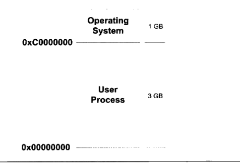

---

title: 程序员的自我修养笔记之装载
date: 2019-2-15 18:53:12
categories: codenote
tags: [OS, Linux]

typora-copy-images-to: 程序员的自我修养笔记之装载
---

《程序员的自我修养笔记之装载》 2

<!--more-->

###  可执行文件的装载与进程

介绍ELF文件在Linux下的装载过程，探寻可执行文件装载的本质

- 什么是进程的虚拟地址空间
- 为什么进程要有自己独立的虚拟地址空间
- 几种装载方式
- 进程虚拟地址空间的分布情况

#### 进程虚拟地址空间

32位硬件平台决定了虚拟地址空间的地址为0 到2^32 -1，即`0x00000000 ~ 0xFFFFFFFF`，也就是4GB的虚拟空间大小；而63位的硬件平台具有64位寻址能力，它的虚拟地址空间达到了2^64 字节，即`0x0000000000000000 ~ 0xFFFFFFFFFFFFFFFF`,总共`17179869184GB`。

而从程序的角度看，C语言中的指针所占空间可用于计算虚拟地址空间的大小，一般情况下，C语言指针大小的位数与虚拟空间的位数相同，如32位平台下的指针为32位，4字节。

以下以32为地址空间为主，64位作为扩展。

默认情况下Linux系统将进程的虚拟地址空间作如下分配：



其中的操作系统使用的空间，进程是不被允许访问的，且进程并不能完全使用剩下的3GB虚拟空间，其中一部分是预留给其他用途的。


##### PAE

Linux下Intel在1995年的Pentium Pro CPU便开始使用36位的物理地址，即可以访问64GB的物理内存。这时，操作系统只能有4GB的虚拟地址空间，无法全部读取完64GB的物理内存，而PAE就是为了解决这个问题出现的。

**PAE(Physical Address Extension)**是一种地址扩展方式，Inter修改了页映射的方式后，使得新的映射方式可以访问更多的物理内存。操作系统提供一个窗口映射的方法，将额外的内存映射进地址空间中。应用程序根据需要选择申请和映射。比如应用程序中的`0x10000000~0x20000000`这一段256MB的虚拟地址空间作为窗口，程序从高于4GB的物理空间中申请多个大小为256MB的物理空间，编号为A,B,C,然后根据需要将窗口映射到不同的物理空间块，用到A时将`0x10000000~0x20000000`映射到A，用到B,C时在映射过去，如此重复。在Windows下，这种内存操作方式为**AWE(Address Windows Extensions)**。像**Linux等UNIX系统则采用mmp()系统调用来实现**。

#### 装载方式

##### 覆盖装入

没有发明虚拟存储之前使用得比较广泛，现已几乎被淘汰。

覆盖装入的方法把挖掘内存潜力的任务交给了程序员程序员在编写程序时必须手动将程序分割成若干块，然后编写小的辅助代码管理这些模块何时驻留在内存，何时被替换。这个辅助代码被称为**覆盖管理器(Overlay Manager)**,比如下图


模块A与B之间相互没有调用依赖关系，因此两模块共享内存区域，当

使用A时则覆盖该内存，使用B时覆盖该内存，覆盖管理器则作为常驻内存。

多模块则如下，程序员需要手工将**模块按照它们之间的调用依赖关系组织成树状结构**。


因此覆盖管理器需要保证一下亮点。

- 树状结构中从任何一个模块到树的根（main）都叫调用路径，当模块被调用时，这个调用路径上的模块必须在内存之中。比如C模块正在执行时，B和main都需要在内存中，确保E执行完毕后能正确返回到模块B和main。

- 禁止跨树间调用

  任意模块不允许跨树状结构进行调用，比如A不可以调用B,E,F。但很多时候两个模块都依赖于同一个模块，如模块E和模块C需要另外一个模块G，则最方便的方法就是把模块G并入到main模块中，这样G就在E和C的调用路径上了。

#### 页映射

页映射是虚拟存储机制的一部分，随着虚拟存储的发明而诞生。

页映射将内存和所有磁盘中的数据及指令按照**页(Page)**为单位划分若干页，以后所有的装载和操作单位就是页。


假设程序所有的指令和数据总共32KB，那么程序被分为8页，并编号P0~P7。但16KB内存无法将32KB程序装入，此时将按照动态装入的原理进行装入过程。如果程序执行入口在P0则装载管理器发现程序的P0不在内存中，则将内存F0分配给P0，并将P0的内存扎un购入F0中。运行后使用P5，则将P4装入F1，以此类推，如下所示：


如果程序继续运行需要访问P4，则装载管理器必须选择放弃目前正在使用的4哥内存页中的其中一个来装载P4，放弃的算法有很多，如：

- FIFO先进先出，则放弃F0，P4装入F0
- LUR最少使用，则放弃F2，P4装入F2

等算法。而这里所谓的装载管理器就是现代的操作系统，准确说影视就是操作系统的存储管理器。

#### 从操作系统角度看可执行文件的装载并在进程中执行

##### 进程的建立

进程关键特征在于它**拥有独立的虚拟地址空间**。一个程序被执行，往往在最开始时需要做三件事：

- 创建独立的虚拟地址空间

  即创建映射函数所需要的相应的数据结构，而在i386的Linux下，创建虚拟地址空间实际上只是分配一个页目录，甚至不需要设置映射关系。也就是完成虚拟空间到物理内存的映射关系。

- 读取可执行文件头，建立虚拟空间与可执行文件的映射关系

  完成虚拟空间与可执行文件的映射关系，这一步是整个装载过程中最重要的一步，也就是传统意义上的“装载”。

  如图，考虑最简单的例子，虚拟地址如图，文件大小为0x000e1，对齐为0x1000。由于.text段大小不到0x1000，因此需要对齐。

  

  这种映射关系是保存在操作系统内部的一个**数据结构**。Linux将进程虚拟空间中的一个段叫做**虚拟内存区域(VMA.Virtual Memory Area)**。windows叫做**虚拟段(Virtual Section)**。在上面例子中，会在进程相应的数据结构中设置有一个.text段的VMA，它在虚拟空间中的地址为`0x08048000~0x08049000`对应ELF文件中偏移为0的.text，属性为只读。

- 将CPU的指令寄存器设置成可执行文件的入口地址，启动运行

##### 页错误

上述步骤执行完后，只是通过可执行文件头部信息建立起可执行文件和进程虚存之间的映射关系，并没有将可执行文件的指令和数据装入内存。

假设在上面的例子中，程序入口地址为`0x08048000`，刚好是.text段的其实地址，CPU打算执行时发现为空页面时，便认为这是个**页错误（Page Fault）**。CPU将控制权交给操作系统，操作系统将查询上面说到的数据结构，找到空页面所在VMA，计算出相应的页面在可执行文件中的偏移，再在物理内存中分配一个物理页面，将进程中该虚拟页与分配的物理页之间建立映射关系，再把控制权还给进程，进程从刚才页错误的位置重新开始执行，如下图所示，为可执行文件，进程虚存与物理内存之间的关系：


#### 进程虚存空间分布

##### ELF文件链接视图和执行视图

在实际场景里面，ELF文件段数量是比较多的，但由于需要进行页对齐等操作，如果以一个段进行页的分配的话，势必会造成较大的浪费。

但是在操作系统的角度来看装载可执行文件（操作系统并不需要知道哪个段名称是什么，作用如何等等信息），发现并不关心可执行文件实际内容，而只是关心跟装载相关的问题，最主要的就是段的权限问题。

段的权限组合基本是以下三种

- 以代码段为代表的可读可执行段
- 以数据段和BSS段为代表的可读可写段
- 以只读数据段为代表的权限为只读的段

因此找到一个以**权限种类为划分，将相同权限的段合并在一起进行映射的方案**，而合并后的数据称之为**Segment**，如`.text`段和`.init`段合在一起看作为一个**Segment**，那么在装载时便可以把他们看作一个个整体进行装载，这样就可以达到明显减少页面内部碎片化的问题，从而节省空间。

对比如下图，左边为按段装载，又边为合并后按Segment装载


下面编写一个例子程序：

`SectionMapping.c`

```c
#include <stdlib.h>

int main(){
	while(1){
		sleep(1000);
	}
	return 0;
}
```

`gcc -static SectionMapping.c -o SectionMapping.elf`

然后再使用`readelf`

`readelf -S SectionMapping.elf`

得到如下信息

```
There are 33 section headers, starting at offset 0xc4d50:

Section Headers:
  [Nr] Name              Type             Address           Offset
       Size              EntSize          Flags  Link  Info  Align
  [ 0]                   NULL             0000000000000000  00000000
       0000000000000000  0000000000000000           0     0     0
  [ 1] .note.ABI-tag     NOTE             0000000000400190  00000190
       0000000000000020  0000000000000000   A       0     0     4
  [ 2] .note.gnu.build-i NOTE             00000000004001b0  000001b0
       0000000000000024  0000000000000000   A       0     0     4
readelf: Warning: [ 3]: Link field (0) should index a symtab section.
  [ 3] .rela.plt         RELA             00000000004001d8  000001d8
       00000000000001f8  0000000000000018  AI       0    24     8
  [ 4] .init             PROGBITS         00000000004003d0  000003d0
       0000000000000017  0000000000000000  AX       0     0     4
  [ 5] .plt              PROGBITS         00000000004003e8  000003e8
       00000000000000a8  0000000000000000  AX       0     0     8
  [ 6] .text             PROGBITS         0000000000400490  00000490
       00000000000874fc  0000000000000000  AX       0     0     16
  [ 7] __libc_freeres_fn PROGBITS         0000000000487990  00087990
       00000000000024e9  0000000000000000  AX       0     0     16
  [ 8] __libc_thread_fre PROGBITS         0000000000489e80  00089e80
       00000000000003d7  0000000000000000  AX       0     0     16
  [ 9] .fini             PROGBITS         000000000048a258  0008a258
       0000000000000009  0000000000000000  AX       0     0     4
  [10] .rodata           PROGBITS         000000000048a280  0008a280
       000000000001bd7c  0000000000000000   A       0     0     32
  [11] __libc_subfreeres PROGBITS         00000000004a6000  000a6000
       0000000000000048  0000000000000000   A       0     0     8
  [12] __libc_IO_vtables PROGBITS         00000000004a6060  000a6060
       00000000000006a8  0000000000000000   A       0     0     32
  [13] __libc_atexit     PROGBITS         00000000004a6708  000a6708
       0000000000000008  0000000000000000   A       0     0     8
  [14] .stapsdt.base     PROGBITS         00000000004a6710  000a6710
       0000000000000001  0000000000000000   A       0     0     1
  [15] __libc_thread_sub PROGBITS         00000000004a6718  000a6718
       0000000000000010  0000000000000000   A       0     0     8
  [16] .eh_frame         PROGBITS         00000000004a6728  000a6728
       0000000000009c38  0000000000000000   A       0     0     8
  [17] .gcc_except_table PROGBITS         00000000004b0360  000b0360
       0000000000000085  0000000000000000   A       0     0     1
  [18] .tdata            PROGBITS         00000000006b0b40  000b0b40
       0000000000000020  0000000000000000 WAT       0     0     8
  [19] .tbss             NOBITS           00000000006b0b60  000b0b60
       0000000000000040  0000000000000000 WAT       0     0     8
  [20] .init_array       INIT_ARRAY       00000000006b0b60  000b0b60
       0000000000000010  0000000000000008  WA       0     0     8
  [21] .fini_array       FINI_ARRAY       00000000006b0b70  000b0b70
       0000000000000010  0000000000000008  WA       0     0     8
  [22] .data.rel.ro      PROGBITS         00000000006b0b80  000b0b80
       0000000000000464  0000000000000000  WA       0     0     32
  [23] .got              PROGBITS         00000000006b0fe8  000b0fe8
       0000000000000008  0000000000000008  WA       0     0     8
  [24] .got.plt          PROGBITS         00000000006b1000  000b1000
       00000000000000c0  0000000000000008  WA       0     0     8
  [25] .data             PROGBITS         00000000006b10c0  000b10c0
       0000000000001af0  0000000000000000  WA       0     0     32
  [26] .bss              NOBITS           00000000006b2bc0  000b2bb0
       0000000000001718  0000000000000000  WA       0     0     32
  [27] __libc_freeres_pt NOBITS           00000000006b42d8  000b2bb0
       0000000000000028  0000000000000000  WA       0     0     8
  [28] .comment          PROGBITS         0000000000000000  000b2bb0
       0000000000000025  0000000000000001  MS       0     0     1
  [29] .note.stapsdt     NOTE             0000000000000000  000b2bd8
       0000000000001408  0000000000000000           0     0     4
  [30] .symtab           SYMTAB           0000000000000000  000b3fe0
       000000000000a6c8  0000000000000018          31   693     8
  [31] .strtab           STRTAB           0000000000000000  000be6a8
       0000000000006532  0000000000000000           0     0     1
  [32] .shstrtab         STRTAB           0000000000000000  000c4bda
       0000000000000176  0000000000000000           0     0     1
Key to Flags:
  W (write), A (alloc), X (execute), M (merge), S (strings), I (info),
  L (link order), O (extra OS processing required), G (group), T (TLS),
  C (compressed), x (unknown), o (OS specific), E (exclude),
  l (large), p (processor specific)

```

查看ELF的`Segment`信息，正如称**Section**属性的结构叫做段表，描述**Segment**的结构为**程序头（Program Header）**，它描述ELF文件该如何被操作系统映射进进程的虚拟空间：

`readelf -l SectionMapping.elf`

结果如下：

```
Elf file type is EXEC (Executable file)
Entry point 0x400a00
There are 6 program headers, starting at offset 64

Program Headers:
  Type           Offset             VirtAddr           PhysAddr
                 FileSiz            MemSiz              Flags  Align
  LOAD           0x0000000000000000 0x0000000000400000 0x0000000000400000
                 0x00000000000b03e5 0x00000000000b03e5  R E    0x200000
  LOAD           0x00000000000b0b40 0x00000000006b0b40 0x00000000006b0b40
                 0x0000000000002070 0x00000000000037c0  RW     0x200000
  NOTE           0x0000000000000190 0x0000000000400190 0x0000000000400190
                 0x0000000000000044 0x0000000000000044  R      0x4
  TLS            0x00000000000b0b40 0x00000000006b0b40 0x00000000006b0b40
                 0x0000000000000020 0x0000000000000060  R      0x8
  GNU_STACK      0x0000000000000000 0x0000000000000000 0x0000000000000000
                 0x0000000000000000 0x0000000000000000  RW     0x10
  GNU_RELRO      0x00000000000b0b40 0x00000000006b0b40 0x00000000006b0b40
                 0x00000000000004c0 0x00000000000004c0  R      0x1

 Section to Segment mapping:
  Segment Sections...
   00     .note.ABI-tag .note.gnu.build-id .rela.plt .init .plt .text __libc_freeres_fn __libc_thread_freeres_fn .fini .rodata __libc_subfreeres __libc_IO_vtables __libc_atexit .stapsdt.base __libc_thread_subfreeres .eh_frame .gcc_except_table 
   01     .tdata .init_array .fini_array .data.rel.ro .got .got.plt .data .bss __libc_freeres_ptrs 
   02     .note.ABI-tag .note.gnu.build-id 
   03     .tdata .tbss 
   04     
   05     .tdata .init_array .fini_array .data.rel.ro .got 

```

从装载的角度看，我们只需要关心两个“LOAD”类型的Segment，其他只是在装载中起辅助作用。这里可以看到，文件被重新划分成三个部分：

- 可读可执行LOAD段
- 可读写的LOAD段
- 没有被映射的段

因此所有相同属性的Section被归类到了同一个Segment，并映射到同一个VMA里面。所以说Segment和Section在不同的角度给ELF文件进行划分。

- 链接视图：从Section的角度进行划分
- 执行视图：从Segment的角度进行划分

可以如下图表示可执行文件的段与进程虚拟空间的映射关系：


ELF可执行文件和共享库文件有个专门的数据结构叫**程序头表（Program Header Table）**用来保存Segment信息，因为ELF文件不需要被装载，因此没有程序头表具体结构如下，并与`readelf -l`读出来的数据一一对应

```c
typedef struct{
    Elf32_Word        p_type;
    Elf32_Off            p_offset;
    Elf32_Addr         p_vaddr;
    Elf32_Addr         p_paddr;
    Elf32_Word        p_filesz;
    Elf32_Word        p_memsz;
    Elf32_Word        p_flags;
    Elf32_Word        p_align;
}Elf32_Phdr;
```

基本含义如下


其中，`p_memsz >= p_filesz`但如果`p_memsz <= p_filesz`则表示Segment段在内存中分配的空间大小超过文件中实际的大小，这部分多余的空间则被全部填充为”0“。这样我们构造ELF可执行文件时就不需要再额外设立BSS的Segment了，可以把数据Segment的p_memsz扩大，那些额外的部分就是BSS。数据段和BSS的区别在于，数据段从文件中初始化内容，而BSS则全部被初始化为0。因此可以看到前面的BSS其实已经被并入数据类型段里面，而没有显示出来。


#### 堆和栈

查看进程虚拟空间分布如图所示：


其中意义可以见我另外一篇文章，《/proc/{pid}/maps的文件结构解析》

其中，主设备号和次设备号及文件节点号都是0，表示没有映射到文件，这种VMA叫做**匿名虚拟内存区域(Anonymous Virtual Memory Area)**。我们目前关注Heap和Stack这两个VMA几乎在所有进程中都存在，malloc()函数内存分配就是从堆里面进行分配的，堆由系统库管理，而`vsyscall`位于内核空间，具体作用待深究，不过在名称来看猜测应该是和内核通信相关的VMA了。

一个进程可主要分如下几个区域：

- 代码VMA，权限只读，可执行；有映像文件
- 数据VMA，权限可读写；有映像文件
- 堆VMA，可读可写不可执行；匿名，可向上扩展
- 栈VMA，可读可写不可执行；匿名，可向下扩展

具体如图：


#### Linux内核装载ELF过程

- bash进程调用`fork()`系统调用创建一个新的进程

- 调用`execve()`系统调用执行指定的ELF文件，原先的bash进程继续返回等待刚才启动的新进程结束，然后等待用户输入命令。`execve()`被定义在`unsitd.h`文件中，原型如下

  `int execve(const char * filename,char * const argv[ ],char * const envp[ ]);`

  三个参数分别是被执行的程序文件名，执行参数，环境变量

啊～～～这里步骤比较多且复杂，没有实际实验也看不太懂，就先直接贴图将就着看吧；


然后最后得到的结果就是返回地址改成被装载的ELF程序入口地址：

- 静态链接：ELF文件的头文件中e_entry所指的地址
- 动态链接：动态链接器地址

至此，可执行文件的装载部分已介绍完毕