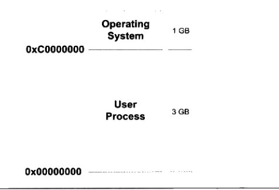
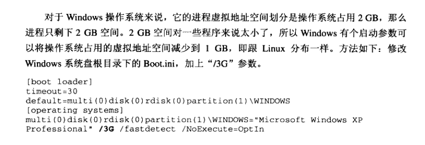
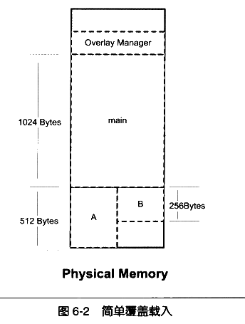
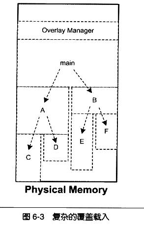
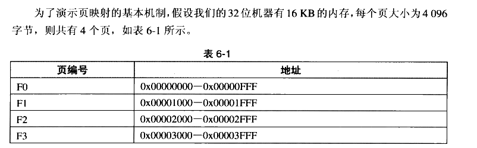
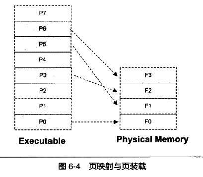
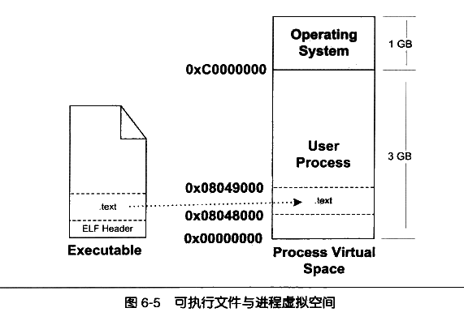

---

title: 程序员的自我修养笔记之装载与动态链接
date: 2018-2-15 18:53:12
categories: codenote
tags: [OS, Linux]

typora-copy-images-to: 程序员的自我修养笔记之装载与动态链接
---

### 第六章 可执行文件的装载与进程

介绍ELF文件在Linux下的装载过程，探寻可执行文件装载的本质

- 什么是进程的虚拟地址空间
- 为什么进程要有自己独立的虚拟地址空间
- 几种装载方式
- 进程虚拟地址空间的分布情况

#### 进程虚拟地址空间

32位硬件平台决定了虚拟地址空间的地址为0 到2^32 -1，即0x00000000~0xFFFFFFFF，也就是4GB的虚拟空间大小；而63位的硬件平台具有64位寻址能力，它的虚拟地址空间达到了2^64 字节，即0x0000000000000000~0xFFFFFFFFFFFFFFFF,总共`17179869184GB`。

而从程序的角度看，C语言中的指针所占空间可用于计算虚拟地址空间的大小，一般情况下，C语言指针大小的位数与虚拟空间的位数相同，如32位平台下的指针为32位，4字节。

以下以32为地址空间为主，64位作为扩展。

默认情况下Linux系统将进程的虚拟地址空间作如下分配：

其中的操作系统使用的空间，进程是不被允许访问的，且进程并不能完全使用剩下的3GB虚拟空间，其中一部分是预留给其他用途的。

##### PAE

Linux下Intel在1995年的Pentium Pro CPU便开始使用36位的物理地址，即可以访问64GB的物理内存。这时，操作系统只能有4GB的虚拟地址空间，无法全部读取完64GB的物理内存，而PAE就是为了解决这个问题出现的。

**PAE(Physical Address Extension)**是一种地址扩展方式，Inter修改了页映射的方式后，使得新的映射方式可以访问更多的物理内存。操作系统提供一个窗口映射的方法，将额外的内存映射进地址空间中。应用程序根据需要选择申请和映射。比如应用程序中的`0x10000000~0x20000000`这一段256MB的虚拟地址空间作为窗口，程序从高于4GB的物理空间中申请多个大小为256MB的物理空间，编号为A,B,C,然后根据需要将窗口映射到不同的物理空间块，用到A时将`0x10000000~0x20000000`映射到A，用到B,C时在映射过去，如此重复。在Windows下，这种内存操作方式为**AWE(Address Windows Extensions)**。像**Linux等UNIX系统则采用mmp()系统调用来实现**。

#### 装载方式

##### 覆盖装入

没有发明虚拟存储之前使用得比较广泛，现已几乎被淘汰。

覆盖装入的方法把挖掘内存潜力的任务交给了程序员程序员在编写程序时必须手动将程序分割成若干块，然后编写小的辅助代码管理这些模块何时驻留在内存，何时被替换。这个辅助代码被称为**覆盖管理器(Overlay Manager)**,比如下图

模块A与B之间相互没有调用依赖关系，因此两模块共享内存区域，当

使用A时则覆盖该内存，使用B时覆盖该内存，覆盖管理器则作为常驻内存。

多模块则如下，程序员需要手工将**模块按照它们之间的调用依赖关系组织成树状结构**。

因此覆盖管理器需要保证一下亮点。

- 树状结构中从任何一个模块到树的根（main）都叫调用路径，当模块被调用时，这个调用路径上的模块必须在内存之中。比如C模块正在执行时，B和main都需要在内存中，确保E执行完毕后能正确返回到模块B和main。

- 禁止跨树间调用

  任意模块不允许跨树状结构进行调用，比如A不可以调用B,E,F。但很多时候两个模块都依赖于同一个模块，如模块E和模块C需要另外一个模块G，则最方便的方法就是把模块G并入到main模块中，这样G就在E和C的调用路径上了。

#### 页映射

页映射是虚拟存储机制的一部分，随着虚拟存储的发明而诞生。

页映射将内存和所有磁盘中的数据及指令按照**页(Page)**为单位划分若干页，以后所有的装载和操作单位就是页。

假设程序所有的指令和数据总共32KB，那么程序被分为8页，并编号P0~P7。但16KB内存无法将32KB程序装入，此时将按照动态装入的原理进行装入过程。如果程序执行入口在P0则装载管理器发现程序的P0不在内存中，则将内存F0分配给P0，并将P0的内存扎un购入F0中。运行后使用P5，则将P4装入F1，以此类推，如下所示：

如果程序继续运行需要访问P4，则装载管理器必须选择放弃目前正在使用的4哥内存页中的其中一个来装载P4，放弃的算法有很多，如：

- FIFO先进先出，则放弃F0，P4装入F0
- LUR最少使用，则放弃F2，P4装入F2

等算法。而这里所谓的装载管理器就是现代的操作系统，准确说影视就是操作系统的存储管理器。

#### 从操作系统角度看可执行文件的装载并在进程中执行

##### 进程的建立

进程关键特征在于它**拥有独立的虚拟地址空间**。一个程序被执行，往往在最开始时需要做三件事：

- 创建独立的虚拟地址空间

  即创建映射函数所需要的相应的数据结构，而在i386的Linux下，创建虚拟地址空间实际上只是分配一个页目录，甚至不需要设置映射关系。也就是完成虚拟空间到物理内存的映射关系。

- 读取可执行文件头，建立虚拟空间与可执行文件的映射关系

  完成虚拟空间与可执行文件的映射关系，这一步是整个装载过程中最重要的一步，也就是传统意义上的“装载”。

  如图，考虑最简单的例子，虚拟地址如图，文件大小为0x000e1，对齐为0x1000。由于.text段大小不到0x1000，因此需要对齐。

  

  这种映射关系是保存在操作系统内部的一个**数据结构**。Linux将进程虚拟空间中的一个段叫做**虚拟内存区域(VMA.Virtual Memory Area)**。windows叫做**虚拟段(Virtual Section)**。在上面例子中，会在进程相应的数据结构中设置有一个.text段的VMA，它在虚拟空间中的地址为`0x08048000~0x08049000`对应ELF文件中偏移为0的.text，属性为只读。

- 将CPU的指令寄存器设置成可执行文件的入口地址，启动运行
