---

title: 程序员的自我修养笔记之静态链接
date: 2018-12-27 23:36:40
categories: codenote
tags: [OS, Linux]

typora-copy-images-to: 程序员的自我修养笔记之静态链接
---

《程序员的自我修养笔记之静态链接》 1

<!--more-->

### 第二章

程序源代码到最终可执行文件的4个步骤：

- 预编译

主要处理那些源代码文件中以"#"开始的预编译指令

`gcc -E hello.c -o hello.i`

- 编译

对预编译生成的文件进行词法分析，语法分析，语义分析，中间语言生成，目标代码生成及优化生成汇编代码文件

`gcc -S hello.i -o hello.s`

- 汇编

汇编器将汇编代码转换成可执行指令,输出目标文件

`as hello.s -o hello.o`或者`gcc -c hello.s -o hello.o`或者`gcc -c hello.c -o hello.o`

- 链接

`ld -static crt1.o crti.o crtbeginT.o -start-gruoup -lgcc -lgcc_eh -lc-end-group crtend.o crtn.o`

这里省略了各文件的路径

链接过程主要有如下步骤：

- 地址和空间分配
- 符号决议
- 重定位

### 第三章

#### 目标文件格式

- 可重定位文件(Relocatable File)
- 可执行文件(Executable File)
- 共享目标文件(Shared Object File)
- 核心转储文件(Core Dump File)

>在Linux下可使用file命令显示文件格式

#### 目标文件与程序之间的关系

`SimpleSection.c`代码如下：

```c
int printf(const char* format, ...);

int global_init_var = 84;
int global_uninit_var;

void func1(int i){
	printf("%d\n", i );
}

int main(void){
	static int static_var = 85;
	static int static_var2;

	int a = 1;
	int b;

	func1(static_var + static_var2 + a + b);

	return a;
}
```


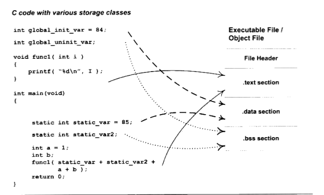

- 程序源代码编译后的机器指令被放在代码段(.code或者.text)里面
- 全局变量和局部静态变量放在数据段(.data)
- 未初始化全局变量和未初始化局部静态变量，或者有些编译器也会将初始化为0的变量也放置在.bss段

> 查看目标文件内部的结构可以使用objdump工具，可看到对应的各个段大致结构(-h)，各个段详细内容(-x)，代码段内容(翻译成了汇编语言)(-s -d)

#### 其他段内容

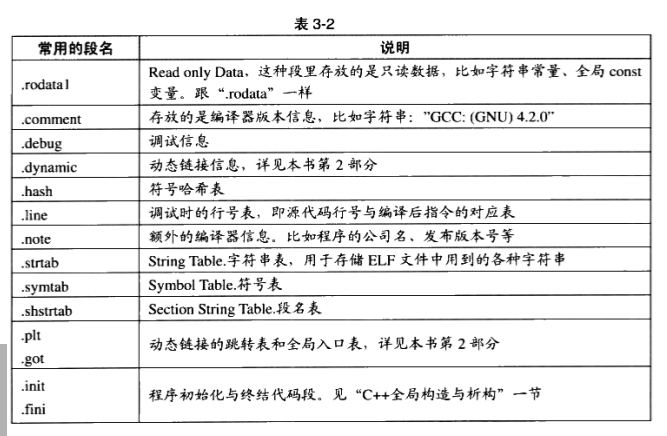

- 将某个二进制文件作为目标文件的一个段

  `objcopy -I binary -o elf32-i386 -B i386 image.jpg image.o`

- 将某个变量放在特定段

  `__attribute__((section("FOO"))) int global = 42`

  `__attribute__((section("BAR"))) void foo()`

### 第四章静态链接

#### 空间与地址分配

- 相似段合并

  - 空间与地址分配

    扫描所有输入目标文件，并获得他们各个段的长度、属性和位置，并将输入目标文件中的符号表所有的符号定义和符号引用收集起来，放到全局符号表中。于是，链接器将获取所有输入目标文件的段长度，并将他们合并，计算输出文件中各个段合并后的长度和位置，建立映射关系。

  - 符号解析与重定位

    利用上一步的信息进行段的数据，读取段数据，重定位信息，进行符号解析与重定位、调整代码中的地址等。

  如下图：

  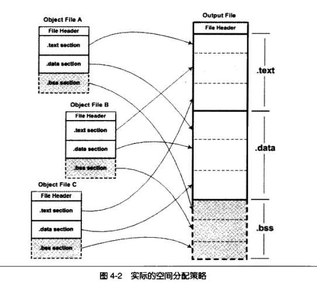


编写程序：

```c
/*a.c*/

extern int shared;

int main(){
	int a = 100;
	swap(&a, &shared);
	return 0;
}
```

```c
/* b.c */
int shared = 1;

void swap(int *a, int *b){
	*a ^= *b  ^= *a ^=*b;
}
```

- `objdump -h a.o`

  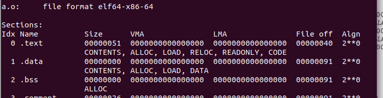

- `objdump -h b.o`

  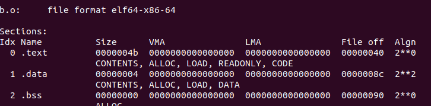

- 链接两个文件`ld a.o b.o -e main -o ab -lc`

  > 在我的机器上面需要加上-lc参数才能链接成功，不然报a.c:(.text+0x4b): undefined reference to `__stack_chk_fail错误，具体原因不明，
  >
  > -c:				从指定的命令文件读取命令
  >
  > -l:				把指定的存档文件添加到要连接的文件清单
  >
  > 得到的可执行文件不只是简单的链接过程，跟书中的内容有差异，有大神知道麻烦赐教

- `objdump -h ab`

  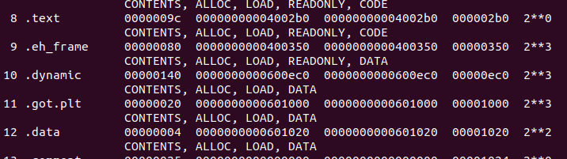

  可以看出，合并后得到的ab文件的`.text`段和`.data`段的长度分别是9c和4，正好等于两个.o文件相应段的长度之和。


#### 符号解析与重定位

##### 重定位

重定位是静态链接的核心内容，首先看`a.o`里面是如何访问调用外部符号(`shared`变量和`swap`函数)

- 使用`objdump -d` 命令查看`a.o`反编译代码

  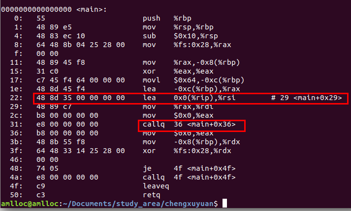

- `objdump -d ab`

  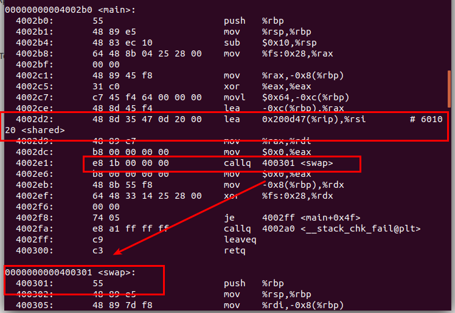


其中`main`起始地址为0x0，共占用0x50个字节，最左边那列代表偏移量偏移量为22和31的地方便是分别引用`sharead`变量和`swap`函数的位置。

- `a.o`中引用`shared`代码为`lea 0x0(%rip),%rsi`，是将`rip寄存器的值+0`直接传递给`rsi`寄存器，这是因为还无法查找符号`shared`的位置，使用0x0代替，后面链接完成之后,ab文件就将`0x0`替换为`0x200d47`，加上`rsi`寄存器的值，计算后也就是`shared`的地址`0x0601020`，可使用`objdump -s ab`在`data段`内看到该变量的值。

- 引用`swap`函数的代码为`callq 36 <main+0x36>`，既下一条指令的地址，ab文件则会直接将`swap`地址`0x400301`填入，变成`	callq  400301 <swap>`。

- 但是第二次试验，是在公司电脑，我得到的是如下结果

  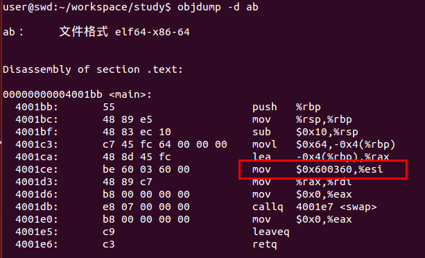

  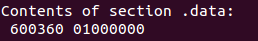

  也就是说，没有相对寻址了，这让我有点纳闷，`swap`函数地址也是,不同于家里电脑生成的指令。

总之，就是当文件并没有链接之前，遇到了不认得的符号时，编译器把地址0x0和下一条指令的地址作为代替，等链接完成地址和空间的分配后，就已经可以确定所有符号的虚拟地址了，此时链接器再将所有需要重定位的指令进行地址修复。

**书中的环境及解释**是这样子的：

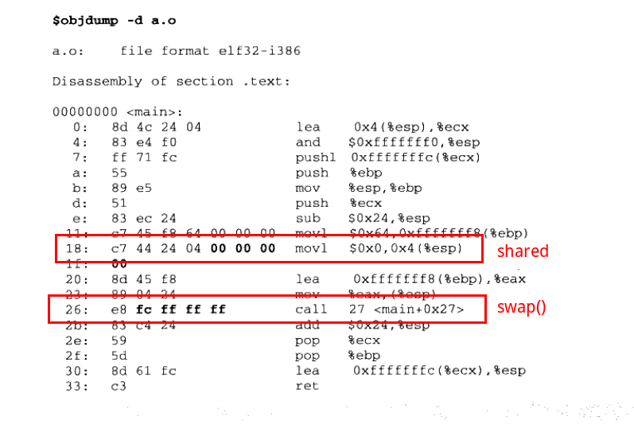

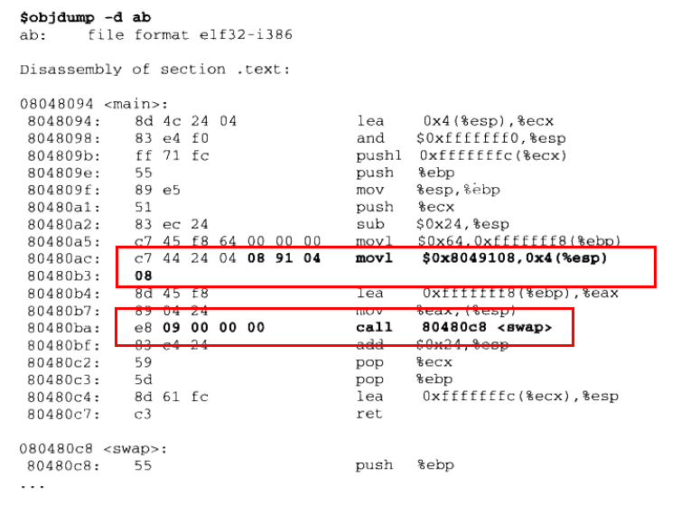

- 绝对寻址修正

  a.o第一个重定位入口，即偏移为18的mov指令修正，修正方式是R_386_32，即绝对地址修正。这个重定位入口，修正后应该是S+A

  - S是符号shared的实际地址，即0x3000
  - A是被修正位置的值，即0x00000000

  所以重定位入口修正后地址为：0x3000+0x00000000=0x3000,指令修正后应该是：

  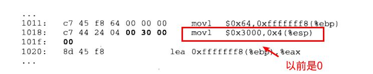

- 相对寻址修正

  a.o的第二个重定位入口，即偏移为0x26这条call指令的修正，修正方式为R_386_PC32,也就是相对地址修正。这个重定位入口，修正后结果应为S+A-P

  - S是swap的实际地址，即0x2000

  - A是被修正的未知的值，即`e8 fc ff ff ff `中操作数`0xfc ff ff ff`（小端：-4）

  - P为被修正的未知，当链接成可执行文件时，这个值应该是被修正位置的虚拟地址，也就是0x1000+0x27

最后重定位入口修正后地址为0x2000 + (-4) - (0x1000 + 0x27) = 0xFD5，即：

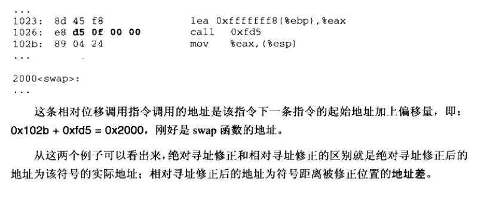

##### 重定位表

重定位表专门用于保存与重定位相关的信息，它在ELF文件中往往是一个或者多个段。对于可重定位ELF文件来说，一个重定位表往往就是ELF文件中的一个段，所以重定位表也可以叫做重定位段。比如，代码段“.text”如果有要被重定位的地方，那么就会有一个相对应的“.rel.text”的段保存代码段的重定位表，可使用objdump来查看目标文件的重定位表：

`objdump -r a.o`

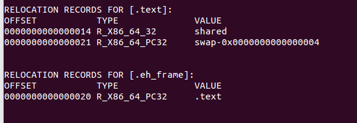

- 每个要被重定位的地方叫做重定位入口，我们可以看到”a.o“有两个**重定位入口(Relocation Entry)**。
- **偏移**：表示该入口在段中的位置
- `RELOCATION RECORDS FOR [.text]`表示这个重定位表是代码段的重定位表

重定位表的结构是一个`Elf64_Rel or Elf32_Rel`结构，如下

```c
struct Elf32_Rel
{
  Elf32_Addr  r_offset;  /* Address */
  Elf32_Word  r_info;    /* Relocation type and symbol index */
};
struct Elf64_Rel
{
  Elf64_Addr  r_offset;  /* Address */
  Elf64_Xword r_info;    /* Relocation type and symbol index */
};
```

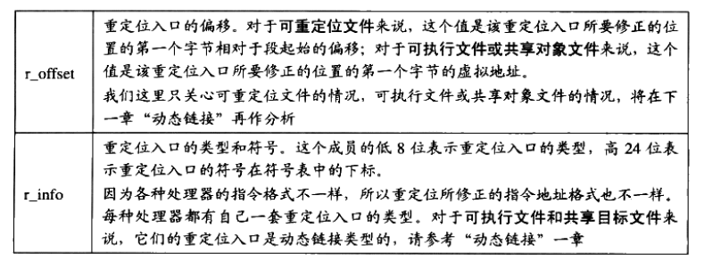

#### 符号解析

链接是因为我们的目标文件中用到的符号被定义在其他目标文件当中，如果我们直接使用ld来链接“a.o”，而不将“b.o”作为输入，则会出现`shared`和`swap`两个符号未定义的情况：

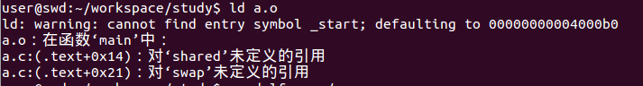

在开发过程中，发生这种情况的原因有很多，最常见的情况一般都是链接时缺少某个库文件或者输入目标文件路径不正确或者符号的声明和定义不一样。因此，从普通程序员的角度看，**符号的解析占据了链接过程的主要内容**。

其实，重定位过程也伴随着符号的解析过程，每一个目标文件都可能定义一些符号，也可能引用到定义在其他目标文件的符号。重定位过程中，每个重定位的入口都是对一个符号的引用，当连接器需要对某个符号的引用进行重定位时，就要确定这个符号的目标地址。此时，链接器就会去查找所有输入目标文件的符号表组成的全局符号表，找到对应的符号后进行重定位。

比如查看“a.o”的符号表

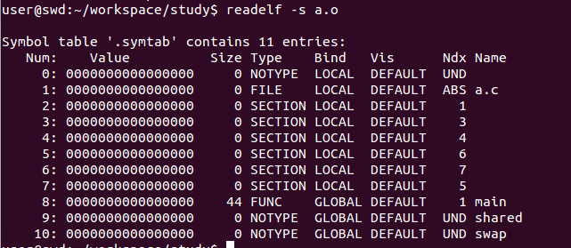

其中UND表示`undefined`未定义类型。这种未定义的符号是因为该目标文件中有关于他们的重定位项。所以链接器扫描完所有输入目标文件之后，这些未定义的符号都应该可以在全局符号表中找到，否则就会报符号未定义错误。

#### 指令修正方式

不同的处理器指令对与地址的格式和方式都不一样。但总的来说寻址方式有如下几个方面：

- 近址寻址或远址寻址

- 绝对寻址或相对寻址

- 寻址长度为8位、16位、32位或64位

  但是对于32位x86平台下ELF文件重定位入口所修正的指令寻址方式只有两种：

- 绝对近址32位寻址

- 相对近址32位寻址

书中的寻址方式是这个：

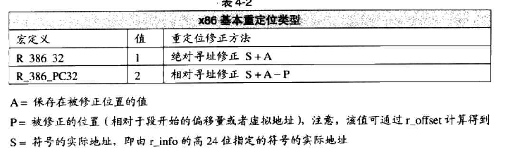

但是在公司，我机器是64位的，寻址方式是这个：

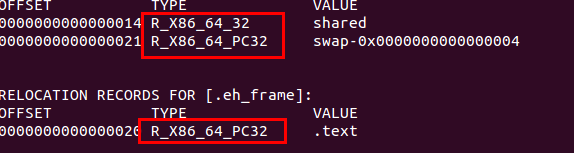

也就是`R_X86_64_32`和`R_X86_64_PC32`，网上也没找到对应的资料，哪位大佬如果知道恳请指导，或者在git上面提issue。

不过我研究了一下，`R_X86_64_32`的寻址方式,似乎是直接将地址直接写入修复即可：

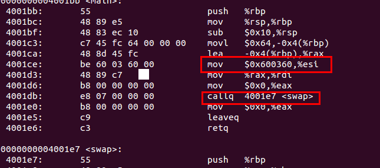

家里机器肯定会不一样的结果，因此这里留一个坑待填。

#### COMMON块

在C语言中，函数和初始化的全局变量（包括显示初始化为0）是强符号，未初始化的全局变量是弱符号。我们也可以通过GCC的"`__attribute__((weak))`"来定义任何一个强符号为弱符号。

对于它们，下列三条规则使用：

① 同名的强符号只能有一个，否则编译器报"重复定义"错误。

② 允许一个强符号和多个弱符号，但定义会选择强符号的。

③ 当有多个弱符号相同时，链接器选择占用内存空间最大的那个。

如果一个弱符号定义在多个目标文件中，它们的类型又不同，而**链接器本身有不支持符号类型**，即变量类型对于链接器来说是透明的，此时如果类型不一致应该如何处理呢？主要分以下集中情况：

- 两个或者两个以上强符号类型不一致
- 一个强符号，其他都是弱符号，出现类型不一致
- 两个或者两个以上弱符号不一致

第一种情况是无需额外处理的，多强符号定义本身即是非法，链接器将报多重定义错误，链接器要处理后两种情况。

此时，`COMMOM块`机制出现。以`SimpleSection.c`为例子，符号表如下：

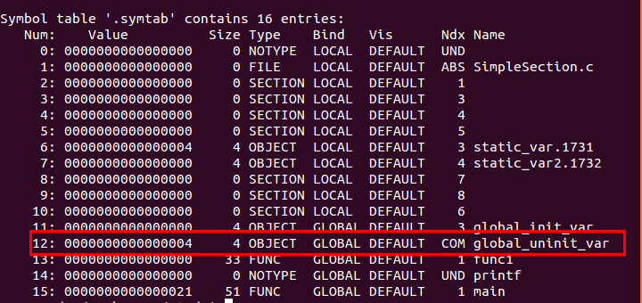

这里可以看到符号`global_uninit_var`为`GLOBAL`数据对象，大小为4，类型为`COM`，而实际上该变量为弱类型 `int` 类型变量

另外编写一个`Common.c`文件内容如下：

`double global_uninit_var = 24;`

- ` gcc -c Common.c SimpleSection.c`

- ` gcc -o Common Common.o SimpleSection.o`

-  `readelf -s Common`

  得到如下结果：

  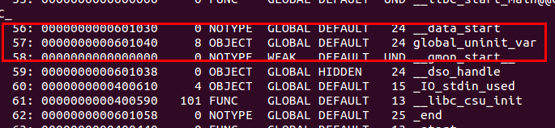

可以看到，size变成了8

但如果将`SimpleSample.c`里面的`global_uninit_var`改为`double`类型，把`Common.c`里面的`global_uninit_var`改为`int`类型，再执行可得如下警告：

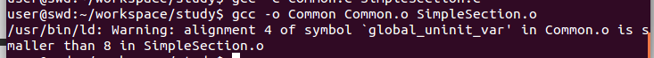

这是因为弱符号大小大于强符号大小所致，此时结果如下，大小是4：

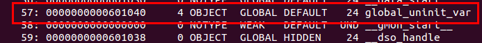

如果`Common.c`里面的`global_uninit_var`也改为弱符号，则得到的符号大小为8


最后.bbs段大小为8，即最终为初始化全局变量还是放在了bbs段。

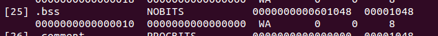

这个时候我们可以得出如下结论：

- 当强符号与弱符号同时存在时，最后得到的符号大小取决于强符号
- 多个弱符号时，大小取决于比较大的那个
- 最后读取完所有输入目标文件以后，弱符号最终还是放在了BBS段

我们可以想到，当编译器将一个编译单元编译成目标文件的时候，如果该编译单元包含了弱符号（未初始化的全局变量就是典型的弱符号），那么**该弱符号最终所占空间的大小此时是未知的，因为有可能其他编译单元中同符号名称的弱符号所占的空间比本编译单元该符号所占的空间要大**。所以编译器此时无法为该弱符号在BSS段分配空间，因为所需要的空间大小此时是未知的。**但是链接器在链接过程中可以确定弱符号的大小，因为当链接器读取所有输入目标文件后，任何一个弱符号的最终大小都可以确定了，所以它可以在最终的输出文件的BSS段为其分配空间**。所以总体来看，**未初始化的全局变量还是被放在BSS段**。

> GCC的`-fno-common`选项允许我们把所有为初始化的全局变量不以COMMON块的形式处理，或者使用`__attribute__`扩展：`int global ____attribute__((nocommon));`

#### C++相关问题

主要有两个：

- 重复代码消除
- 全局构造与析构

##### 重复代码消除

C++编译器会产生重复代码，如模板（Templates），外部内联函数（ExternInline Function）和虚函数表（Virtual Function Table）都可能在不同的编译单元中生成相同代码。

有效做法是将每个模板实例单独放在一个段里面，每个段包含一个模板实例。比如`add<T>()`，某个编译单元以int类型和float类型实例化该模板函数，那么目标文件就包含了该模板实例的段，如`.tmp.add<int>`和`.tmp.add<float>`，当其他编译单元也需要相同的方式实例化该模板函数后，也会使用相同的名字，这样在链接器最终链接的时候可以区分这些相同的模板实例段，然后将它们并入最后的代码段。

GCC把类似最终链接时合并的段叫做`Link Once`，将这种类型的段命名为`.gnu.linkonce.name`，其中`name`是该模板函数实例的修饰后名称。

而VISUAL C++则将该类型的段叫做“COMDAT”，链接器会根据这个标记，在连接时将重复的段丢弃。

但是，当相同名称的段可能有不同的内容，这可能是不同编译单元使用的编译器版本或编译优化选项不同。这时链接器很有可能随意选择其中一个副本作为链接的输入，然后提供一个警告信息，通常情况下，这种信息是不能随意忽略的。

##### 函数级别链接

这是VISUAL C++提供的编译选项“函数级别链接”，可将函数象上述方式那样把函数放在单独的段中，可以做到没有用到的函数则将它抛弃。

GCC 也提供类似的机制

- `-ffunction-sections`：将函数分别保持到独立的段中
- `-fdata-sections`：将变量分别保持到独立的段中

##### 全局构造和析构

Linux系统下一般程序入口为`_start`,这个函数是Linux系统库（Glibc）的一部分。当程序和Glibc库链接到一起形成最终可执行文件以后，这个函数就是程序的初始化部分入口。

ELF文件定义如下两个特殊段

- .init

  该段保存可执行指令，构成进程的初始化代码，main函数被调用前，Glibc的初始化部分安排执行这个段中的代码。

- .fini

  该段保存着进程终止代码指令。当main函数正常退出时，Glibc会安排执行这个段中的代码。

利用这个特性，C++全局构造和析构函数便由此实现。

#### 静态链接库

静态链接库实际上可以看成是一组目标文件的集合。使用ar压缩程序可将这些目标文件压缩在一起，并对其进行编号和索引，以便于查找和检索。

- `ar -t libc.a`

  查看文件包含哪些目标文件

- `objdump -t libc.a grep xxx`

  查找某个函数所在目标文件 

- `ar -x libc.a`

  解压出目标文件

链接过程可以十分复杂，以printf函数为例：

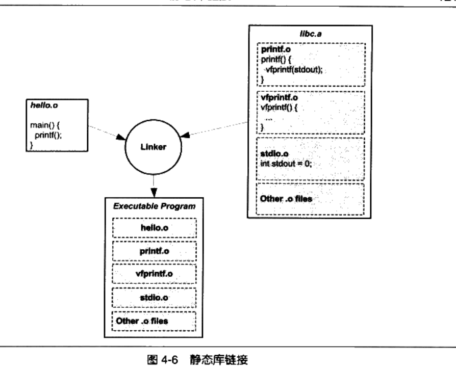