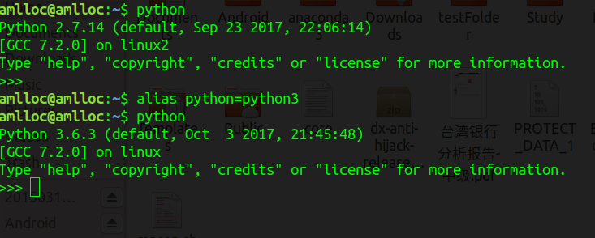

Python学习的点点滴滴
> [参考菜鸟教程](http://www.runoob.com/python/python-tutorial.html)

<!--more-->

# Ubuntu下Python2 与 Python3切换

​        这里不详细介绍如何`python2`与`python3`共存的问题，这里简单只简单说一下，只要在`/usr/bin`目录下的`python2.7`的执行文件命名为`python`，然后保留一个`python3.6`的可执行文件，并命名为`python3`，这样就可以使得默认状态下`$python`执行`python2.7`，`python3`执行`python3.6`，反之亦然。

​        我的机器上默认是`python2`，但希望有时候需要用到`python3`，尤其是当有些开源库需要用到`python3`的时候，此时其要求`$python`即执行的是`python3`。此时可在命令行下执行以下命令：

`alias python=python3`

或将其写入到`~/.bashrc`文件中即可，效果如下:



最好的切换方法

```shell
#调整Python3的优先级，使得3.6优先级较高

sudo update-alternatives --install /usr/bin/python3 python3 /usr/bin/python3.5 1

sudo update-alternatives --install /usr/bin/python3 python3 /usr/bin/python3.6 2

#更改默认值，python默认为Python2，现在修改为Python3

sudo update-alternatives --install /usr/bin/python python /usr/bin/python2 100

sudo update-alternatives --install /usr/bin/python python /usr/bin/python3 150
```


# Python 变量类型

- Python有五个标准的数据类型：

    - Numbers（数字）
    - String（字符串）
    - List（列表）
    - Tuple（元组）
    - Dictionary（字典）

## Python数字

- Python支持四种不同的数字类型：

    - int（有符号整型）
    - long（长整型[也可以代表八进制和十六进制]）
    - float（浮点型）
    - complex（复数)

| int    | long                  | float      | complex    |
| ------ | :-------------------- | ---------- | ---------- |
| 10     | 51924361L             | 0.0        | 3.14j      |
| 100    | -0x19323L             | 15.20      | 45.j       |
| -786   | 0122L                 | -21.9      | 9.322e-36j |
| 080    | 0xDEFABCECBDAECBFBAEl | 32.3e+18   | .876j      |
| -0490  | 535633629843L         | -90.       | -.6545+0J  |
| -0x260 | -052318172735L        | -32.54e100 | 3e+26J     |
| 0x69   | -4721885298529L       | 70.2E-12   | 4.53e-7j   |

- 长整型也可以使用小写 l，但是还是建议您使用大写 L，避免与数字 1 混淆。Python使用 L 来显示长整型。
- Python 还支持复数，复数由实数部分和虚数部分构成，可以用 a + bj,或者 complex(a,b) 表示， 复数的实部 a 和虚部 b 都是浮点型。

> **注意：**long 类型只存在于 Python2.X 版本中，在 2.2 以后的版本中，int 类型数据溢出后会自动转为long类型。在 Python3.X 版本中 long 类型被移除，使用 int 替代。

## Python字符串

```python
#!/usr/bin/python
# -*- coding: UTF-8 -*-
 
str = 'Hello World!'
 
print str           # 输出完整字符串
print str[0]        # 输出字符串中的第一个字符
print str[2:5]      # 输出字符串中第三个至第五个之间的字符串
print str[2:]       # 输出从第三个字符开始的字符串
print str * 2       # 输出字符串两次
print str + "TEST"  # 输出连接的字符串
```

以上实例输出结果：

```python
Hello World!
H
llo
llo World!
Hello World!Hello World!
Hello World!TEST
```

## Python列表

List（列表） 是 Python 中使用最频繁的数据类型。

列表可以完成大多数集合类的数据结构实现。它支持字符，数字，字符串甚至可以包含列表（即嵌套）。

列表用 [ ] 标识，是 python 最通用的复合数据类型。

列表中值的切割也可以用到变量 [头下标:尾下标] ，就可以截取相应的列表，从左到右索引默认 0 开始，从右到左索引默认 -1 开始，下标可以为空表示取到头或尾。

```python
#!/usr/bin/python
# -*- coding: UTF-8 -*-
 
list = [ 'runoob', 786 , 2.23, 'john', 70.2 ]
tinylist = [123, 'john']
 
print list               # 输出完整列表
print list[0]            # 输出列表的第一个元素
print list[1:3]          # 输出第二个至第三个元素 
print list[2:]           # 输出从第三个开始至列表末尾的所有元素
print tinylist * 2       # 输出列表两次
print list + tinylist    # 打印组合的列表
```

以上实例输出结果：

```python
['runoob', 786, 2.23, 'john', 70.2]
runoob
[786, 2.23]
[2.23, 'john', 70.2]
[123, 'john', 123, 'john']
['runoob', 786, 2.23, 'john', 70.2, 123, 'john']
```

## Python元组

元组是另一个数据类型，类似于List（列表）。

元组用"()"标识。内部元素用逗号隔开。但是元组不能二次赋值，相当于只读列表。

```python
#!/usr/bin/python
# -*- coding: UTF-8 -*-
 
tuple = ( 'runoob', 786 , 2.23, 'john', 70.2 )
tinytuple = (123, 'john')
 
print tuple               # 输出完整元组
print tuple[0]            # 输出元组的第一个元素
print tuple[1:3]          # 输出第二个至第三个的元素 
print tuple[2:]           # 输出从第三个开始至列表末尾的所有元素
print tinytuple * 2       # 输出元组两次
print tuple + tinytuple   # 打印组合的元组
```

以上实例输出结果：

```python
('runoob', 786, 2.23, 'john', 70.2)
runoob
(786, 2.23)
(2.23, 'john', 70.2)
(123, 'john', 123, 'john')
('runoob', 786, 2.23, 'john', 70.2, 123, 'john')

```

元组是不允许更新的，而列表是允许的：

```python
#!/usr/bin/python
# -*- coding: UTF-8 -*-
 
tuple = ( 'runoob', 786 , 2.23, 'john', 70.2 )
list = [ 'runoob', 786 , 2.23, 'john', 70.2 ]
tuple[2] = 1000    # 元组中是非法应用
list[2] = 1000     # 列表中是合法应用
```

## Python 字典

字典(dictionary)是除列表以外python之中最灵活的内置数据结构类型。列表是有序的对象集合，字典是无序的对象集合。

两者之间的区别在于：字典当中的元素是通过键来存取的，而不是通过偏移存取。

字典用"{ }"标识。字典由索引(key)和它对应的值value组成。

```python
#!/usr/bin/python
# -*- coding: UTF-8 -*-
 
dict = {}
dict['one'] = "This is one"
dict[2] = "This is two"
 
tinydict = {'name': 'john','code':6734, 'dept': 'sales'}
 
 
print dict['one']          # 输出键为'one' 的值
print dict[2]              # 输出键为 2 的值
print tinydict             # 输出完整的字典
print tinydict.keys()      # 输出所有键
print tinydict.values()    # 输出所有值

```

输出结果为：

```python
This is one
This is two
{'dept': 'sales', 'code': 6734, 'name': 'john'}
['dept', 'code', 'name']
['sales', 6734, 'john']
```

## Python数据类型转换

有时候，我们需要对数据内置的类型进行转换，数据类型的转换，你只需要将数据类型作为函数名即可。

以下几个内置的函数可以执行数据类型之间的转换。这些函数返回一个新的对象，表示转换的值。

| 函数                  | 描述                                                |
| --------------------- | :-------------------------------------------------- |
| int(x, base=10)       | 将x转换为一个整数,base表示进制数                    |
| long(x [,base\] )     | 将x转换为一个长整数                                 |
| float(x)              | 将x转换到一个浮点数                                 |
| complex(real [,imag]) | 创建一个复数                                        |
| str(x)                | 将对象 x 转换为字符串                               |
| repr(x)               | 将对象 x 转换为表达式字符串                         |
| eval(str)             | 用来计算在字符串中的有效Python表达式,并返回一个对象 |
| tuple(s)              | 将序列 s 转换为一个元组                             |
| list(s)               | 将序列 s 转换为一个列表                             |
| set(s)                | 转换为可变集合                                      |
| dict(d)               | 创建一个字典。d 必须是一个序列 (key,value)元组。    |
| frozenset(s)          | 转换为不可变集合                                    |
| chr(x)                | 将一个整数转换为一个字符                            |
| unichr(x)             | 将一个整数转换为Unicode字符                         |
| ord(x)                | 将一个字符转换为它的整数值                          |
| hex(x)                | 将一个整数转换为一个十六进制字符串                  |
| oct(x)                | 将一个整数转换为一个八进制字符串                    |

# Python 运算符

## Python运算符优先级

以下表格列出了从最高到最低优先级的所有运算符：

| 运算符                   | 描述                                                   |
| ------------------------ | ------------------------------------------------------ |
| **                       | 指数 (最高优先级)                                      |
| ~ + -                    | 按位翻转, 一元加号和减号 (最后两个的方法名为 +@ 和 -@) |
| * / % //                 | 乘，除，取模和取整除                                   |
| + -                      | 加法减法                                               |
| >> <<                    | 右移，左移运算符                                       |
| &                        | 位 'AND'                                               |
| ^ \|                     | 位运算符                                               |
| <= < > >=                | 比较运算符                                             |
| <> == !=                 | 等于运算符                                             |
| = %= /= //= -= += *= **= | 赋值运算符                                             |
| is is not                | 身份运算符                                             |
| in not in                | 成员运算符                                             |
| not and or               | 逻辑运算符                                             |

> is 与 == 区别：
>
> is 用于判断两个变量引用对象是否为同一个， == 用于判断引用变量的值是否相等。
>
> ```python
> >>> a = [1, 2, 3]
> >>> b = a
> >>> b is a 
> True
> >>> b == a
> True
> >>> b = a[:]
> >>> b is a
> False
> >>> b == a
> True
> ```

# Python函数

## 函数调用

```python
#!/usr/bin/python
# -*- coding: UTF-8 -*-
 
# 定义函数
def printme( str ):
   "打印任何传入的字符串"
   print str;
   return;
 
# 调用函数
printme("我要调用用户自定义函数!");
printme("再次调用同一函数");

```

以上实例输出结果：

```python
我要调用用户自定义函数!
再次调用同一函数
```

## 参数传递

在 python 中，类型属于对象，变量是没有类型的：

a=[1,2,3]   a="Runoob"

以上代码中，**[1,2,3]** 是 List 类型，**"Runoob"** 是 String 类型，而变量 a 是没有类型，她仅仅是一个对象的引用（一个指针），可以是 List 类型对象，也可以指向 String 类型对象。

### 可更改(mutable)与不可更改(immutable)对象

在 python 中，strings, tuples, 和 numbers 是不可更改的对象，而 list,dict 等则是可以修改的对象。

- **不可变类型：**变量赋值 **a=5** 后再赋值 **a=10**，这里实际是新生成一个 int 值对象 10，再让 a 指向它，而 5 被丢弃，不是改变a的值，相当于新生成了a。
- **可变类型：**变量赋值 **la=[1,2,3,4]** 后再赋值 **la[2]=5** 则是将 list la 的第三个元素值更改，本身la没有动，只是其内部的一部分值被修改了。

python 函数的参数传递：

- **不可变类型：**类似 c++ 的值传递，如 整数、字符串、元组。如fun（a），传递的只是a的值，没有影响a对象本身。比如在 fun（a）内部修改 a 的值，只是修改另一个复制的对象，不会影响 a 本身。
- **可变类型：**类似 c++ 的引用传递，如 列表，字典。如 fun（la），则是将 la 真正的传过去，修改后fun外部的la也会受影响

python 中一切都是对象，严格意义我们不能说值传递还是引用传递，我们应该说传不可变对象和传可变对象。

## 参数

以下是调用函数时可使用的正式参数类型：

- 必备参数
- 关键字参数
- 默认参数
- 不定长参数

### 必备参数

必备参数须以正确的顺序传入函数。调用时的数量必须和声明时的一样。

调用printme()函数，你必须传入一个参数，不然会出现语法错误：

```python
#!/usr/bin/python
# -*- coding: UTF-8 -*-
 
#可写函数说明
def printme( str ):
   "打印任何传入的字符串"
   print str;
   return;
 
#调用printme函数
printme();
```

以上实例输出结果：

```
Traceback (most recent call last):
  File "test.py", line 11, in <module>
    printme();
TypeError: printme() takes exactly 1 argument (0 given)
```

### 关键字参数

关键字参数和函数调用关系紧密，函数调用使用关键字参数来确定传入的参数值。

使用关键字参数允许函数调用时参数的顺序与声明时不一致，因为 Python 解释器能够用参数名匹配参数值。

以下实例在函数 printme() 调用时使用参数名：

```python
#!/usr/bin/python
# -*- coding: UTF-8 -*-
 
#可写函数说明
def printme( str ):
   "打印任何传入的字符串"
   print str;
   return;
 
#调用printme函数
printme( str = "My string");
```


以上实例输出结果：

```
My string
```

下例能将关键字参数顺序不重要展示得更清楚：

```python
#!/usr/bin/python
# -*- coding: UTF-8 -*-
 
#可写函数说明
def printinfo( name, age ):
   "打印任何传入的字符串"
   print "Name: ", name;
   print "Age ", age;
   return;
 
#调用printinfo函数
printinfo( age=50, name="miki" );
```

以上实例输出结果：

```
Name:  miki
Age  50
```

### 缺省参数

调用函数时，缺省参数的值如果没有传入，则被认为是默认值。下例会打印默认的age，如果age没有被传入：


```python
#!/usr/bin/python
# -*- coding: UTF-8 -*-
 
#可写函数说明
def printinfo( name, age = 35 ):
   "打印任何传入的字符串"
   print "Name: ", name;
   print "Age ", age;
   return;
 
#调用printinfo函数
printinfo( age=50, name="miki" );
printinfo( name="miki" );
```


以上实例输出结果：

```python
Name:  miki
Age  50
Name:  miki
Age  35
```

### 不定长参数

你可能需要一个函数能处理比当初声明时更多的参数。这些参数叫做不定长参数，和上述2种参数不同，声明时不会命名。基本语法如下：

def functionname([formal_args,] *var_args_tuple ):    "函数_文档字符串"    function_suite    return [expression]

加了星号（*）的变量名会存放所有未命名的变量参数。不定长参数实例如下：

```
def functionname([formal_args,] *var_args_tuple ):
   "函数_文档字符串"
   function_suite
   return [expression]
```

以上实例输出结果：

```
输出:
10
输出:
70
60
50
```

------

## 匿名函数

python 使用 lambda 来创建匿名函数。

- lambda只是一个表达式，函数体比def简单很多。
- lambda的主体是一个表达式，而不是一个代码块。仅仅能在lambda表达式中封装有限的逻辑进去。
- lambda函数拥有自己的命名空间，且不能访问自有参数列表之外或全局命名空间里的参数。
- 虽然lambda函数看起来只能写一行，却不等同于C或C++的内联函数，后者的目的是调用小函数时不占用栈内存从而增加运行效率。

### 语法

lambda函数的语法只包含一个语句，如下：

```
lambda [arg1 [,arg2,.....argn]]:expression
```

如下实例：

```python
#!/usr/bin/python
# -*- coding: UTF-8 -*-
 
# 可写函数说明
sum = lambda arg1, arg2: arg1 + arg2;
 
# 调用sum函数
print "相加后的值为 : ", sum( 10, 20 )
print "相加后的值为 : ", sum( 20, 20 )
```

以上实例输出结果：

```
相加后的值为 :  30
相加后的值为 :  40
```

------

## return 语句

return语句[表达式]退出函数，选择性地向调用方返回一个表达式。不带参数值的return语句返回None。之前的例子都没有示范如何返回数值，下例便告诉你怎么做：

```python
#!/usr/bin/python
# -*- coding: UTF-8 -*-
 
# 可写函数说明
def sum( arg1, arg2 ):
   # 返回2个参数的和."
   total = arg1 + arg2
   print "函数内 : ", total
   return total;
 
# 调用sum函数
total = sum( 10, 20 );
```

以上实例输出结果：

```
函数内 :  30
```

------

## 变量作用域

一个程序的所有的变量并不是在哪个位置都可以访问的。访问权限决定于这个变量是在哪里赋值的。

变量的作用域决定了在哪一部分程序你可以访问哪个特定的变量名称。两种最基本的变量作用域如下：

- 全局变量
- 局部变量

------

## 全局变量和局部变量

定义在函数内部的变量拥有一个局部作用域，定义在函数外的拥有全局作用域。

局部变量只能在其被声明的函数内部访问，而全局变量可以在整个程序范围内访问。调用函数时，所有在函数内声明的变量名称都将被加入到作用域中。如下实例：

```python
#!/usr/bin/python
# -*- coding: UTF-8 -*-
 
total = 0; # 这是一个全局变量
# 可写函数说明
def sum( arg1, arg2 ):
   #返回2个参数的和."
   total = arg1 + arg2; # total在这里是局部变量.
   print "函数内是局部变量 : ", total
   return total;
 
#调用sum函数
sum( 10, 20 );
print "函数外是全局变量 : ", total
```

以上实例输出结果：

```python
函数内是局部变量 :  30
函数外是全局变量 :  0
```

# 以下为Python3内容

#  Python3迭代器与生成器

## 迭代器

- 基本方法

  `iter()`与`next()`

- 字符串，列表，元组对象创建迭代器

  ```python
  list=[1,2,3,4]
  it = iter(list)
  print(next(it))
  1
  print(nexit(it))
  2
  ```

- 遍历方法

  ```python
  #!/usr/bin/python3
  list=[1,2,3,4]
  it = iter(list)
  it=iter(list)
  for x in it:
      print(x, end=" ")
  ```

  输出结果：

  ```
  1 2 3 4
  ```
  ```python
  #!/usr/bin/python3
  import sys
  list=[1,2,3,4]
  it=iter(list)
  
  while True:
      try:
          print (next(it))
      except StopIteration:
          sys.exit()
  ```
  输出结果如下：

  ```
  1
  2
  3
  4
  ```

## 创建迭代器

类中实现迭代器的两个方法

`__iter__()与__next__()`

实例：

```python
class Numbers:
  def __iter__(self):
    self.number = 1
    return self
    
  def __next__(self):
    x = self.number
    self.number += 1
    return x
    
numbers = Numbers()
iter = iter(numbers)

print(next(iter))
print(next(iter))
print(next(iter))
print(next(iter))
```

输出结果：

```
1
2
3
4
```

## 生成器

使用了`yield`的函数被称为生成器(generator)

跟普通函数不同的是，生成器是一个返回迭代器的函数，只能用于迭代操作，更简单点理解生成器就是一个迭代器。

在调用生成器运行的过程中，每次遇到 yield 时函数会暂停并保存当前所有的运行信息，返回 yield 的值, 并在下一次执行 next() 方法时从当前位置继续运行。

调用一个生成器函数，返回的是一个迭代器对象。

实例：

- 使用yield

```python
#!/usr/bin/python3

import sys

def fibonacci(n,w=0): # 生成器函数 - 斐波那契
    a, b, counter = 0, 1, 0
    while True:
        if (counter > n): 
            return
        yield a
        a, b = b, a + b
        print('%d,%d' % (a,b))
        counter += 1
f = fibonacci(10,0) # f 是一个迭代器，由生成器返回生成

while True:
    try:
        print (next(f), end=" ")
    except :
        sys.exit()
```

输出结果：

```
0 1,1
1 1,2
1 2,3
2 3,5
3 5,8
5 8,13
8 13,21
13 21,34
21 34,55
34 55,89
55 89,144
```

- 不使用yield

```python
#!/usr/bin/python3

import sys

def fibonacci(n,w=0): # 生成器函数 - 斐波那契
    a, b, counter = 0, 1, 0
    while True:
        if (counter > n): 
            return
        #yield a
        a, b = b, a + b
        print('%d,%d' % (a,b))
        counter += 1
f = fibonacci(10,0) # f 是一个迭代器，由生成器返回生成

while True:
    try:
        print (next(f), end=" ")
    except :
        sys.exit()
```

输出结果：

```
1,1
1,2
2,3
3,5
5,8
8,13
13,21
21,34
34,55
55,89
89,144
```

- 生成器总结：

  - 类似断点，可在遇到yield时就返回值，函数暂停，知道下次调用或者迭代终止
  - 可多加数值，返回的值为元组

# Python数据结构

## 列表

例子：

```python
>>> a = [66.25, 333, 333, 1, 1234.5]
>>> print(a.count(333), a.count(66.25), a.count('x'))
2 1 0
>>> a.insert(2, -1)
>>> a.append(333)
>>> a
[66.25, 333, -1, 333, 1, 1234.5, 333]
>>> a.index(333)
1
>>> a.remove(333)
>>> a
[66.25, -1, 333, 1, 1234.5, 333]
>>> a.reverse()
>>> a
[333, 1234.5, 1, 333, -1, 66.25]
>>> a.sort()
>>> a
[-1, 1, 66.25, 333, 333, 1234.5]
```

## 元组和序列

元组由若干逗号分隔的值组成，例如：

```python
>>> t = 12345, 54321, 'hello!'
>>> t[0]
12345
>>> t
(12345, 54321, 'hello!')
>>> # Tuples may be nested:
... u = t, (1, 2, 3, 4, 5)
>>> u
((12345, 54321, 'hello!'), (1, 2, 3, 4, 5))
```

如你所见，元组在输出时总是有括号的，以便于正确表达嵌套结构。在输入时可能有或没有括号， 不过括号通常是必须的（如果元组是更大的表达式的一部分）。

------

## 集合

集合是一个无序不重复元素的集。基本功能包括关系测试和消除重复元素。

可以用大括号({})创建集合。注意：如果要创建一个空集合，你必须用 set() 而不是 {} ；后者创建一个空的字典，下一节我们会介绍这个数据结构。

以下是一个简单的演示：

```python
>>> basket = {'apple', 'orange', 'apple', 'pear', 'orange', 'banana'}
>>> print(basket)                      # 删除重复的
{'orange', 'banana', 'pear', 'apple'}
>>> 'orange' in basket                 # 检测成员
True
>>> 'crabgrass' in basket
False

>>> # 以下演示了两个集合的操作
...
>>> a = set('abracadabra')
>>> b = set('alacazam')
>>> a                                  # a 中唯一的字母
{'a', 'r', 'b', 'c', 'd'}
>>> a - b                              # 在 a 中的字母，但不在 b 中
{'r', 'd', 'b'}
>>> a | b                              # 在 a 或 b 中的字母
{'a', 'c', 'r', 'd', 'b', 'm', 'z', 'l'}
>>> a & b                              # 在 a 和 b 中都有的字母
{'a', 'c'}
>>> a ^ b                              # 在 a 或 b 中的字母，但不同时在 a 和 b 中
{'r', 'd', 'b', 'm', 'z', 'l'}
```

集合也支持推导式：

```
>>> a = {x for x in 'abracadabra' if x not in 'abc'}
>>> a
{'r', 'd'}
```

------

## 字典

另一个非常有用的 Python 内建数据类型是字典。

序列是以连续的整数为索引，与此不同的是，字典以关键字为索引，关键字可以是任意不可变类型，通常用字符串或数值。

理解字典的最佳方式是把它看做无序的键=>值对集合。在同一个字典之内，关键字必须是互不相同。

一对大括号创建一个空的字典：{}。

这是一个字典运用的简单例子：

```python
>>> tel = {'jack': 4098, 'sape': 4139}
>>> tel['guido'] = 4127
>>> tel
{'sape': 4139, 'guido': 4127, 'jack': 4098}
>>> tel['jack']
4098
>>> del tel['sape']
>>> tel['irv'] = 4127
>>> tel
{'guido': 4127, 'irv': 4127, 'jack': 4098}
>>> list(tel.keys())
['irv', 'guido', 'jack']
>>> sorted(tel.keys())
['guido', 'irv', 'jack']
>>> 'guido' in tel
True
>>> 'jack' not in tel
False
```

构造函数 dict() 直接从键值对元组列表中构建字典。如果有固定的模式，列表推导式指定特定的键值对：

```python
>>> dict([('sape', 4139), ('guido', 4127), ('jack', 4098)])
{'sape': 4139, 'jack': 4098, 'guido': 4127}
```