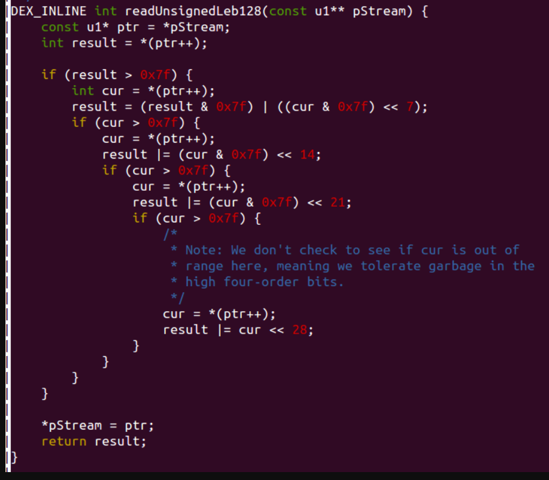

DexFile文件结构

<!--more-->

## DexFile.h文件

### LEB128类型数据

`DexClass.h`文件中引用了`Leb128.h`，所以u4字节都以LEB128类型的规则去计算大小.。

> 逐字节读取数据，如果大于0x7f（即第一个bit为1)，则表示还需要读下一个字节，如果小于0x7f(即第一个bit为0)，则表示这个字节为最后一个字节，不需要继续往下读。
>
> - 因为高位被用于表示是否读下一位字节，所以如果要表示大数，原本4位byte就可以表示的数字使用uleb128格式却要使用5个byte，但在dexfile程序中使用的整形却一般都不会大于100。
> - 一个uleb128编码的整形值，是以字节中最高位是否为0来表示字节流有没有结束的。

源码中计算大小如下：



搬运的python代码：

```python
    def readUnsignedLeb128(self, hex_value):
        byte_count = len(hex_value) / 2

        index = 0
        for i in range(byte_count):
            v1 = int(hex_value[i * 2 : i * 2 + 2], 16)
            if v1 > 0:
                index = index
                break
        
        result = 0
        hex_value = hex_value[index * 2:]
        byte_count = len(hex_value) / 2
        for i in range(byte_count):
            cur = int(hex_value[i * 2:i * 2 + 2], 16)
            if cur > 0x7f:
                result = result | ((cur & 0x7f) <<(7 * i))
            else:
                result = result | ((cur & 0x7f) << (7 * i))
                break
        
        return result
```

参考：

[shuwoom的博客](https://shuwoom.com/?p=179)

https://blog.csdn.net/Roland_Sun/article/details/46708061


