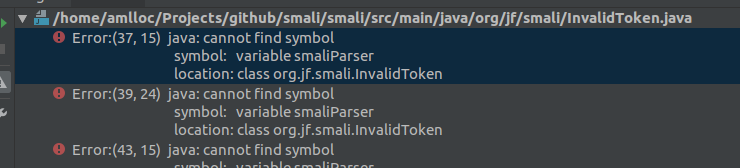
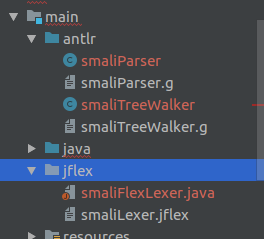
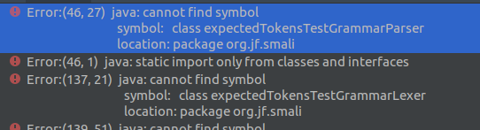
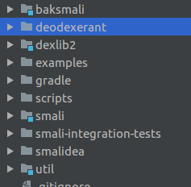

bakesmali源码编译及其解析笔记

<!--more-->

## 源码编译

- 源码clone:

  `git clone git@github.com:JesusFreke/smali.git`

- 导入idea中，并编译，发现出现如下错误

  

- 此时应该下载如下工具进行转化：

  1. [antlr-3.5.2-complete.jar](https://www.antlr3.org/download/)，注意，必须使用antlr3版本的

     一个开源的词法分析器的jar包，主要用于生成smali和baksmali的语法解释器

  2. [jflex-1.7.0.tar.gz](https://jflex.de/download.html),其中我们需要用到的jflex-full-1.7.0.jar文件在解压缩包下面的`lib`目录下

  接下来就是利用这两个jar包分别对三个文件进行转换:

  - ` java -jar antlr-3.5.2-complete.jar '/home/amlloc/Projects/github/smali/smali/src/main/antlr/smaliTreeWalker.g'`

  - ` java -jar antlr-3.5.2-complete.jar '/home/amlloc/Projects/github/smali/smali/src/main/antlr/smaliParser.g'`
  - `java -jar jflex-full-1.7.0.jar '/home/amlloc/Projects/github/smali/smali/src/main/jflex/smaliLexer.jflex' `

  之后得到三个java源文件(标红的三个文件):

  

- 将这三个文件移动到`org/jf/smali`文件夹下，然后进行编译，依旧报错

  

  发现提示涉及的文件夹下有关键.g文件，`smali/smali/src/test/antlr/org/jf/smali/expectedTokensTestGrammar.g`

  如法炮制，

  `java -jar antlr-3.5.2-complete.jar '/home/amlloc/Projects/github/smali/smali/src/test/antlr/org/jf/smali/expectedTokensTestGrammar.g'`

- 编译成功

## baksmali代码框架

apktool工具实际上就是利用baksmali和smali文件进行dex文件的转换的

其中baksmali的作用是将dex文件转换成smali文件，而smali项目是将smali文件重新编译回dex文件

命令如下：

`java -jar baksmali.jar classes.dex -o smalidir`

`java -jar smali.jar  ` smalidir -o classes.dex

下图就可看到smali和baksmali项目的文件夹



- baksmali

  实现dex2smali，重点分析

- deodexerant

  一个C文件，主要是查看`libdvm`中的`dvmGetInlineOpsTable`这个导出表，这里不作解析，可以使用ndk工具进行编译具体源码如下：

  ```c
  /*
   * Copyright 2011, Google Inc.
   * All rights reserved.
   */
  
  #include <stdio.h>
  #include <dlfcn.h>
  
  typedef struct InlineOperation {
      void *          func;
      const char*     classDescriptor;
      const char*     methodName;
      const char*     methodSignature;
  } InlineOperation;
  
  typedef const InlineOperation* (*dvmGetInlineOpsTablePtr)();
  typedef int (*dvmGetInlineOpsTableLengthPtr)();
  
  void main(int argc, char **argv) {
  	int i;
  
  	void *libdvm = dlopen("libdvm.so", RTLD_LAZY);
  
  	if (libdvm == NULL) {
  		printf("Failed to load libdvm: %s\n", dlerror());
  		return;
  	}
  
  	dvmGetInlineOpsTablePtr dvmGetInlineOpsTable = dlsym(libdvm, "dvmGetInlineOpsTable");
  
  	if (dvmGetInlineOpsTable == NULL) {
  		// clear the error, and retry with the c++ mangled name
  		dlerror();
  		dvmGetInlineOpsTable = dlsym(libdvm, "_Z20dvmGetInlineOpsTablev");
  	}
  
  	if (dvmGetInlineOpsTable == NULL) {
  		printf("Failed to load dvmGetInlineOpsTable: %s\n", dlerror());
  		dlclose(libdvm);
  		return;
  	}
  
  	dvmGetInlineOpsTableLengthPtr dvmGetInlineOpsTableLength = dlsym(libdvm, "dvmGetInlineOpsTableLength");
  
  	if (dvmGetInlineOpsTableLength == NULL) {
  		// clear the error, and retry with the c++ mangled name
  		dlerror();
  		dvmGetInlineOpsTableLength = dlsym(libdvm, "_Z26dvmGetInlineOpsTableLengthv");
  	}
  
  	if (dvmGetInlineOpsTableLength == NULL) {
  		printf("Failed to load dvmGetInlineOpsTableLength: %s\n", dlerror());
  		dlclose(libdvm);
  		return;
  	}
  
  	const InlineOperation *inlineTable = dvmGetInlineOpsTable();
  	int length = dvmGetInlineOpsTableLength();
  
  	for (i=0; i<length; i++) {
  		InlineOperation *item = &inlineTable[i];
  
  		printf("%s->%s%s\n", item->classDescriptor, item->methodName, item->methodSignature);
  	}
  
  	dlclose(libdvm);
  	return;
  }
  ```

- dexlib2

  dex和smali真正起到关键作用的项目，不管是smali还是baksmali都需要用到这个库中的方法和接口，才能解析和生成相应的smali文件

- example

  具备代表性质的smali文件

- smali

  将smali文件转成dex文件的项目

- smali-integration-tests

  整合测试的一个文件夹，里面也是一些smali文件，跟源码无关

- util

  辅助工具类

参考文献:

https://blog.51cto.com/sunzeduo/1540085