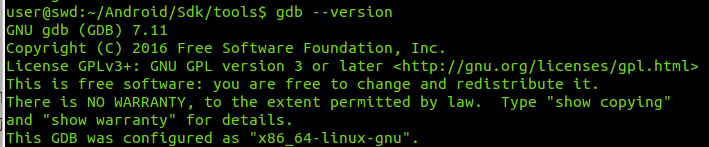
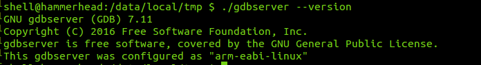
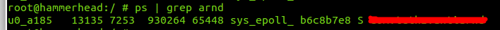
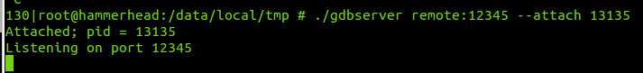
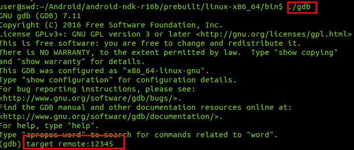
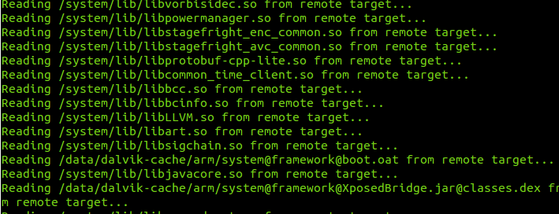
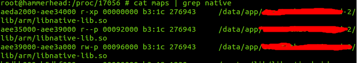
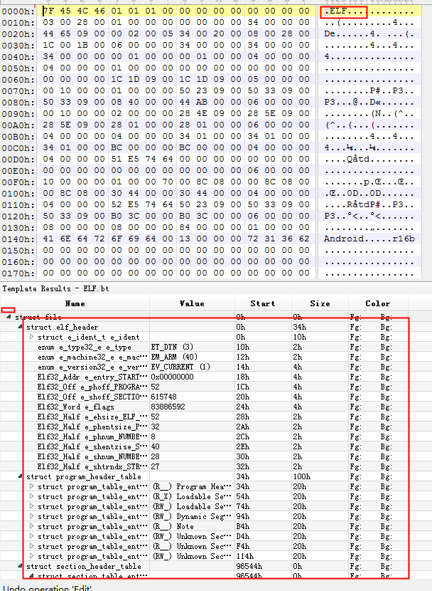

gdb dump及调试记录，这个工具很少用，但有时又得用一下，所以记录在此，以防遗忘

<!--more-->

### gdb调试准备

1. `gdb`位置：`$NDK_DIR/toolchains/arm-linux-androideabi-4.9/prebuilt/linux-x86_64/bin/arm-linux-androideabi-gdb`,这个在新版本的ndk中已经找不到了，可以去旧版本的ndk中找

2. `gdbserver`位置：`$NDK_DIR/prebuilt/android-arm64/gdbserver`

首先需要保证gdbserver和gdb的版本一致：

`gdb --version`

`adb shell`

`./gdbserver --version`

可以发现我这里的gdb 和gdbserver的版本均为`7.11`

### 开始gdb dump

首先获取要调试的app进程号：13135

启动gdbserver附加到目标进程,其中remote表示远程连接端口

adb端口映射：

`adb forward tcp:12345 tcp:12345`

使用gdb进行调试及其他操作

`./gdb`

`target remote:12345`

等待gdb对相关文件加载完毕

之后，查看需要dump的so在内存中的分布

发现起始地址和末尾地址分别为`0xaeda2000`和`0xaee3a000`

回到gdb窗口，输入以下命令

` dump binary memory /home/user/local/workspace/AndroidReverse/bin.so 0xaeda2000 0xaee3a000`

即将该so文件dump下来了，利用010editor进行查看

