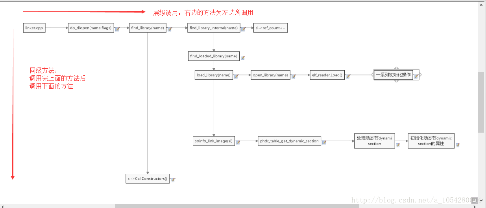

linker是Android系统动态库so的加载器和链接器，也是Android脱壳一重要脱壳点，这里介绍一下此部分的Android源码，并介绍几个脱壳点，及分析过程中产生的反调试手段，学习Linker的加载和启动原理，又需要介绍so的加载和启动。

<!--more-->

**系统** :Android4.4-r1
**linker源码的位置** : `Android/bionic/linker`

## 0x00 加载与启动so 
1、Java层中声明加载某个so文件以共享，则可在Java层声明代码：

```
static{
    System.loadLibrary("libhello.so")
}
```
其对应的执行流程如下：
1、 定位到文件Dalvik/vm/native/java_lang_Runtime.cpp
2、 调用Dalvik_java_lang_Runtime_nativeLoad -> Dalvik/vm/Native.cpp:dvmLoadNativeCode
具体代码如下，我略过一些错误判断代码，这段代码以/***  说明  ***/的形式省略

```
bool dvmLoadNativeCode(const char* pathName, Object* classLoader,
        char** detail)
{
    SharedLib* pEntry;
    void* handle;
    bool verbose;

    /*********根据path查找so文件**********/
    pEntry = findSharedLibEntry(pathName);

    /*********加载指定so文件，并延迟加载*******/
    handle = dlopen(pathName, RTLD_LAZY);
    dvmChangeStatus(self, oldStatus);

    /* create a new entry */
    SharedLib* pNewEntry;
    /*.......*/

    /* try to add it to the list */
    /***当执行addShareLibEntry()方法的时候，如果还有线程B同时在加载该so，***/
    /***并且B线程先执行到了这里，那么就说明该so的信息已经添加过了，我们就不需要再执行添加pNewEntry的操作***/
    SharedLib* pActualEntry = addSharedLibEntry(pNewEntry);
         if (pNewEntry != pActualEntry) {
        ALOGI("WOW: we lost a race to add a shared lib (%s CL=%p)",
            pathName, classLoader);
        freeSharedLibEntry(pNewEntry);
        return checkOnLoadResult(pActualEntry);
    } else {
        if (verbose)
            ALOGD("Added shared lib %s %p", pathName, classLoader);

        bool result = false;
        void* vonLoad;
        int version;
       /***定位JNI_OnLoad()方法***/
        vonLoad = dlsym(handle, "JNI_OnLoad");//
        /***如果找不到则延迟加载，说明是用javah风格的代码**/
        if (vonLoad == NULL) {
            ALOGD("No JNI_OnLoad found in %s %p, skipping init", pathName, classLoader);
            result = true;
        } else {
            /*
             * Call JNI_OnLoad.  We have to override the current class
             * loader, which will always be "null" since the stuff at the
             * top of the stack is around Runtime.loadLibrary().  (See
             * the comments in the JNI FindClass function.)
             */
            /***这里省略了重写相应类加载器的代码，如上面鸡肠文所示功能,不重要**/
            /***gDvm是一个全局变量，功能后面再补***/
            if (gDvm.verboseJni) {
                ALOGI("[Calling JNI_OnLoad for \"%s\"]", pathName);
            }
            /***执行JNI_OnLoad***/
            version = (*func)(gDvmJni.jniVm, NULL);
            
           /***省略一大段代码。。。***/
        dvmUnlockMutex(&pNewEntry->onLoadLock);
        return result;
    }
}
```
从上面的代码我们可看出
1、Android系统加载so文件时使用了dlopen函数；
2、定位JNI_OnLoad()方法，则dlsym(handle, "JNI_OnLoad")；
3、执行JNI_OnLoad()方法：(*func)(gDvmJni.jniVm, NULL)
我们查找加载so文件的函数dlopen在bionic/linker/dlfcn.c中，而此函数有主要调用了do_dlopen函数，这里对dlopen函数不详细赘述，主要解析一下do_dlopen函数，而此关键函数正是在Linker中。接下来详细分析Linker源码。

## 0x01  Linker源码总览 ##


## 0x02  do_dlopen
先贴上代码：

```
soinfo* si = find_library(name);//**完成so的加载到内存的工作
  if (si != NULL) {
    si->CallConstructors();//**完成so及本身的构造函数的调用。完成so文件的加载
  }

```

嗯，注释简单明了，接下来解析find_library(name)与si->CallConstructors()。
## 0x03 续0 find_library 
作用：完成so的加载到内存的工作,成为是否加载过该so的重要依据

```
static soinfo* find_library(const char* name) {//成为是否加载过该so的重要依据
  soinfo* si = find_library_internal(name);//寻找相应的so信息
  if (si != NULL) {
    si->ref_count++;
  }
  return si;

```
嗯，还是很清晰，里面的调用的方法先放下先，我们现分析如下方法。
## 0x04 si->CallConstructors()
完成so及本身的构造函数的调用。完成so文件的加载

```
/***省略一大堆代码,下面是主要函数****/
 if (dynamic != NULL) {
    for (Elf32_Dyn* d = dynamic; d->d_tag != DT_NULL; ++d) {
      if (d->d_tag == DT_NEEDED) {//调动依赖库的构造函数
        const char* library_name = strtab + d->d_un.d_val;
        TRACE("\"%s\": calling constructors in DT_NEEDED \"%s\"", name, library_name);
        find_loaded_library(library_name)->CallConstructors();
      }
       // DT_INIT should be called before DT_INIT_ARRAY if both are present.
  TRACE("\"%s\": calling constructors", name);
  CallFunction("DT_INIT", init_func);//调用自己的一系列构造函数后返回,这里是so文件加壳的脱壳点
  CallArray("DT_INIT_ARRAY", init_array, init_array_count, false);//dex文件的脱壳点

```
这主要是完成so文件的加载，然后遍历所有动态节，再根据标签d_tag ==DT_NEEDED调用依赖库的构造函数，再调用自己的一系列构造函数，以及init_arry函数，其中后面两个函数分别是so文件和dex文件的脱壳点，这样就结束了so文件的加载，但分析远远没有结束，我们需要回过头来解析find_library方法。
## 0x05  find_library  之find_library_internal()

操作：寻找相应的so信息

```
static soinfo* find_library_internal(const char* name) {
  if (name == NULL) {
    return somain;
  }
 
  soinfo* si = find_loaded_library(name);
  if (si != NULL) {
    if (si->flags & FLAG_LINKED) {
      return si;
    }
    DL_ERR("OOPS: recursive link to \"%s\"", si->name);
    return NULL;
  }
 
  TRACE("[ '%s' has not been loaded yet.  Locating...]", name);
  si = load_library(name);//真正加载so文件的函数
  if (si == NULL) {
    return NULL;
  }
 
  // At this point we know that whatever is loaded @ base is a valid ELF
  // shared library whose segments are properly mapped in.
  TRACE("[ init_library base=0x%08x sz=0x%08x name='%s' ]",
        si->base, si->size, si->name);
 
  if (!soinfo_link_image(si)) {//进行重定位
    munmap(reinterpret_cast<void*>(si->base), si->size);
    soinfo_free(si);
    return NULL;
  }
```
注释很明白，整理一下基本流程：
1、find_loaded_library()：寻找相应的so信息
2、load_library()：真正加载so文件的函数
3、soinfo_link_image():处理动态节dynamic section,初始化动态节dynamic section的属性

## 0x06 find_library_internal() 之 find_loaded_library()

```
//寻找相应的so信息 
 static soinfo *find_loaded_library(const char *name)
{
    soinfo *si;
    const char *bname;
 
    // TODO: don't use basename only for determining libraries
    // http://code.google.com/p/android/issues/detail?id=6670
 
    bname = strrchr(name, '/');//查找一个字符"/"在另一个字符串name中末次出现的位置并返回这个位置的地址
    bname = bname ? bname + 1 : name;
 
    for (si = solist; si != NULL; si = si->next) {//判断是否有加载这个so
        if (!strcmp(bname, si->name)) {
            return si;
        }
    }
    return NULL;
}

```
## 0x07  find_library_internal() 之load_library()
操作：真正加载so文件的函数

```
static soinfo* load_library(const char* name) {
    // Open the file.
    int fd = open_library(name);
    if (fd == -1) {
        DL_ERR("library \"%s\" not found", name);
        return NULL;
    }
 
    // Read the ELF header and load the segments.
    ElfReader elf_reader(name, fd);
    if (!elf_reader.Load()) {//读取elf的操作，源码中看出只读取了Program 段
        return NULL;
    }
     const char* bname = strrchr(name, '/');
     //在so文件加载完以后，接着就会调用soinfo_alloc函数为so分配soinfo
    soinfo* si = soinfo_alloc(bname ? bname + 1 : name);
    if (si == NULL) {
        return NULL;
    }//利用装载结果初始化soinfo对象
    si->base = elf_reader.load_start();
    si->size = elf_reader.load_size();
    si->load_bias = elf_reader.load_bias();
    si->flags = 0;
    si->entry = 0;
    si->dynamic = NULL;
    si->phnum = elf_reader.phdr_count();
    si->phdr = elf_reader.loaded_phdr();
    return si;
}
```
这里着重强调一下elf_reader.Load()方法：

```
bool ElfReader::Load() {
  return ReadElfHeader() &&
         VerifyElfHeader() &&
         ReadProgramHeader() &&
         ReserveAddressSpace() &&
         LoadSegments() &&
         FindPhdr();
}
```
可以看出读取elf的操作，源码中看出只读取了Program 段，这也是很多加固进行抹头操作的原因：IDA只通过加载section Header段，来读取so文件，而实际上源码只读取了Program段，如果只是将section Header段抹头了，IDA便无法正常解析so文件，而Android系统却可以正常解析so文件，这也是一种反调试手段。
再后来就进行一系列对so文件的初始化操作：

```
si->base = elf_reader.load_start();
    si->size = elf_reader.load_size();
    si->load_bias = elf_reader.load_bias();
    si->flags = 0;
    si->entry = 0;
    si->dynamic = NULL;
    si->phnum = elf_reader.phdr_count();
    si->phdr = elf_reader.loaded_phdr();
    return si;
```
其中si结构体如下（可略）：

```
struct soinfo {
 public:
  char name[SOINFO_NAME_LEN];
  const Elf32_Phdr* phdr;
  size_t phnum;
  Elf32_Addr entry;
  Elf32_Addr base;
  unsigned size;

  uint32_t unused1;  // DO NOT USE, maintained for compatibility.

  Elf32_Dyn* dynamic;

  uint32_t unused2; // DO NOT USE, maintained for compatibility
  uint32_t unused3; // DO NOT USE, maintained for compatibility

  soinfo* next;
  unsigned flags;

  const char* strtab;
  Elf32_Sym* symtab;

  size_t nbucket;
  size_t nchain;
  unsigned* bucket;
  unsigned* chain;

  unsigned* plt_got;

  Elf32_Rel* plt_rel;
  size_t plt_rel_count;

  Elf32_Rel* rel;
  size_t rel_count;

  linker_function_t* preinit_array;
  size_t preinit_array_count;

  linker_function_t* init_array;
  size_t init_array_count;
  linker_function_t* fini_array;
  size_t fini_array_count;

  linker_function_t init_func;
  linker_function_t fini_func;

#if defined(ANDROID_ARM_LINKER)
  // ARM EABI section used for stack unwinding.
  unsigned* ARM_exidx;
  size_t ARM_exidx_count;
#elif defined(ANDROID_MIPS_LINKER)
  unsigned mips_symtabno;
  unsigned mips_local_gotno;
  unsigned mips_gotsym;
#endif

  size_t ref_count;
  link_map_t link_map;

  bool constructors_called;

  // When you read a virtual address from the ELF file, add this
  // value to get the corresponding address in the process' address space.
  Elf32_Addr load_bias;

  bool has_text_relocations;
  bool has_DT_SYMBOLIC;

  void CallConstructors();
  void CallDestructors();
  void CallPreInitConstructors();

 private:
  void CallArray(const char* array_name, linker_function_t* functions, size_t count, bool reverse);//dex文件脱壳点
  void CallFunction(const char* function_name, linker_function_t function);//so文件脱壳点
};
```
## 0x08  find_library_internal() 之soinfo_link_image(si) 
在si = load_library(name)获得了so文件的info之后，就开始进行一系列操作：
1、定位动态节；
2、解析动态节；
3、加载动态节
4、重定位

1、定位动态节：

```
phdr_table_get_dynamic_section(const Elf32_Phdr* phdr_table,
                               int               phdr_count,
                               Elf32_Addr        load_bias,
                               Elf32_Dyn**       dynamic,
                               size_t*           dynamic_count,
                               Elf32_Word*       dynamic_flags)
{
    const Elf32_Phdr* phdr = phdr_table;
    const Elf32_Phdr* phdr_limit = phdr + phdr_count;
 
    for (phdr = phdr_table; phdr < phdr_limit; phdr++) {
        if (phdr->p_type != PT_DYNAMIC) {//遍历phdr寻找DYNAMIC段，存放了字符串，方法等偏移地址
            continue;
        }
 
        *dynamic = reinterpret_cast<Elf32_Dyn*>(load_bias + phdr->p_vaddr);
        if (dynamic_count) {
            *dynamic_count = (unsigned)(phdr->p_memsz / 8);
        }
        if (dynamic_flags) {
            *dynamic_flags = phdr->p_flags;
        }
        return;
    }
    *dynamic = NULL;
    if (dynamic_count) {
        *dynamic_count = 0;
    }
}

```
值得注意的是，这里源码加载动态节的时候只加载了第一个动态节，后面的动态节都没有加载，因此我们可以自己自定义多个programm段中的动态节区，然后在section header中也改变相应的数据，这样IDA解析的信息是有所偏差的，因为Android系统实际上只读取了第一个动态节。
2、解析动态节。
解析代码如下：

```
for (Elf32_Dyn* d = si->dynamic; d->d_tag != DT_NULL; ++d) {
        DEBUG("d = %p, d[0](tag) = 0x%08x d[1](val) = 0x%08x", d, d->d_tag, d->d_un.d_val);
        switch(d->d_tag){/初始化动态节dynamic section的属性
        case DT_HASH:
            si->nbucket = ((unsigned *) (base + d->d_un.d_ptr))[0];
            si->nchain = ((unsigned *) (base + d->d_un.d_ptr))[1];
            si->bucket = (unsigned *) (base + d->d_un.d_ptr + 8);
            si->chain = (unsigned *) (base + d->d_un.d_ptr + 8 + si->nbucket * 4);
            break;
        case DT_STRTAB:
            si->strtab = (const char *) (base + d->d_un.d_ptr);
            break;
        case DT_SYMTAB:
            si->symtab = (Elf32_Sym *) (base + d->d_un.d_ptr);
            break;
        case DT_PLTREL:
            if (d->d_un.d_val != DT_REL) {
                DL_ERR("unsupported DT_RELA in \"%s\"", si->name);
                return false;
            }
            break;
        case DT_JMPREL:
            si->plt_rel = (Elf32_Rel*) (base + d->d_un.d_ptr);
            break;
        case DT_PLTRELSZ:
            si->plt_rel_count = d->d_un.d_val / sizeof(Elf32_Rel);
            break;
        case DT_REL:
            si->rel = (Elf32_Rel*) (base + d->d_un.d_ptr);
            break;
        case DT_RELSZ:
            si->rel_count = d->d_un.d_val / sizeof(Elf32_Rel);
            break;
        case DT_PLTGOT:
            /* Save this in case we decide to do lazy binding. We don't yet. */
            si->plt_got = (unsigned *)(base + d->d_un.d_ptr);
            break;
        case DT_DEBUG:
            // Set the DT_DEBUG entry to the address of _r_debug for GDB
            // if the dynamic table is writable
            if ((dynamic_flags & PF_W) != 0) {
                d->d_un.d_val = (int) &_r_debug;
            }
            break;
         case DT_RELA:
            DL_ERR("unsupported DT_RELA in \"%s\"", si->name);
            return false;
        case DT_INIT:
            si->init_func = reinterpret_cast<linker_function_t>(base + d->d_un.d_ptr);
            DEBUG("%s constructors (DT_INIT) found at %p", si->name, si->init_func);
            break;
        case DT_FINI:
            si->fini_func = reinterpret_cast<linker_function_t>(base + d->d_un.d_ptr);
            DEBUG("%s destructors (DT_FINI) found at %p", si->name, si->fini_func);
            break;
        case DT_INIT_ARRAY:
            si->init_array = reinterpret_cast<linker_function_t*>(base + d->d_un.d_ptr);
            DEBUG("%s constructors (DT_INIT_ARRAY) found at %p", si->name, si->init_array);
            break;
        case DT_INIT_ARRAYSZ:
            si->init_array_count = ((unsigned)d->d_un.d_val) / sizeof(Elf32_Addr);
            break;
        case DT_FINI_ARRAY:
            si->fini_array = reinterpret_cast<linker_function_t*>(base + d->d_un.d_ptr);
            DEBUG("%s destructors (DT_FINI_ARRAY) found at %p", si->name, si->fini_array);
            break;
        case DT_FINI_ARRAYSZ:
            si->fini_array_count = ((unsigned)d->d_un.d_val) / sizeof(Elf32_Addr);
            break;
        case DT_PREINIT_ARRAY:
            si->preinit_array = reinterpret_cast<linker_function_t*>(base + d->d_un.d_ptr);
            DEBUG("%s constructors (DT_PREINIT_ARRAY) found at %p", si->name, si->preinit_array);
            break;
        case DT_PREINIT_ARRAYSZ:
            si->preinit_array_count = ((unsigned)d->d_un.d_val) / sizeof(Elf32_Addr);
            break;
        case DT_TEXTREL:
            si->has_text_relocations = true;
            break;
        case DT_SYMBOLIC:
            si->has_DT_SYMBOLIC = true;
            break;
        case DT_NEEDED:
            ++needed_count;
            break;
#if defined DT_FLAGS
        // TODO: why is DT_FLAGS not defined?
        case DT_FLAGS:
            if (d->d_un.d_val & DF_TEXTREL) {
                si->has_text_relocations = true;
            }
            if (d->d_un.d_val & DF_SYMBOLIC) {
                si->has_DT_SYMBOLIC = true;
            }
            break;
#endif
#if defined(ANDROID_MIPS_LINKER)
        case DT_STRSZ:
        case DT_SYMENT:
        case DT_RELENT:
             break;
        case DT_MIPS_RLD_MAP:
            // Set the DT_MIPS_RLD_MAP entry to the address of _r_debug for GDB.
            {
              r_debug** dp = (r_debug**) d->d_un.d_ptr;
              *dp = &_r_debug;
            }
            break;
        case DT_MIPS_RLD_VERSION:
        case DT_MIPS_FLAGS:
        case DT_MIPS_BASE_ADDRESS:
        case DT_MIPS_UNREFEXTNO:
            break;

        case DT_MIPS_SYMTABNO:
            si->mips_symtabno = d->d_un.d_val;
            break;

        case DT_MIPS_LOCAL_GOTNO:
            si->mips_local_gotno = d->d_un.d_val;
            break;

        case DT_MIPS_GOTSYM:
            si->mips_gotsym = d->d_un.d_val;
            break;

        default:
            DEBUG("Unused DT entry: type 0x%08x arg 0x%08x", d->d_tag, d->d_un.d_val);
            break;
#endif
        }
    }
  
```
3、加载依赖库

```
 //********加载依赖库 (NEEDED)       Shared library: [liblog.so]
    for (Elf32_Dyn* d = si->dynamic; d->d_tag != DT_NULL; ++d) {
        if (d->d_tag == DT_NEEDED) {
            const char* library_name = si->strtab + d->d_un.d_val;
            DEBUG("%s needs %s", si->name, library_name);
            soinfo* lsi = find_library(library_name);
            if (lsi == NULL) {
                strlcpy(tmp_err_buf, linker_get_error_buffer(), sizeof(tmp_err_buf));
                DL_ERR("could not load library \"%s\" needed by \"%s\"; caused by %s",
                       library_name, si->name, tmp_err_buf);
                return false;
            }
            *pneeded++ = lsi;
        }
    }
```
4、重定位操作

```
if (si->has_text_relocations) {//重定位操作
        /* Unprotect the segments, i.e. make them writable, to allow
         * text relocations to work properly. We will later call
         * phdr_table_protect_segments() after all of them are applied
         * and all constructors are run.
         */
        DL_WARN("%s has text relocations. This is wasting memory and is "
                "a security risk. Please fix.", si->name);
        if (phdr_table_unprotect_segments(si->phdr, si->phnum, si->load_bias) < 0) {
            DL_ERR("can't unprotect loadable segments for \"%s\": %s",
                   si->name, strerror(errno));
            return false;
        }
    }

    if (si->plt_rel != NULL) {//修改数据达到重定位的目的
        DEBUG("[ relocating %s plt ]", si->name );
        if (soinfo_relocate(si, si->plt_rel, si->plt_rel_count, needed)) {
            return false;//修改数据达到重定位的目的
        }
    }
    if (si->rel != NULL) {
        DEBUG("[ relocating %s ]", si->name );
        if (soinfo_relocate(si, si->rel, si->rel_count, needed)) {
            return false;
        }
    }
```
其中具体的意义参见以下博客
http://blog.csdn.net/feibabeibei_beibei/article/details/53004525
## 0xFF 收尾
1、dlopen执行完毕后
2、调用 vonLoad = dlsym(handle, "JNI_OnLoad")定位JNI_Onload
3、再执行version = (*func)(gDvmJni.jniVm, NULL);执行JNI_Onload
期间可以有三个断点：
.init->.init_array->JNI_Onload->java_com_XX.
反调试思路：
1、section Header的抹头操作
2、自定义多个动态节

这里留个坑，就是未进行对全局变量gDvm的解析，师傅们多多指教哇~
参考链接：

http://blog.csdn.net/feibabeibei_beibei/article/details/53004525
https://xianzhi.aliyun.com/forum/read/316.html
http://blog.csdn.net/maspchen/article/details/50568693